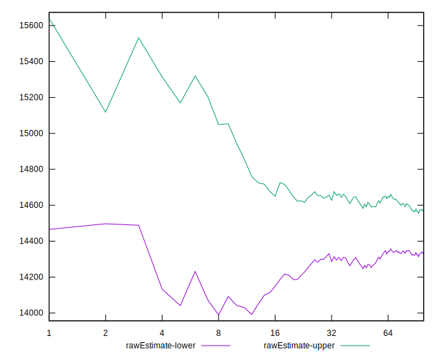

# //interactive/samples/music

[→ Parent](../..)


## Raw


```yaml
p90min: 13304.08
p90max: 15751.0875
p90range: 2447.0074999999997
p90mean: 14459.524079787236
median: 14432.239250000002
p90stdev: 578.2613144580087
mad: 431.33650000000307
stdevBySn: 639.3048578500016
lfitCenter: 14447.527563242389
lfitStdev: 476.49317326811
mfitCenter: 14447.527563242389
mfitStdev: 597.1956309921701
mfitConfidence: 59.71956309921701
p90skewness: 0.3460569083519599
p90eccentricity: 0.9999999999999997
p90discretization: 1
outlandishness: 1.001582985820627

```


## Score


```yaml
p90min: 0.07
p90max: 0.12
p90range: 0.04999999999999999
p90mean: 0.09191489361702126
median: 0.09
p90stdev: 0.012905268241804883
mad: 0.010000000000000009
stdevBySn: 0.011926000000000011
lfitCenter: 0.09184760080339632
lfitStdev: 0.0107712045809618
mfitCenter: 0.09184760080339632
mfitStdev: 0.013499702990820879
mfitConfidence: 0.001349970299082088
p90skewness: 0.05645110502417593
p90eccentricity: 1.0000000000000007
p90discretization: 15.666666666666666
outlandishness: 1.001852709190672

```


## Raw Estimate


## Score Estimate


## P Score


```yaml
p90min: 0.0667450614097449
p90max: 0.1207882760308619
p90range: 0.054043214621117
p90mean: 0.09208555751047473
median: 0.09178153639221859
p90stdev: 0.01262749379698581
mad: 0.010143169784242817
stdevBySn: 0.014744220394346027
lfitCenter: 0.09219198448862148
lfitStdev: 0.010515225559187272
mfitCenter: 0.09219198448862148
mfitStdev: 0.013178880863651845
mfitConfidence: 0.0013178880863651845
p90skewness: -0.04287675623833147
p90eccentricity: 1
p90discretization: 1
outlandishness: 1.0015780985162748

```


## Score Difference


```yaml
p90min: 0
p90max: 0
p90range: 0
p90mean: 0
median: 0
p90stdev: 0
mad: 0
stdevBySn: 0
lfitCenter: 0
lfitStdev: 0
mfitCenter: 0
mfitStdev: 0
mfitConfidence: 0
p90skewness: .nan
p90eccentricity: .nan
p90discretization: 94
outlandishness: .nan

```


## P Score Difference


```yaml
p90min: -0.004640666262629975
p90max: 0.004607381217792528
p90range: 0.009248047480422503
p90mean: 0.00016864725637525204
median: 0.0003354074643867194
p90stdev: 0.002902481871812763
mad: 0.002764281497431187
stdevBySn: 0.0034833205857929296
lfitCenter: 0.00016357675296568578
lfitStdev: 0.0027077424413804907
mfitCenter: 0.00016357675296568578
mfitStdev: 0.003393651885406193
mfitConfidence: 0.0003393651885406193
p90skewness: 0.005825468998427302
p90eccentricity: 0.9999999999999996
p90discretization: 1
outlandishness: 0.8798193192715523

```

