# //largest-contentful-paint/samples/agenda

[→ Parent](../..)


## Raw


```yaml
p90min: 1714.122
p90max: 8641.79
p90range: 6927.668000000001
p90mean: 3580.8941595744686
median: 2285.91075
p90stdev: 2145.1077605091346
mad: 432.9107499999998
stdevBySn: 663.7245354499996
lfitCenter: 3307.1614381522018
lfitStdev: 1857.079711497463
mfitCenter: 3307.1614381522018
mfitStdev: 2327.5042588835945
mfitConfidence: 232.75042588835944
p90skewness: 1.1949952144279217
p90eccentricity: 0.9999999999999992
p90discretization: 1
outlandishness: 1.0732833053676443

```

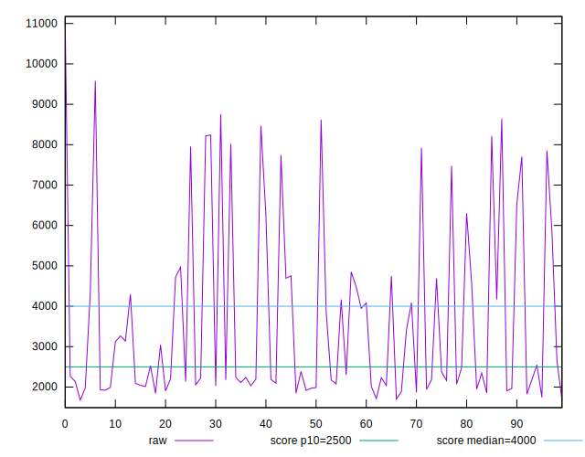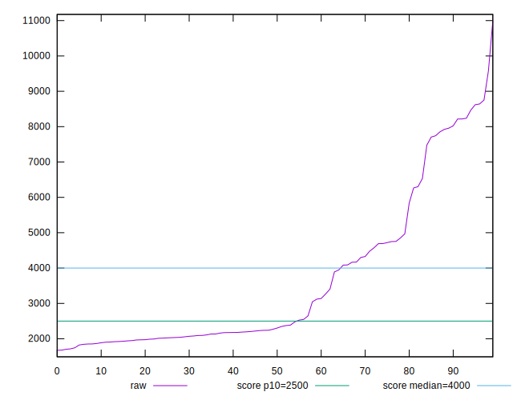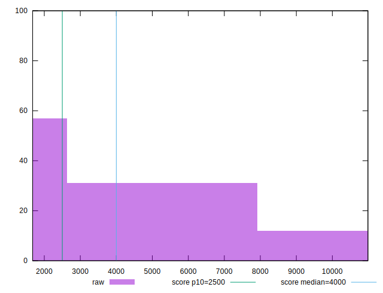
## Score


```yaml
p90min: 0.02
p90max: 0.99
p90range: 0.97
p90mean: 0.6788297872340424
median: 0.935
p90stdev: 0.3658416596887025
mad: 0.044999999999999984
stdevBySn: 0.065593
lfitCenter: 0.7287575926753552
lfitStdev: 0.35387312575513
mfitCenter: 0.7287575926753552
mfitStdev: 0.44351419177121315
mfitConfidence: 0.044351419177121314
p90skewness: -0.7761804010737037
p90eccentricity: 1.0000000000000002
p90discretization: 2.8484848484848486
outlandishness: 0.9686372392122331

```

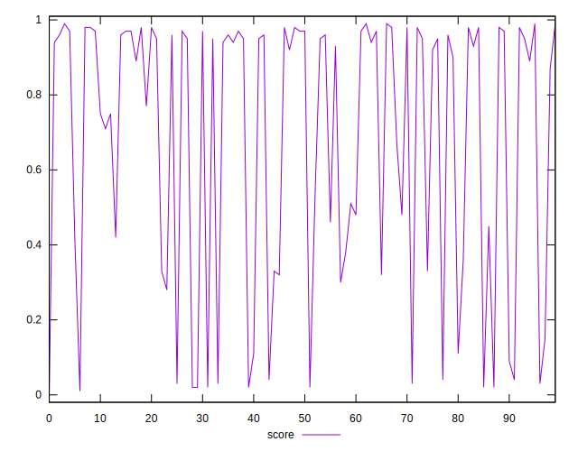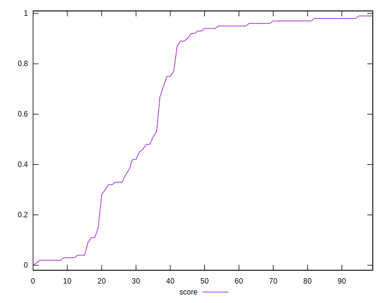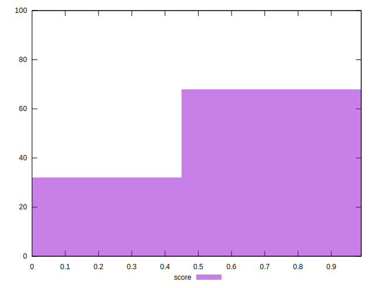
## Raw Estimate

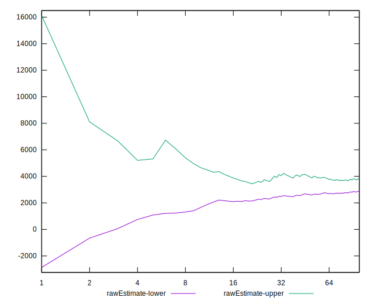
## Score Estimate

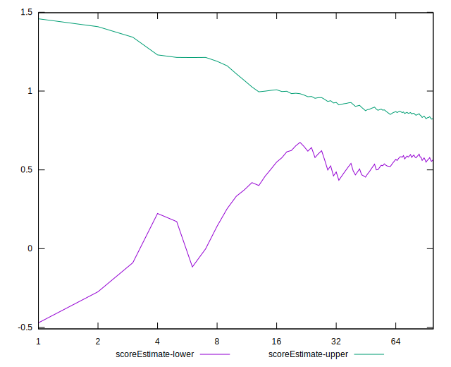
## P Score


```yaml
p90min: 0.01784646789190969
p90max: 0.9895718354379947
p90range: 0.971725367546085
p90mean: 0.6788909133219154
median: 0.9364191033495971
p90stdev: 0.36580757853948903
mad: 0.045987757182817335
stdevBySn: 0.06523781515480652
lfitCenter: 0.7289011610735603
lfitStdev: 0.3541643911102357
mfitCenter: 0.7289011610735603
mfitStdev: 0.4438792387588446
mfitConfidence: 0.04438792387588446
p90skewness: -0.7747278823357645
p90eccentricity: 1.0000000000000004
p90discretization: 1
outlandishness: 0.9686366297051044

```

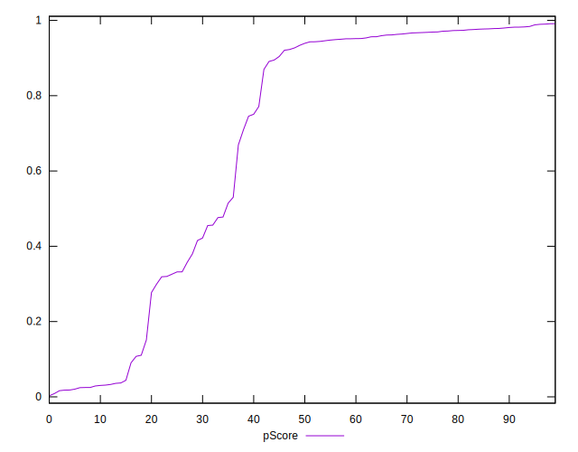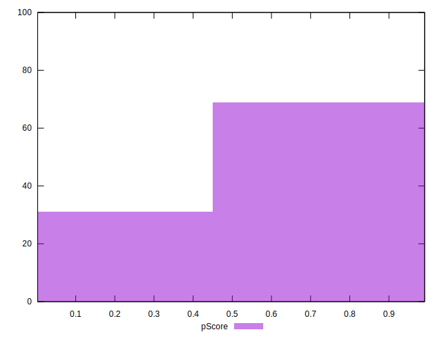
## Score Difference


```yaml
p90min: 0
p90max: 1.1102230246251565e-16
p90range: 1.1102230246251565e-16
p90mean: 1.1810883240693155e-17
median: 0
p90stdev: 3.4231191749227837e-17
mad: 0
stdevBySn: 0
lfitCenter: 7.935972681207082e-18
lfitStdev: 1.8470597583696066e-17
mfitCenter: 7.935972681207082e-18
mfitStdev: 2.314946109960577e-17
mfitConfidence: 2.314946109960577e-18
p90skewness: 2.5532425695667196
p90eccentricity: 1.0000000000000024
p90discretization: 47
outlandishness: 1.4932839999999998

```

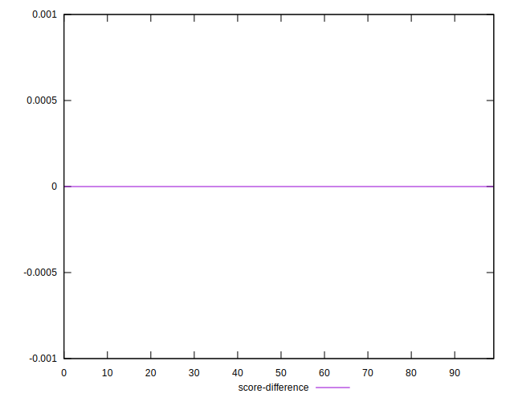
## P Score Difference


```yaml
p90min: -0.004443044799985918
p90max: 0.0046528023660918905
p90range: 0.009095847166077808
p90mean: 0.00006186184490007718
median: 0.0001313506633595085
p90stdev: 0.00250906895540797
mad: 0.0021393593657333867
stdevBySn: 0.0029427602953987345
lfitCenter: 0.00007275955945832281
lfitStdev: 0.0021838464023335234
mfitCenter: 0.00007275955945832281
mfitStdev: 0.0027370455725243305
mfitConfidence: 0.00027370455725243305
p90skewness: -0.008187497368026115
p90eccentricity: 1
p90discretization: 1
outlandishness: 0.9391353687089846

```

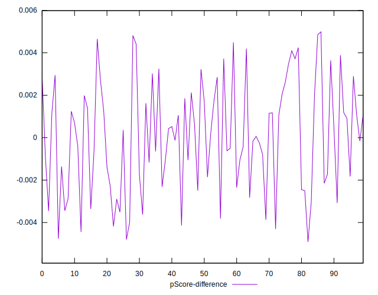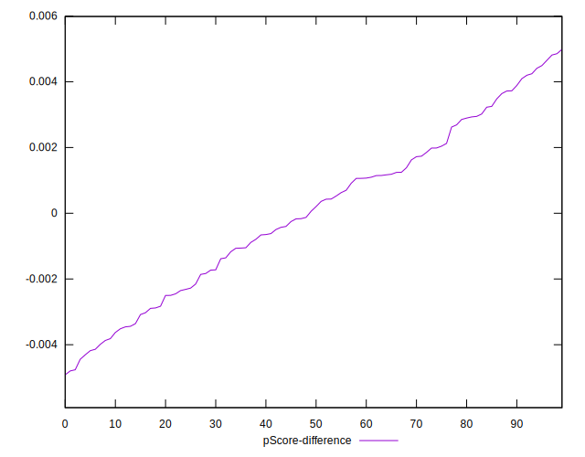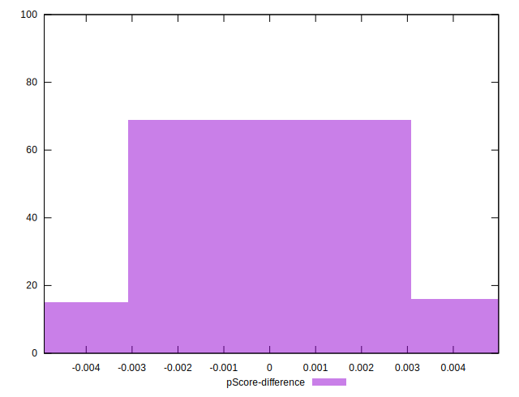