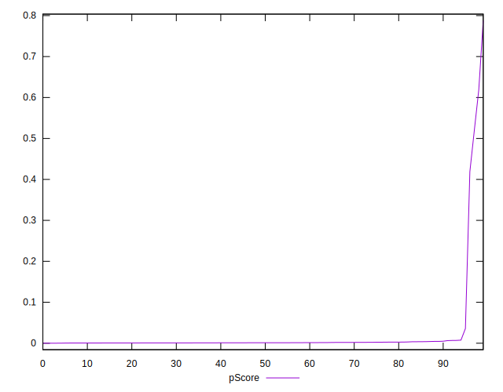
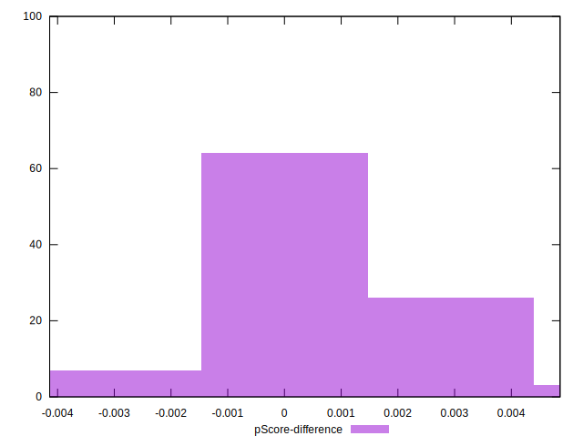

# //largest-contentful-paint/samples/astro

[→ Parent](../..)


## Raw


```yaml
p90min: 4311.7965
p90max: 16117.970000000003
p90range: 11806.173500000003
p90mean: 12000.612585106379
median: 12277.65725
p90stdev: 1396.5073865180111
mad: 732.9005000000016
stdevBySn: 1100.2993192999998
lfitCenter: 12041.20018229226
lfitStdev: 1100.8113531975011
mfitCenter: 12041.20018229226
mfitStdev: 1379.6624328681096
mfitConfidence: 137.96624328681096
p90skewness: -1.7994183278223108
p90eccentricity: 1.0000000000000002
p90discretization: 1
outlandishness: 0.9855487052275425

```


## Score


```yaml
p90min: 0
p90max: 0.42
p90range: 0.42
p90mean: 0.005319148936170213
median: 0
p90stdev: 0.043238628505311905
mad: 0
stdevBySn: 0
lfitCenter: 0.011733960642299111
lfitStdev: 0.028134959777923095
mfitCenter: 0.011733960642299111
mfitStdev: 0.035261942877956046
mfitConfidence: 0.0035261942877956045
p90skewness: 9.388024397196672
p90eccentricity: 0.999999999999994
p90discretization: 23.5
outlandishness: 20.870278559999996

```


## Raw Estimate


## Score Estimate


## P Score


```yaml
p90min: 0.00007236728525056302
p90max: 0.4189166932243992
p90range: 0.4188443259391486
p90mean: 0.006507840854452842
median: 0.0011143889138043594
p90stdev: 0.0429342643447627
mad: 0.0005006531784907398
stdevBySn: 0.0007577000868499607
lfitCenter: 0.012923236615039533
lfitStdev: 0.0279436870413547
mfitCenter: 0.012923236615039533
mfitStdev: 0.03502221805289063
mfitConfidence: 0.003502221805289063
p90skewness: 9.430238168709742
p90eccentricity: 1.0000000000000002
p90discretization: 1
outlandishness: 15.203805464804681

```


## Score Difference


```yaml
p90min: 0
p90max: 0
p90range: 0
p90mean: 0
median: 0
p90stdev: 0
mad: 0
stdevBySn: 0
lfitCenter: 0
lfitStdev: 0
mfitCenter: 0
mfitStdev: 0
mfitConfidence: 0
p90skewness: .nan
p90eccentricity: .nan
p90discretization: 94
outlandishness: .nan

```


## P Score Difference


```yaml
p90min: -0.0031369299571948252
p90max: 0.004135421349235224
p90range: 0.0072723513064300496
p90mean: 0.0011148322372395698
median: 0.0009885700721880553
p90stdev: 0.0011923764483324532
mad: 0.0004243360137856089
stdevBySn: 0.0007577000868499607
lfitCenter: 0.0010654437589521068
lfitStdev: 0.0008149752005345989
mfitCenter: 0.0010654437589521068
mfitStdev: 0.0010214199414193437
mfitConfidence: 0.00010214199414193437
p90skewness: -0.4151773001341976
p90eccentricity: 1.0000000000000002
p90discretization: 1
outlandishness: 0.930528074791742

```

