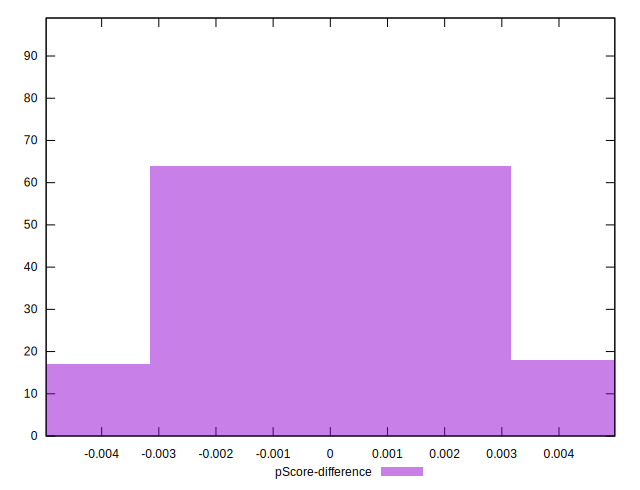

# //largest-contentful-paint/samples/card

[→ Parent](../..)


## Raw


```yaml
p90min: 1900.721
p90max: 8430.99
p90range: 6530.269
p90mean: 3428.0346236559135
median: 2381.388
p90stdev: 1953.8353709844184
mad: 309.0340000000001
stdevBySn: 514.9294983000001
lfitCenter: 3156.6960678306614
lfitStdev: 1533.1688554413824
mfitCenter: 3156.6960678306614
mfitStdev: 1921.5422033500465
mfitConfidence: 193.12225779833034
p90skewness: 1.494601495832
p90eccentricity: 1.0000000000000002
p90discretization: 1
outlandishness: 1.0702037263466246

```


## Score


```yaml
p90min: 0.02
p90max: 0.98
p90range: 0.96
p90mean: 0.7133333333333335
median: 0.92
p90stdev: 0.3404687891947963
mad: 0.04999999999999993
stdevBySn: 0.07155599999999994
lfitCenter: 0.7648145806935982
lfitStdev: 0.2954516092364072
mfitCenter: 0.7648145806935982
mfitStdev: 0.3702936791212092
mfitConfidence: 0.037215915026827584
p90skewness: -1.0872116373850005
p90eccentricity: 0.9999999999999992
p90discretization: 2.4473684210526314
outlandishness: 0.9635221027720571

```


## Raw Estimate


## Score Estimate


## P Score


```yaml
p90min: 0.02102265814006088
p90max: 0.978761740304478
p90range: 0.9577390821644172
p90mean: 0.7133692582786718
median: 0.9213319324712685
p90stdev: 0.34044945500380475
mad: 0.04500978837080116
stdevBySn: 0.06712492558105586
lfitCenter: 0.7648040618044482
lfitStdev: 0.29508047986804403
mfitCenter: 0.7648040618044482
mfitStdev: 0.36982853743659866
mfitConfidence: 0.037169166528578886
p90skewness: -1.0885113306498078
p90eccentricity: 1.0000000000000007
p90discretization: 1
outlandishness: 0.963668487338421

```


## Score Difference


```yaml
p90min: 0
p90max: 1.1102230246251565e-16
p90range: 1.1102230246251565e-16
p90mean: 1.9697505275607617e-17
median: 0
p90stdev: 4.202066629373935e-17
mad: 0
stdevBySn: 0
lfitCenter: 1.3300715764488378e-17
lfitStdev: 2.9212200245767904e-17
mfitCenter: 1.3300715764488378e-17
mfitStdev: 3.661206358695286e-17
mfitConfidence: 3.679650839956245e-18
p90skewness: 1.6885796997974458
p90eccentricity: 1.0000000000000022
p90discretization: 31
outlandishness: 1.232528136359842

```


## P Score Difference


```yaml
p90min: -0.004722887331517822
p90max: 0.004666802951594606
p90range: 0.009389690283112428
p90mean: 0.00009253674034658856
median: 0.00025545310512031794
p90stdev: 0.002561511233762765
mad: 0.002195677085536807
stdevBySn: 0.0028830941329199586
lfitCenter: 0.0001329476747412199
lfitStdev: 0.0020733457803341617
mfitCenter: 0.0001329476747412199
mfitStdev: 0.0025985535806510177
mfitConfidence: 0.00026116446135315016
p90skewness: -0.1131315760951953
p90eccentricity: 0.9999999999999997
p90discretization: 1
outlandishness: 0.9137044012025654

```

