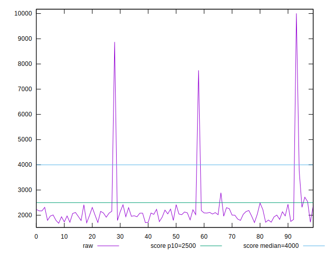

# //largest-contentful-paint/samples/music

[→ Parent](../..)


## Raw


```yaml
p90min: 1709.655
p90max: 3763.5649999999996
p90range: 2053.91
p90mean: 2075.6675585106377
median: 2041.0007500000002
p90stdev: 285.3918319567354
mad: 145.83825000000002
stdevBySn: 237.71514407500044
lfitCenter: 2153.2882415885415
lfitStdev: 335.4716701886124
mfitCenter: 2153.2882415885415
mfitStdev: 420.45138733930685
mfitConfidence: 42.045138733930685
p90skewness: 2.47290948572829
p90eccentricity: 1.0000000000000007
p90discretization: 1
outlandishness: 1.1941747044717037

```


## Score


```yaml
p90min: 0.57
p90max: 0.99
p90range: 0.42000000000000004
p90mean: 0.9557446808510636
median: 0.97
p90stdev: 0.04964746702848951
mad: 0.015000000000000013
stdevBySn: 0.023852000000000022
lfitCenter: 0.9473086344261151
lfitStdev: 0.04726273747132302
mfitCenter: 0.9473086344261151
mfitStdev: 0.059235057100645014
mfitConfidence: 0.005923505710064501
p90skewness: -5.363798316770351
p90eccentricity: 0.9999999999999996
p90discretization: 6.714285714285714
outlandishness: 0.9442067738560053

```


## Raw Estimate


## Score Estimate


## P Score


```yaml
p90min: 0.5659729356503225
p90max: 0.9897669178325682
p90range: 0.42379398218224573
p90mean: 0.9559108633864798
median: 0.9667196875120189
p90stdev: 0.049412988549724236
mad: 0.01607475898677302
stdevBySn: 0.022225644281119936
lfitCenter: 0.9474075474408252
lfitStdev: 0.046632989776476556
mfitCenter: 0.9474075474408252
mfitStdev: 0.05844578541095789
mfitConfidence: 0.005844578541095789
p90skewness: -5.5881209792534
p90eccentricity: 0.9999999999999994
p90discretization: 1
outlandishness: 0.9441548563668364

```


## Score Difference


```yaml
p90min: 0
p90max: 1.1102230246251565e-16
p90range: 1.1102230246251565e-16
p90mean: 1.299197156476247e-17
median: 0
p90stdev: 3.5687634714391856e-17
mad: 0
stdevBySn: 0
lfitCenter: 8.673082431196366e-18
lfitStdev: 2.004184579420307e-17
mfitCenter: 8.673082431196366e-18
mfitStdev: 2.511872869704744e-17
mfitConfidence: 2.511872869704744e-18
p90skewness: 2.382852212357381
p90eccentricity: 1.0000000000000002
p90discretization: 47
outlandishness: 1.4312859504132236

```


## P Score Difference


```yaml
p90min: -0.004507661346874414
p90max: 0.004689182903867106
p90range: 0.00919684425074152
p90mean: 0.00014080410364787708
median: 0.0001612095006363612
p90stdev: 0.002937616678909027
mad: 0.002806946746844119
stdevBySn: 0.003593378699445957
lfitCenter: 0.00019888857431982727
lfitStdev: 0.0026083358631674362
mfitCenter: 0.00019888857431982727
mfitStdev: 0.0032690642154642475
mfitConfidence: 0.00032690642154642474
p90skewness: -0.14648270313130196
p90eccentricity: 0.9999999999999996
p90discretization: 1
outlandishness: 0.9321422219157152

```

