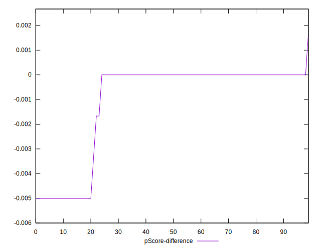

# //legacy-javascript/samples/astro

[→ Parent](../..)


## Raw


```yaml
p90min: 0
p90max: 150
p90range: 150
p90mean: 37.5531914893617
median: 0
p90stdev: 63.59255560293404
mad: 0
stdevBySn: 0
lfitCenter: 29.33658972093958
lfitStdev: 59.24845528122239
mfitCenter: 29.33658972093958
mfitStdev: 74.25692669278172
mfitConfidence: 7.425692669278172
p90skewness: 1.1386142946263142
p90eccentricity: 1.000000000000002
p90discretization: 18.8
outlandishness: 1.416841740163231

```


## Score


```yaml
p90min: 0.88
p90max: 1
p90range: 0.12
p90mean: 0.9698936170212764
median: 1
p90stdev: 0.0509796513608577
mad: 0
stdevBySn: 0
lfitCenter: 0.976435035908874
lfitStdev: 0.0475920253321107
mfitCenter: 0.976435035908874
mfitStdev: 0.05964775823223187
mfitConfidence: 0.005964775823223187
p90skewness: -1.1355966206411579
p90eccentricity: 1.0000000000000027
p90discretization: 18.8
outlandishness: 0.9880887698172209

```


## Raw Estimate


## Score Estimate


## P Score


```yaml
p90min: 0.875
p90max: 1
p90range: 0.125
p90mean: 0.9687056737588653
median: 1
p90stdev: 0.052993796335778456
mad: 0
stdevBySn: 0
lfitCenter: 0.975669181933031
lfitStdev: 0.04913875129689787
mfitCenter: 0.975669181933031
mfitStdev: 0.06158629175240322
mfitConfidence: 0.006158629175240322
p90skewness: -1.1386142946263094
p90eccentricity: 0.9999999999999997
p90discretization: 18.8
outlandishness: 0.9882546975586438

```


## Score Difference


```yaml
p90min: 0
p90max: 0
p90range: 0
p90mean: 0
median: 0
p90stdev: 0
mad: 0
stdevBySn: 0
lfitCenter: 5.166535369026208e-19
lfitStdev: 1.2890316797319448e-18
mfitCenter: 5.166535369026208e-19
mfitStdev: 1.6155616292812394e-18
mfitConfidence: 1.6155616292812395e-19
p90skewness: .nan
p90eccentricity: .nan
p90discretization: 94
outlandishness: .inf

```


## P Score Difference


```yaml
p90min: -0.0050000000000000044
p90max: 0
p90range: 0.0050000000000000044
p90mean: -0.0010283687943262424
median: 0
p90stdev: 0.0019766124126768506
mad: 0
stdevBySn: 0
lfitCenter: -0.0007008471946964503
lfitStdev: 0.0015018839078591844
mfitCenter: -0.0007008471946964503
mfitStdev: 0.0018823323362206488
mfitConfidence: 0.0001882332336220649
p90skewness: -1.4616338826122397
p90eccentricity: 0.9999999999999983
p90discretization: 23.5
outlandishness: 1.1441621878715826

```

