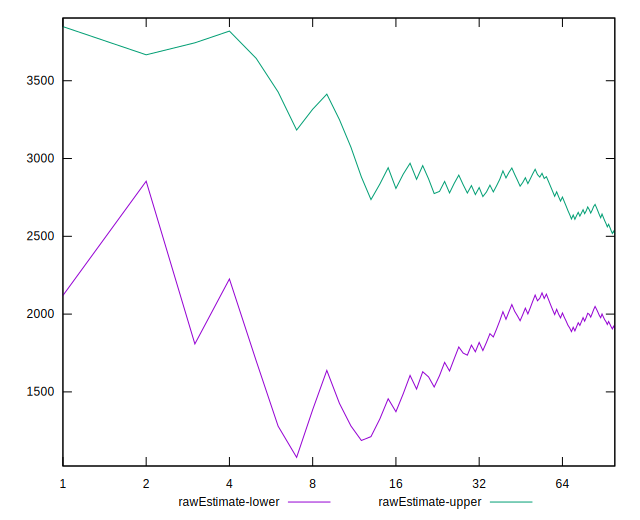

# //mainthread-work-breakdown/samples/agenda

[→ Parent](../..)


## Raw


```yaml
p90min: 1037.4160000000006
p90max: 3881.2079999999874
p90range: 2843.7919999999867
p90mean: 2251.5154893616973
median: 1599.6940000000004
p90stdev: 1080.5384393702345
mad: 565.928
stdevBySn: 775.66704
lfitCenter: 2210.1949030162737
lfitStdev: 1236.512972121817
mfitCenter: 2210.1949030162737
mfitStdev: 1549.7391904936937
mfitConfidence: 154.97391904936939
p90skewness: 0.17305234301512232
p90eccentricity: 1.0000000000000007
p90discretization: 1
outlandishness: 1.0176905002105792

```


## Score


```yaml
p90min: 0.52
p90max: 0.99
p90range: 0.47
p90mean: 0.8144680851063827
median: 0.955
p90stdev: 0.18275443948548098
mad: 0.03500000000000003
stdevBySn: 0.05068550000000005
lfitCenter: 0.8257344104935548
lfitStdev: 0.2101962716772887
mfitCenter: 0.8257344104935548
mfitStdev: 0.26344195916924207
mfitConfidence: 0.026344195916924208
p90skewness: -0.24567572859412723
p90eccentricity: 1.0000000000000004
p90discretization: 3.6153846153846154
outlandishness: 0.9875935793182071

```


## Raw Estimate


## Score Estimate


## P Score


```yaml
p90min: 0.5225001146632778
p90max: 0.9942320562523539
p90range: 0.47173194158907605
p90mean: 0.8151704275225222
median: 0.9566947850249277
p90stdev: 0.18301263947086585
mad: 0.03764397953966592
stdevBySn: 0.04992684798171175
lfitCenter: 0.8265320927507943
lfitStdev: 0.2104047023566403
mfitCenter: 0.8265320927507943
mfitStdev: 0.2637031882865866
mfitConfidence: 0.026370318828658663
p90skewness: -0.24614433896360466
p90eccentricity: 1.0000000000000002
p90discretization: 1
outlandishness: 0.9878402938373653

```


## Score Difference


```yaml
p90min: 0
p90max: 1.1102230246251565e-16
p90range: 1.1102230246251565e-16
p90mean: 1.1810883240693154e-18
median: 0
p90stdev: 1.139000331521095e-17
mad: 0
stdevBySn: 0
lfitCenter: 2.1510305028010703e-18
lfitStdev: 5.2873683940481196e-18
mfitCenter: 2.1510305028010703e-18
mfitStdev: 6.626733564123762e-18
mfitConfidence: 6.626733564123762e-19
p90skewness: 9.539955591519895
p90eccentricity: 1.0000000000000018
p90discretization: 47
outlandishness: 14.137600000000003

```


## P Score Difference


```yaml
p90min: -0.004253818859418224
p90max: 0.004858605320704923
p90range: 0.009112424180123146
p90mean: 0.0008434818109522916
median: 0.0012318056596321014
p90stdev: 0.002407613070668032
mad: 0.002047037129242424
stdevBySn: 0.0026817108885697823
lfitCenter: 0.0009013981033706963
lfitStdev: 0.002038986973654855
mfitCenter: 0.0009013981033706963
mfitStdev: 0.002555491202455221
mfitConfidence: 0.0002555491202455221
p90skewness: -0.26447132893947367
p90eccentricity: 0.9999999999999994
p90discretization: 1
outlandishness: 0.8976518709731575

```

