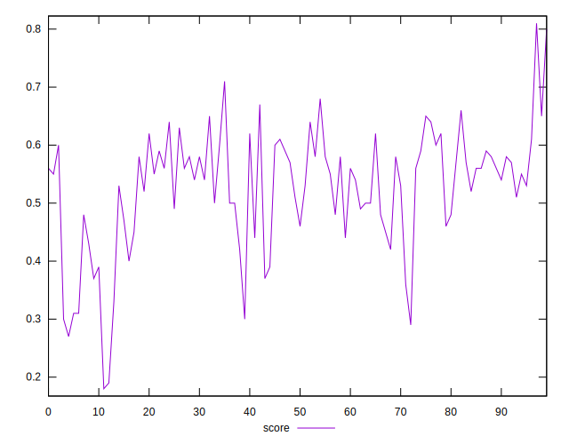

# //mainthread-work-breakdown/samples/astro

[→ Parent](../..)


## Raw


```yaml
p90min: 3108.5359999999982
p90max: 5413.367999999984
p90range: 2304.831999999986
p90mean: 3894.9644680851056
median: 3752.659999999998
p90stdev: 520.5687721811231
mad: 294.7099999999991
stdevBySn: 461.3418062000003
lfitCenter: 3862.8217884704072
lfitStdev: 426.85386724982845
mfitCenter: 3862.8217884704072
mfitStdev: 534.9819869303254
mfitConfidence: 53.49819869303254
p90skewness: 1.138021719566686
p90eccentricity: 1.0000000000000002
p90discretization: 1
outlandishness: 1.0163929746618334

```


## Score


```yaml
p90min: 0.29
p90max: 0.68
p90range: 0.39000000000000007
p90mean: 0.5260638297872341
median: 0.55
p90stdev: 0.09202472014218584
mad: 0.05499999999999999
stdevBySn: 0.09540799999999997
lfitCenter: 0.5319548476137714
lfitStdev: 0.07626613305620604
mfitCenter: 0.5319548476137714
mfitStdev: 0.09558542285391014
mfitConfidence: 0.009558542285391014
p90skewness: -0.8240066678889681
p90eccentricity: 0.9999999999999997
p90discretization: 2.6857142857142855
outlandishness: 0.9925478083631786

```


## Raw Estimate


## Score Estimate


## P Score


```yaml
p90min: 0.28557896270823746
p90max: 0.6815173955648407
p90range: 0.39593843285660324
p90mean: 0.52604107788679
median: 0.547549541313106
p90stdev: 0.09204440069245289
mad: 0.05796012346142118
stdevBySn: 0.09133686089350011
lfitCenter: 0.5318828290762141
lfitStdev: 0.07610398947312602
mfitCenter: 0.5318828290762141
mfitStdev: 0.09538220600875648
mfitConfidence: 0.009538220600875648
p90skewness: -0.8305453784757689
p90eccentricity: 0.9999999999999996
p90discretization: 1
outlandishness: 0.9924293326990603

```


## Score Difference


```yaml
p90min: 0
p90max: 1.1102230246251565e-16
p90range: 1.1102230246251565e-16
p90mean: 1.771632486103973e-18
median: 0
p90stdev: 1.2679520880987273e-17
mad: 0
stdevBySn: 0
lfitCenter: 2.4383062820427357e-18
lfitStdev: 5.961880506742725e-18
mfitCenter: 2.4383062820427357e-18
mfitStdev: 7.47210913160511e-18
mfitConfidence: 7.47210913160511e-19
p90skewness: 7.612377922141545
p90eccentricity: 1.0000000000000022
p90discretization: 31.333333333333332
outlandishness: 7.952400000000002

```


## P Score Difference


```yaml
p90min: -0.004724807008143261
p90max: 0.004866127661831143
p90range: 0.009590934669974405
p90mean: -0.00006182054298134159
median: -0.0001874294052711667
p90stdev: 0.0027277989108129
mad: 0.002576540196771504
stdevBySn: 0.003219746433498903
lfitCenter: -0.00006061103400596998
lfitStdev: 0.0024160058237113445
mfitCenter: -0.00006061103400596998
mfitStdev: 0.003028014257740925
mfitConfidence: 0.00030280142577409247
p90skewness: 0.001518633126728189
p90eccentricity: 0.9999999999999999
p90discretization: 1
outlandishness: 0.7614756659533811

```

