# //mainthread-work-breakdown/samples/card

[→ Parent](../..)


## Raw


```yaml
p90min: 1119.0480000000007
p90max: 4235.147999999983
p90range: 3116.099999999982
p90mean: 2584.2469677419294
median: 3177.871999999988
p90stdev: 1128.2273628947617
mad: 870.919999999991
stdevBySn: 1260.907357599994
lfitCenter: 2636.224169747109
lfitStdev: 1223.461952669347
mfitCenter: 2636.224169747109
mfitStdev: 1533.3821632910744
mfitConfidence: 154.11070593515058
p90skewness: -0.17966551593615646
p90eccentricity: 0.9999999999999997
p90discretization: 1
outlandishness: 1.0072588142148071

```

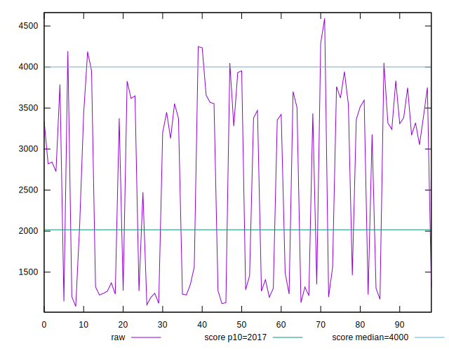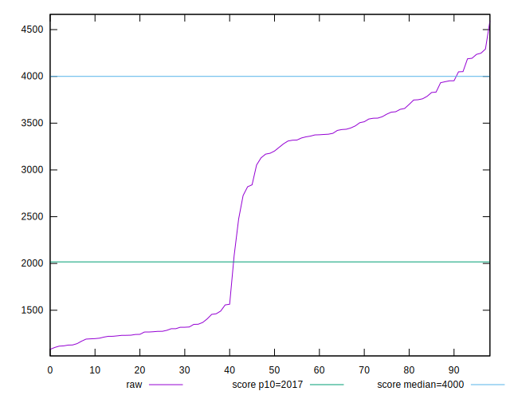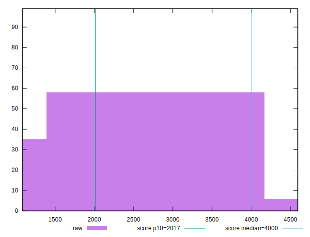
## Score


```yaml
p90min: 0.46
p90max: 0.99
p90range: 0.53
p90mean: 0.758494623655914
median: 0.67
p90stdev: 0.19702052857703015
mad: 0.18000000000000005
stdevBySn: 0.25044600000000006
lfitCenter: 0.7526414925284336
lfitStdev: 0.2132973921804257
mfitCenter: 0.7526414925284336
mfitStdev: 0.2673286373412536
mfitConfidence: 0.026867538962967577
p90skewness: 0.1092532438149242
p90eccentricity: 0.9999999999999993
p90discretization: 3.206896551724138
outlandishness: 0.9927959685981017

```

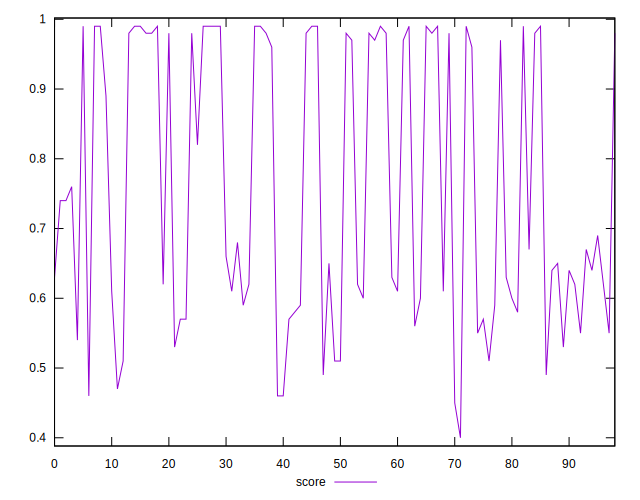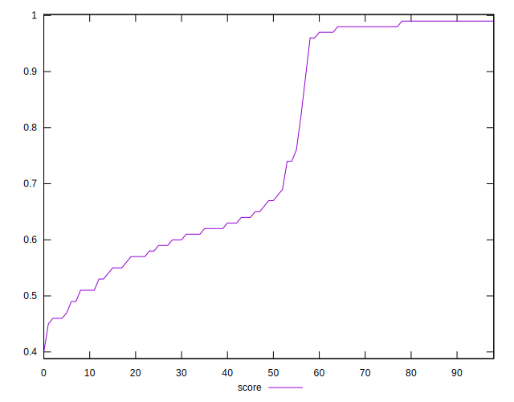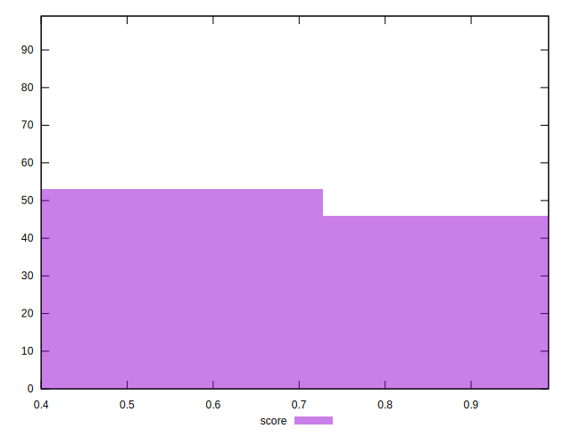
## Raw Estimate

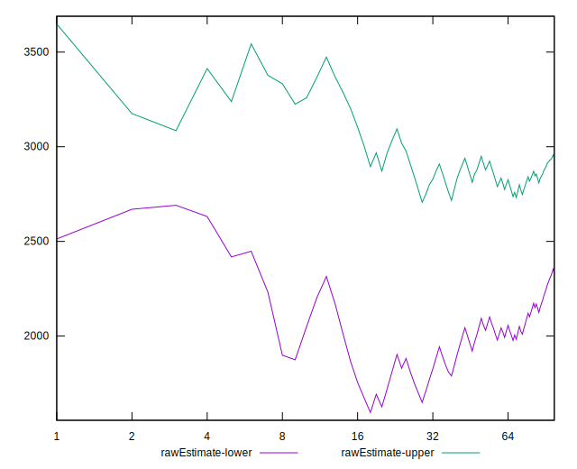
## Score Estimate

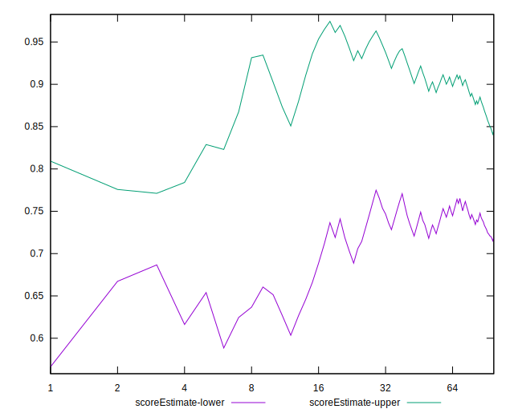
## P Score


```yaml
p90min: 0.4574256358096427
p90max: 0.9914432026630028
p90range: 0.5340175668533601
p90mean: 0.7585587492736364
median: 0.6666405965002571
p90stdev: 0.1968293757582945
mad: 0.17569322344763738
stdevBySn: 0.24079161238708266
lfitCenter: 0.7527813221120838
lfitStdev: 0.2132498818498765
mfitCenter: 0.7527813221120838
mfitStdev: 0.26726909197224785
mfitConfidence: 0.02686155442821014
p90skewness: 0.10791125210984899
p90eccentricity: 1.0000000000000007
p90discretization: 1
outlandishness: 0.9927109986410576

```

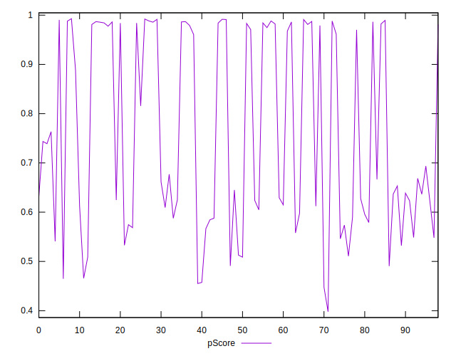
## Score Difference


```yaml
p90min: 0
p90max: 1.1102230246251565e-16
p90range: 1.1102230246251565e-16
p90mean: 4.178258694825858e-18
median: 0
p90stdev: 2.0329480471708805e-17
mad: 0
stdevBySn: 0
lfitCenter: 3.6584064800840644e-18
lfitStdev: 8.842742181505509e-18
mfitCenter: 3.6584064800840644e-18
mfitStdev: 1.108273379986888e-17
mfitConfidence: 1.1138566565319644e-18
p90skewness: 4.847654779392054
p90eccentricity: 1.0000000000000024
p90discretization: 31
outlandishness: 3.0435898877457324

```

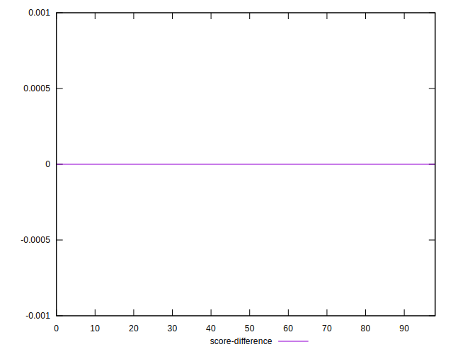
## P Score Difference


```yaml
p90min: -0.00430999399038523
p90max: 0.004735840180382311
p90range: 0.009045834170767542
p90mean: 0.000029806379221478793
median: -0.00041372889225332887
p90stdev: 0.002707177906292174
mad: 0.002355316997548651
stdevBySn: 0.0032471536106703338
lfitCenter: -0.000024755088652120237
lfitStdev: 0.002528697989194689
mfitCenter: -0.000024755088652120237
mfitStdev: 0.003169252942048019
mfitConfidence: 0.0003185219052879771
p90skewness: 0.14287753106744397
p90eccentricity: 0.9999999999999997
p90discretization: 1
outlandishness: 1.1203801791757515

```

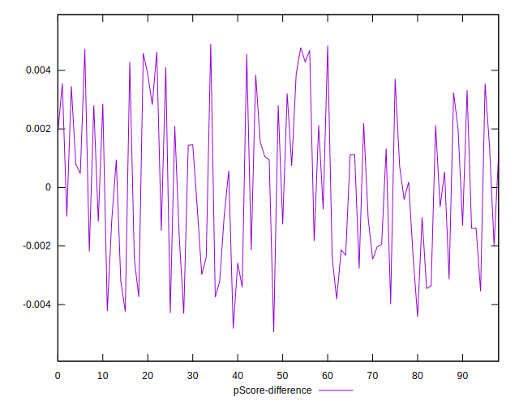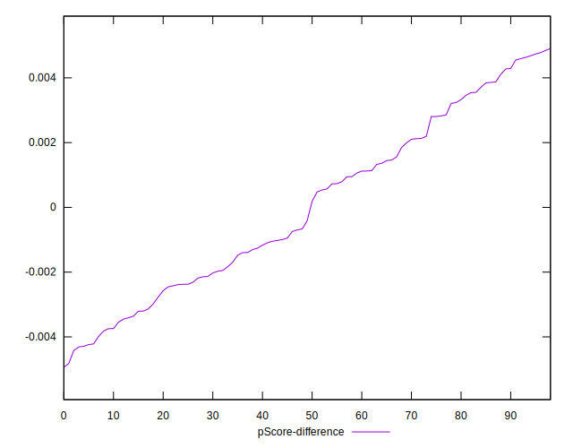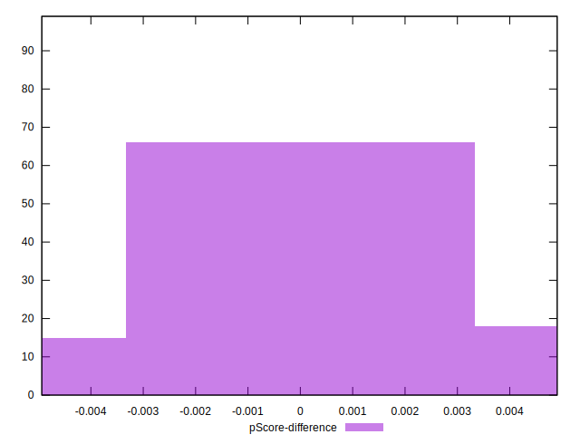