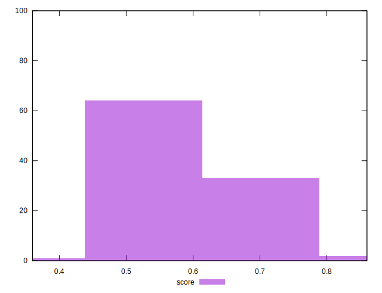

# //mainthread-work-breakdown/samples/music

[→ Parent](../..)


## Raw


```yaml
p90min: 2820.6679999999938
p90max: 4254.675999999988
p90range: 1434.007999999994
p90mean: 3550.7599999999916
median: 3537.4939999999915
p90stdev: 350.7090043285254
mad: 275.41200000000003
stdevBySn: 403.4518096000008
lfitCenter: 3546.9104474673222
lfitStdev: 294.39010204412074
mfitCenter: 3546.9104474673222
mfitStdev: 368.9632771489158
mfitConfidence: 36.89632771489158
p90skewness: 0.04128880245953821
p90eccentricity: 0.9999999999999996
p90discretization: 1
outlandishness: 0.9975971823704581

```


## Score


```yaml
p90min: 0.45
p90max: 0.74
p90range: 0.29
p90mean: 0.5904255319148939
median: 0.59
p90stdev: 0.07126389216738534
mad: 0.05999999999999994
stdevBySn: 0.08348199999999999
lfitCenter: 0.5909088636686636
lfitStdev: 0.060126457921200804
mfitCenter: 0.5909088636686636
mfitStdev: 0.07535733981517427
mfitConfidence: 0.007535733981517427
p90skewness: 0.05804108941424666
p90eccentricity: 1.0000000000000002
p90discretization: 3.1333333333333333
outlandishness: 1.005000831088386

```


## Raw Estimate


## Score Estimate


## P Score


```yaml
p90min: 0.4540116803560713
p90max: 0.7433922373842247
p90range: 0.28938055702815335
p90mean: 0.5902135964162804
median: 0.5909512444320683
p90stdev: 0.07117915980934572
mad: 0.056308876552179477
stdevBySn: 0.08349137917256129
lfitCenter: 0.5906204827129138
lfitStdev: 0.05975246315979795
mfitCenter: 0.5906204827129138
mfitStdev: 0.07488860689295448
mfitConfidence: 0.007488860689295449
p90skewness: 0.06678930090374693
p90eccentricity: 1.0000000000000004
p90discretization: 1
outlandishness: 1.0051044991409732

```


## Score Difference


```yaml
p90min: 0
p90max: 1.1102230246251565e-16
p90range: 1.1102230246251565e-16
p90mean: 1.3582515726797127e-17
median: 0
p90stdev: 3.592625292827252e-17
mad: 0
stdevBySn: 0
lfitCenter: 9.052266367611218e-18
lfitStdev: 2.0763073095614967e-17
mfitCenter: 9.052266367611218e-18
mfitStdev: 2.6022653071034446e-17
mfitConfidence: 2.6022653071034446e-18
p90skewness: 2.304508210444721
p90eccentricity: 1.000000000000001
p90discretization: 31.333333333333332
outlandishness: 1.4047402646502833

```


## P Score Difference


```yaml
p90min: -0.004733078063183793
p90max: 0.004646558274533641
p90range: 0.009379636337717434
p90mean: -0.0001949417513371248
median: 0.00010211102335910827
p90stdev: 0.0027765295427123818
mad: 0.0026975586752740477
stdevBySn: 0.0033484884840390607
lfitCenter: -0.00015823158933186415
lfitStdev: 0.002476466724561261
mfitCenter: -0.00015823158933186415
mfitStdev: 0.0031037907596072056
mfitConfidence: 0.0003103790759607206
p90skewness: -0.047120622768883694
p90eccentricity: 1
p90discretization: 1
outlandishness: 0.8711396435013629

```

