# //max-potential-fid/samples/agenda

[→ Parent](../..)


## Raw


```yaml
p90min: 42
p90max: 1004
p90range: 962
p90mean: 388.7659574468085
median: 222
p90stdev: 345.13017665962593
mad: 180
stdevBySn: 243.88670000000002
lfitCenter: 371.41711030447794
lfitStdev: 389.4530123191958
mfitCenter: 371.41711030447794
mfitStdev: 488.1069666509098
mfitConfidence: 48.81069666509098
p90skewness: 0.25226153021582143
p90eccentricity: 0.9999999999999994
p90discretization: 1.2533333333333334
outlandishness: 1.0527083435058784

```

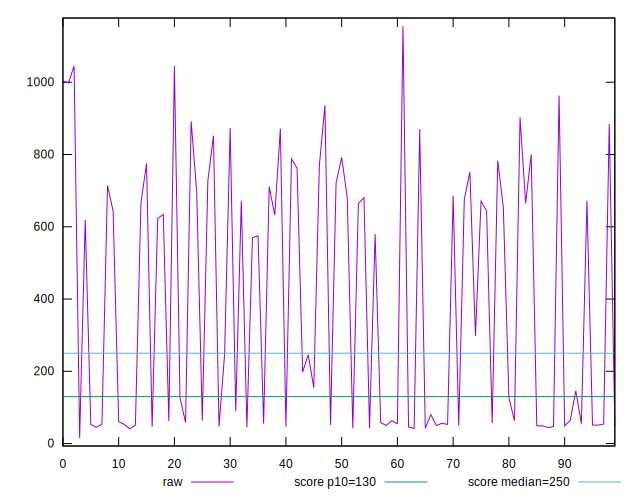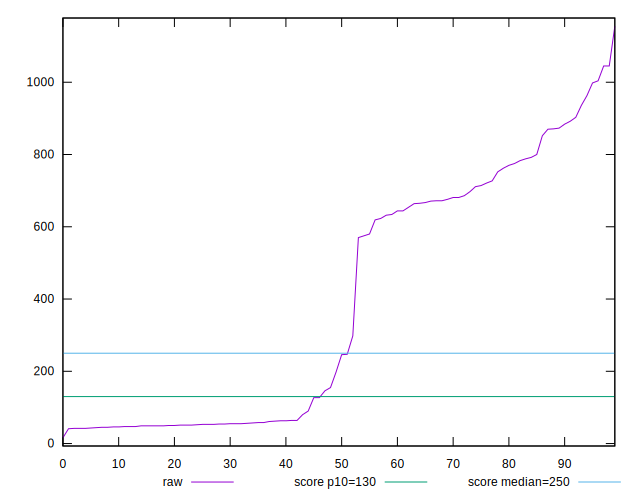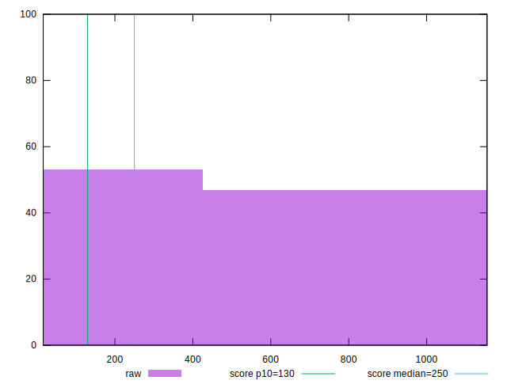
## Score


```yaml
p90min: 0
p90max: 1
p90range: 1
p90mean: 0.5154255319148936
median: 0.595
p90stdev: 0.4746973613577772
mad: 0.405
stdevBySn: 0.483003
lfitCenter: 0.5205826245186316
lfitStdev: 0.5639494339891348
mfitCenter: 0.5205826245186316
mfitStdev: 0.7068057990608752
mfitConfidence: 0.07068057990608752
p90skewness: -0.038624752589203025
p90eccentricity: 1.0000000000000013
p90discretization: 6.266666666666667
outlandishness: 0.9964118931457221

```

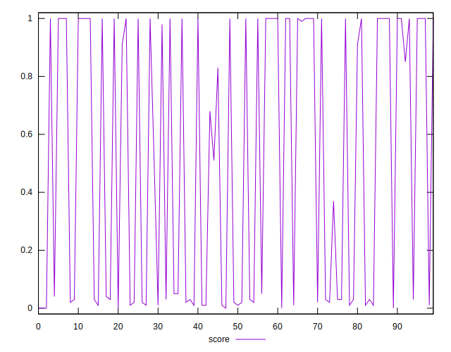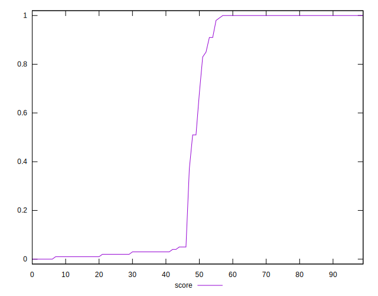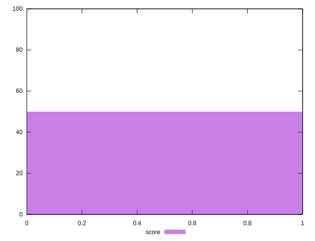
## Raw Estimate

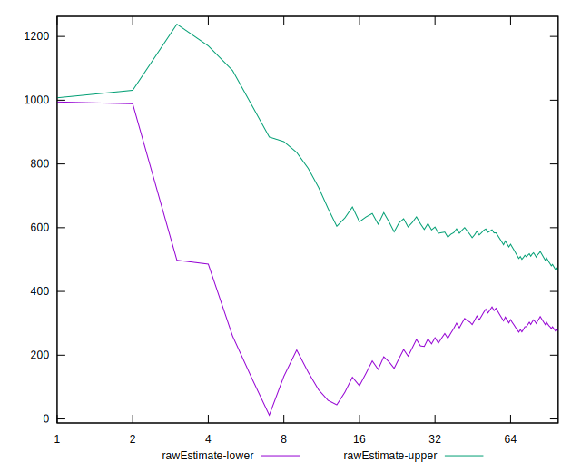
## Score Estimate

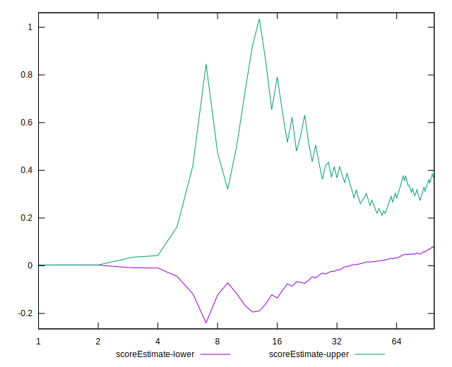
## P Score


```yaml
p90min: 0.003218492879378698
p90max: 0.9997636670093073
p90range: 0.9965451741299286
p90mean: 0.5148026258838667
median: 0.5943880314697708
p90stdev: 0.4739177667582857
mad: 0.4053756355395365
stdevBySn: 0.4836148670350139
lfitCenter: 0.5198305730311567
lfitStdev: 0.5628030855137985
mfitCenter: 0.5198305730311567
mfitStdev: 0.7053690643090005
mfitConfidence: 0.07053690643090005
p90skewness: -0.03833718729780886
p90eccentricity: 1.0000000000000007
p90discretization: 1.323943661971831
outlandishness: 0.9967844642725017

```

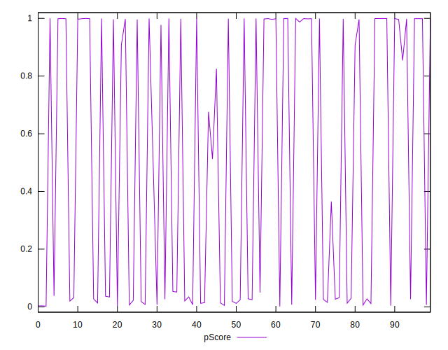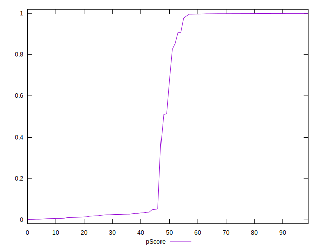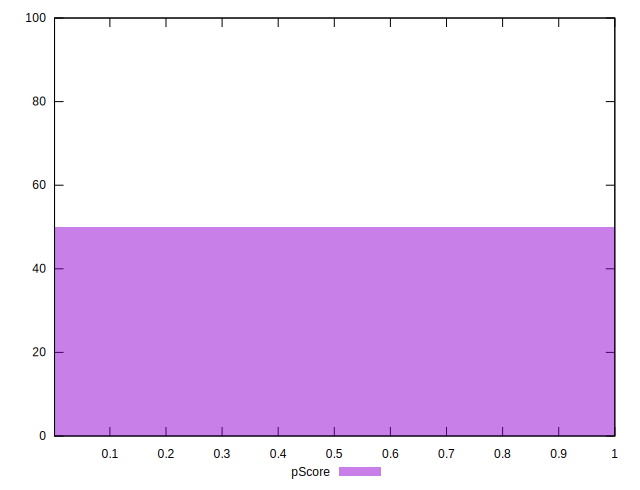
## Score Difference


```yaml
p90min: 0
p90max: 0
p90range: 0
p90mean: 0
median: 0
p90stdev: 0
mad: 0
stdevBySn: 0
lfitCenter: 5.166535369026208e-19
lfitStdev: 1.2890316797319448e-18
mfitCenter: 5.166535369026208e-19
mfitStdev: 1.6155616292812394e-18
mfitConfidence: 1.6155616292812395e-19
p90skewness: .nan
p90eccentricity: .nan
p90discretization: 94
outlandishness: .inf

```

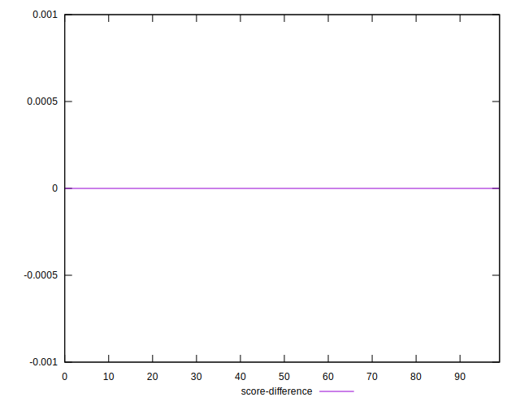
## P Score Difference


```yaml
p90min: -0.004379543250685319
p90max: 0.004566020827585587
p90range: 0.008945564078270907
p90mean: -0.000567386266797238
median: -0.0007536018965672575
p90stdev: 0.0023034630041920768
mad: 0.0017620556895123624
stdevBySn: 0.002406421511644676
lfitCenter: -0.0006618189980286986
lfitStdev: 0.001738492546828056
mfitCenter: -0.0006618189980286986
mfitStdev: 0.002178877288749711
mfitConfidence: 0.0002178877288749711
p90skewness: 0.5705559391070568
p90eccentricity: 1.0000000000000002
p90discretization: 1.3428571428571427
outlandishness: 0.8585338397634932

```

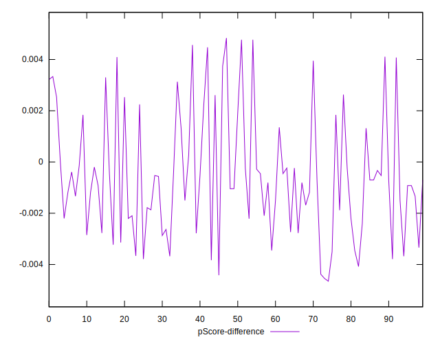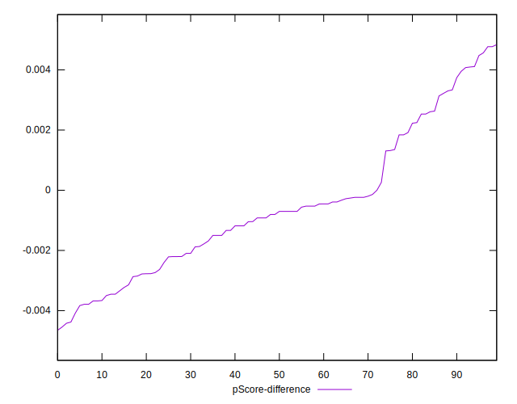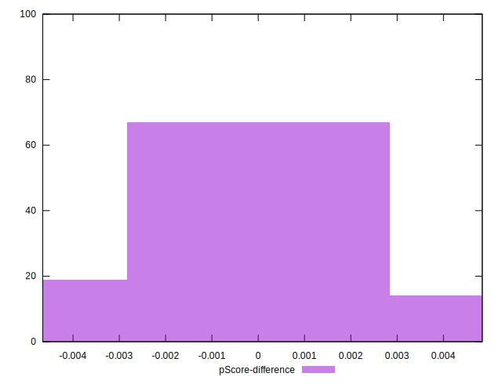