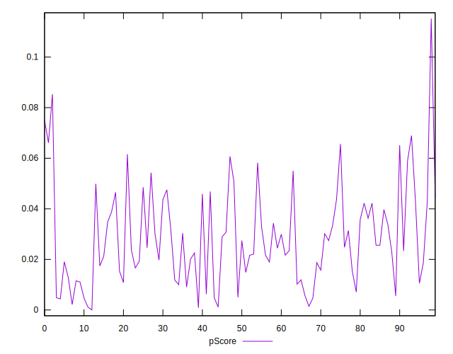

# //max-potential-fid/samples/astro

[→ Parent](../..)


## Raw


```yaml
p90min: 532.9999999999982
p90max: 1186
p90range: 653.0000000000018
p90mean: 707.9042553191489
median: 682.5
p90stdev: 132.95008415006464
mad: 82
stdevBySn: 115.08589999999947
lfitCenter: 705.7554748031869
lfitStdev: 109.58017495946433
mfitCenter: 705.7554748031869
mfitStdev: 137.33838258439835
mfitConfidence: 13.733838258439835
p90skewness: 1.2938851706644838
p90eccentricity: 1.0000000000000007
p90discretization: 1.0561797752808988
outlandishness: 1.0530245509157823

```


## Score


```yaml
p90min: 0
p90max: 0.07
p90range: 0.07
p90mean: 0.027553191489361705
median: 0.02
p90stdev: 0.018082916012538554
mad: 0.01
stdevBySn: 0.011926000000000003
lfitCenter: 0.027077108749252326
lfitStdev: 0.015591915641297884
mfitCenter: 0.027077108749252326
mfitStdev: 0.01954156832073287
mfitConfidence: 0.001954156832073287
p90skewness: 0.5829262080747828
p90eccentricity: 1.0000000000000002
p90discretization: 11.75
outlandishness: 1.0925495803580745

```


## Raw Estimate


## Score Estimate


## P Score


```yaml
p90min: 0.0011399307132050618
p90max: 0.06894807674135972
p90range: 0.06780814602815466
p90mean: 0.027848481145682846
median: 0.024522045309588014
p90stdev: 0.017383284673733648
mad: 0.013595988880249349
stdevBySn: 0.018132635114660185
lfitCenter: 0.027488535545851712
lfitStdev: 0.014962470607007599
mfitCenter: 0.027488535545851712
mfitStdev: 0.018752675959799996
mfitConfidence: 0.0018752675959799996
p90skewness: 0.518953491138603
p90eccentricity: 0.9999999999999997
p90discretization: 1.0561797752808988
outlandishness: 1.0809500920770543

```


## Score Difference


```yaml
p90min: 0
p90max: 0
p90range: 0
p90mean: 0
median: 0
p90stdev: 0
mad: 0
stdevBySn: 0
lfitCenter: 0
lfitStdev: 0
mfitCenter: 0
mfitStdev: 0
mfitConfidence: 0
p90skewness: .nan
p90eccentricity: .nan
p90discretization: 94
outlandishness: .nan

```


## P Score Difference


```yaml
p90min: -0.004843381874879982
p90max: 0.004804045665204509
p90range: 0.009647427540084491
p90mean: 0.00016631016388952817
median: 0.00045107975255422473
p90stdev: 0.002901453330369552
mad: 0.002448054676561011
stdevBySn: 0.0034206231722667814
lfitCenter: 0.00023551954617824662
lfitStdev: 0.0024497391203890636
mfitCenter: 0.00023551954617824662
mfitStdev: 0.0030702926754079107
mfitConfidence: 0.00030702926754079107
p90skewness: -0.19103670972506115
p90eccentricity: 0.9999999999999997
p90discretization: 1.0561797752808988
outlandishness: 0.8542991665846837

```

