# //max-potential-fid/samples/card

[→ Parent](../..)


## Raw


```yaml
p90min: 50
p90max: 941
p90range: 891
p90mean: 436.19354838709677
median: 605
p90stdev: 317.64466717077534
mad: 245.9999999999991
stdevBySn: 368.51340000000005
lfitCenter: 453.11137596499094
lfitStdev: 352.495789265993
mfitCenter: 453.11137596499094
mfitStdev: 441.7879564758002
mfitConfidence: 44.40136025842701
p90skewness: -0.15992013117295226
p90eccentricity: 0.9999999999999992
p90discretization: 1.1772151898734178
outlandishness: 1.050305046369883

```

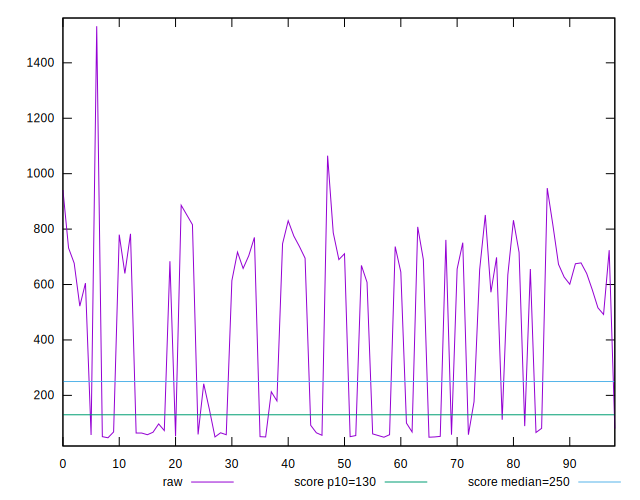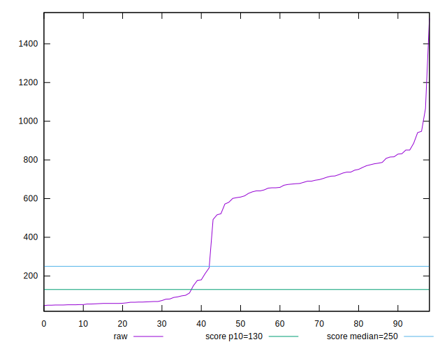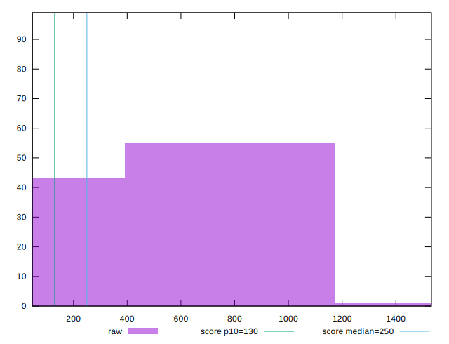
## Score


```yaml
p90min: 0
p90max: 1
p90range: 1
p90mean: 0.42602150537634415
median: 0.04
p90stdev: 0.4660682948361722
mad: 0.030000000000000006
stdevBySn: 0.047704
lfitCenter: 0.38271781452554376
lfitStdev: 0.5391100620983892
mfitCenter: 0.38271781452554376
mfitStdev: 0.6756742630768405
mfitConfidence: 0.06790781851896259
p90skewness: 0.3328077651779048
p90eccentricity: 1.0000000000000009
p90discretization: 4.65
outlandishness: 1.0211592043367506

```

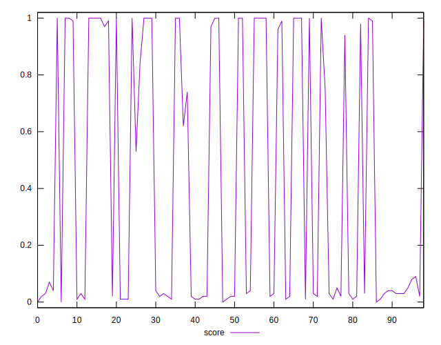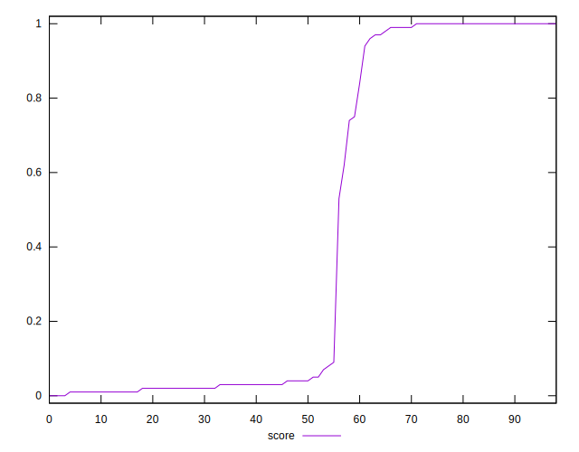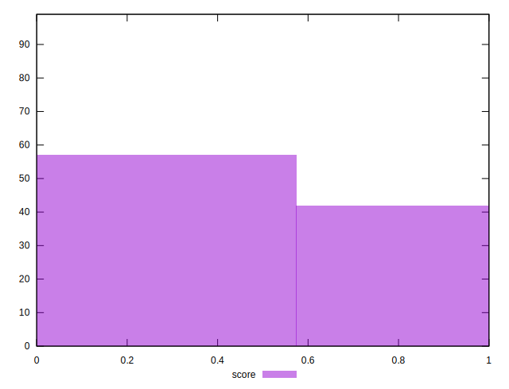
## Raw Estimate

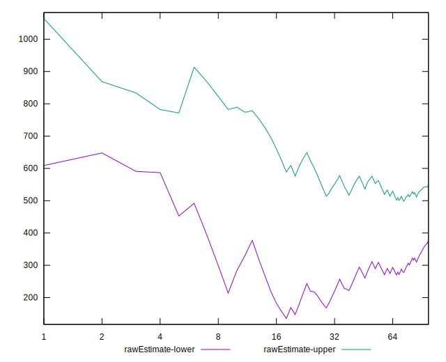
## Score Estimate

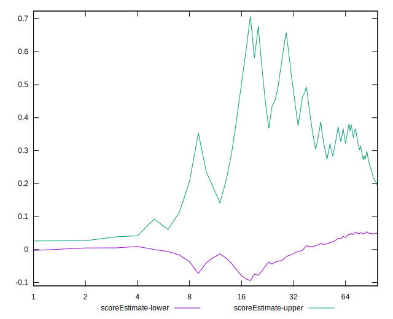
## P Score


```yaml
p90min: 0.0046932031073328995
p90max: 0.9991950831806855
p90range: 0.9945018800733526
p90mean: 0.4256760821076024
median: 0.04163769207152673
p90stdev: 0.46544840352794475
mad: 0.03506160625229149
stdevBySn: 0.046969004059695015
lfitCenter: 0.38259721448517875
lfitStdev: 0.5384822786657151
mfitCenter: 0.38259721448517875
mfitStdev: 0.6748874532247059
mfitConfidence: 0.06782874115348121
p90skewness: 0.33240569189095
p90eccentricity: 1.0000000000000002
p90discretization: 1.2077922077922079
outlandishness: 1.021516200169795

```

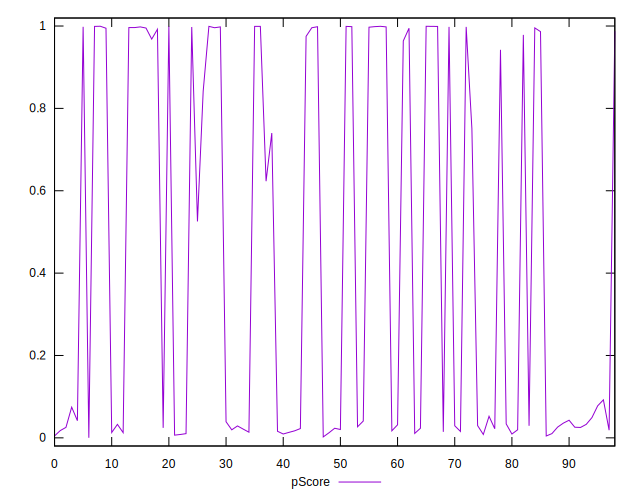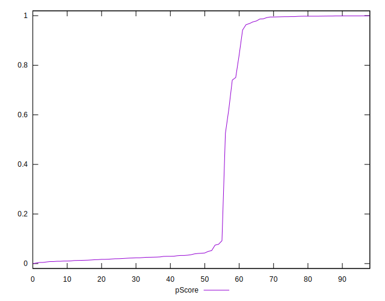
## Score Difference


```yaml
p90min: 0
p90max: 0
p90range: 0
p90mean: 0
median: 0
p90stdev: 0
mad: 0
stdevBySn: 0
lfitCenter: 5.21847134031707e-19
lfitStdev: 1.3019283231074932e-18
mfitCenter: 5.21847134031707e-19
mfitStdev: 1.631725174763995e-18
mfitConfidence: 1.6399455047482617e-19
p90skewness: .nan
p90eccentricity: .nan
p90discretization: 93
outlandishness: .inf

```

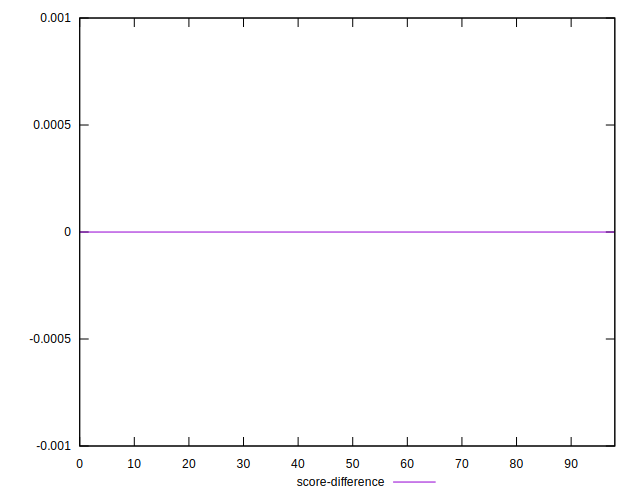
## P Score Difference


```yaml
p90min: -0.00455188164558859
p90max: 0.0046375893622611075
p90range: 0.009189471007849698
p90mean: -0.0002919567965600031
median: -0.0007730724485107612
p90stdev: 0.002549028003893969
mad: 0.0021720451768150652
stdevBySn: 0.002727612638267111
lfitCenter: -0.0003733226002711558
lfitStdev: 0.0021396071659403174
mfitCenter: -0.0003733226002711558
mfitStdev: 0.002681599912072891
mfitConfidence: 0.00026951093170290335
p90skewness: 0.23421664075687446
p90eccentricity: 0.9999999999999999
p90discretization: 1.2077922077922079
outlandishness: 0.879964215266808

```

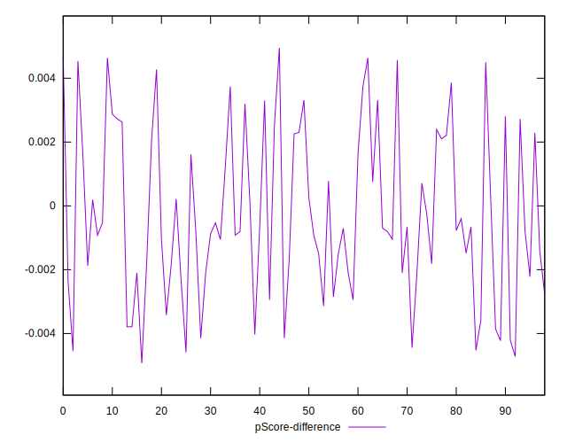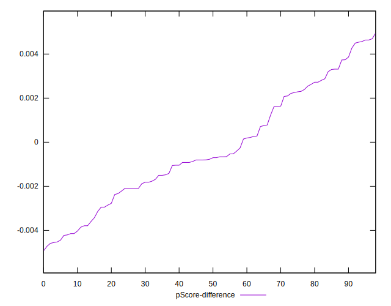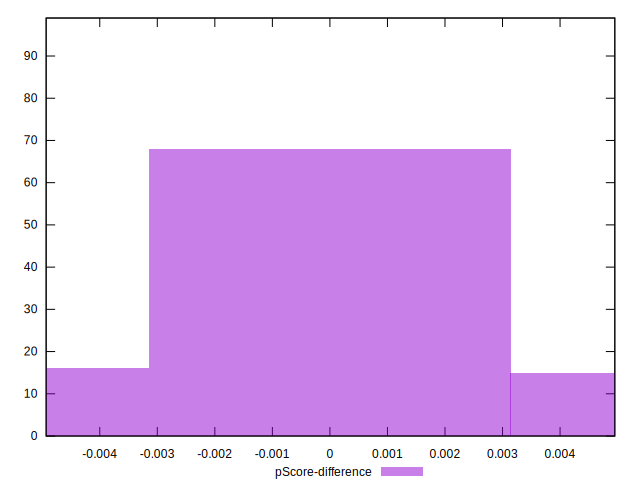