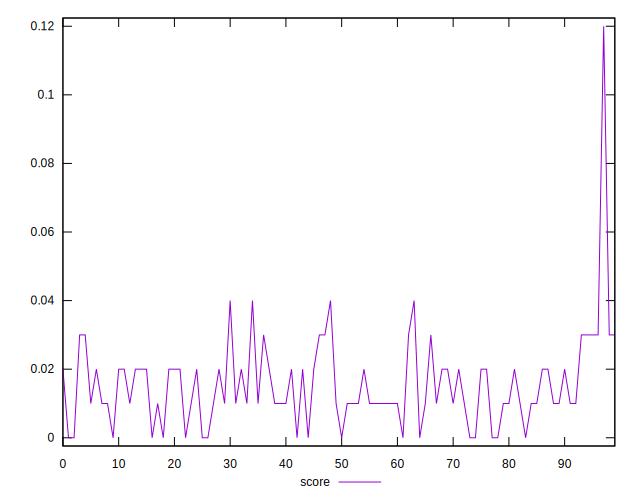
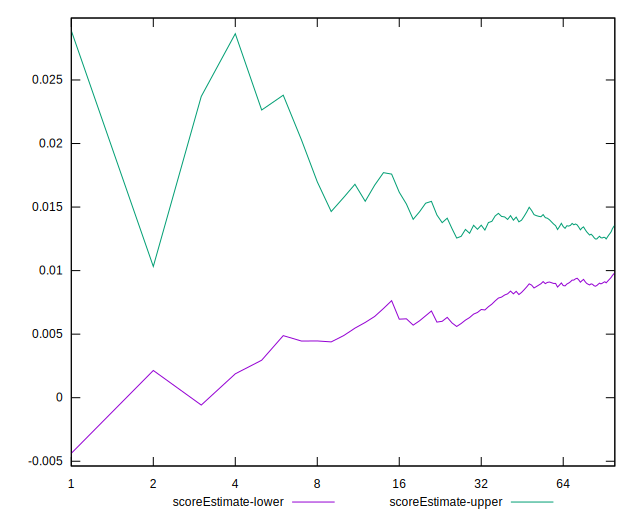

# //max-potential-fid/samples/music

[→ Parent](../..)


## Raw


```yaml
p90min: 616
p90max: 1087.999999999999
p90range: 471.9999999999991
p90mean: 798.563829787234
median: 779.4999999999995
p90stdev: 114.27203065312206
mad: 88.5
stdevBySn: 132.97490000000056
lfitCenter: 795.361736113278
lfitStdev: 101.39734930498796
mfitCenter: 795.361736113278
mfitStdev: 127.08273149813546
mfitConfidence: 12.708273149813547
p90skewness: 0.4860408098796144
p90eccentricity: 0.9999999999999999
p90discretization: 1.0681818181818181
outlandishness: 1.0117709313665761

```


## Score


```yaml
p90min: 0
p90max: 0.04
p90range: 0.04
p90mean: 0.014680851063829796
median: 0.01
p90stdev: 0.009860961894686347
mad: 0.01
stdevBySn: 0.011926
lfitCenter: 0.01476208797210161
lfitStdev: 0.00966331171986721
mfitCenter: 0.01476208797210161
mfitStdev: 0.012111165203982905
mfitConfidence: 0.0012111165203982906
p90skewness: 0.3550795958198849
p90eccentricity: 1.0000000000000022
p90discretization: 18.8
outlandishness: 1.1582750682629699

```


## Raw Estimate


## Score Estimate


## P Score


```yaml
p90min: 0.0019751058090970997
p90max: 0.03858881688693483
p90range: 0.03661371107783773
p90mean: 0.014672509529742781
median: 0.012918799342218207
p90stdev: 0.009329326910662402
mad: 0.0069624956722467435
stdevBySn: 0.010525398495130957
lfitCenter: 0.01460421059599659
lfitStdev: 0.008502202095885631
mfitCenter: 0.01460421059599659
mfitStdev: 0.010655930095809387
mfitConfidence: 0.0010655930095809388
p90skewness: 0.7084837451712477
p90eccentricity: 1.0000000000000002
p90discretization: 1.0681818181818181
outlandishness: 1.1699162523457625

```


## Score Difference


```yaml
p90min: 0
p90max: 0
p90range: 0
p90mean: 0
median: 0
p90stdev: 0
mad: 0
stdevBySn: 0
lfitCenter: 0
lfitStdev: 0
mfitCenter: 0
mfitStdev: 0
mfitConfidence: 0
p90skewness: .nan
p90eccentricity: .nan
p90discretization: 94
outlandishness: .nan

```


## P Score Difference


```yaml
p90min: -0.004763377389064674
p90max: 0.00462889644965573
p90range: 0.009392273838720403
p90mean: 0.00007761902983227501
median: 0.00004738605424263898
p90stdev: 0.0029093977098199214
mad: 0.0027849482693446947
stdevBySn: 0.003446888642534706
lfitCenter: 0.00007324942873755192
lfitStdev: 0.0027505873398736887
mfitCenter: 0.00007324942873755192
mfitStdev: 0.003447350002453599
mfitConfidence: 0.0003447350002453599
p90skewness: -0.006538648558555568
p90eccentricity: 0.9999999999999997
p90discretization: 1.0804597701149425
outlandishness: 0.8174492767543836

```

