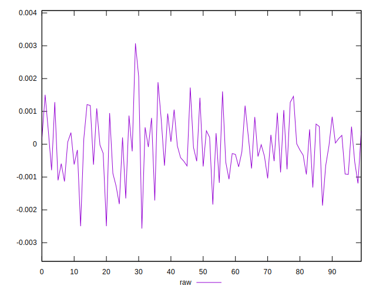
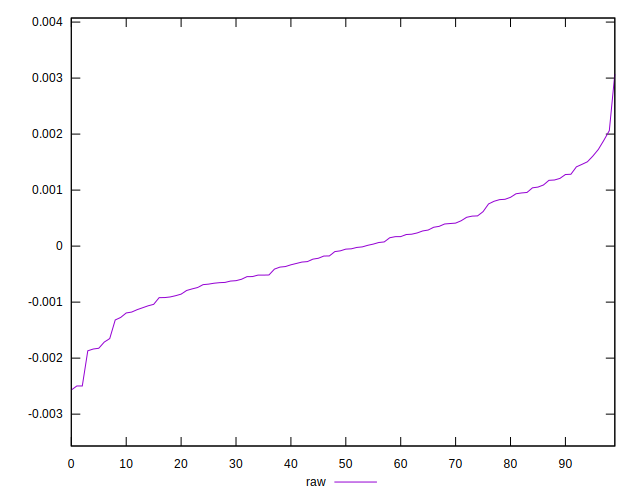
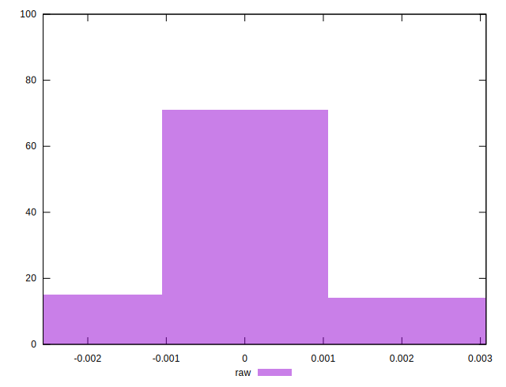

# //meta/pScore-difference/samples/agenda

[→ Parent](../..)


## Raw


```yaml
p90min: -0.0018690660589285213
p90max: 0.0017264565674176217
p90range: 0.003595522626346143
p90mean: -0.00006238225297055026
median: -0.00006908003811303548
p90stdev: 0.0008588642338132761
mad: 0.0006142927096141682
stdevBySn: 0.0009955109786866584
lfitCenter: -0.00007224038349784093
lfitStdev: 0.0007386680278578241
mfitCenter: -0.00007224038349784093
mfitStdev: 0.000925783083028733
mfitConfidence: 0.0000925783083028733
p90skewness: 0.026765249336525146
p90eccentricity: 0.9999999999999994
p90discretization: 1
outlandishness: 1.0536549086619482

```

