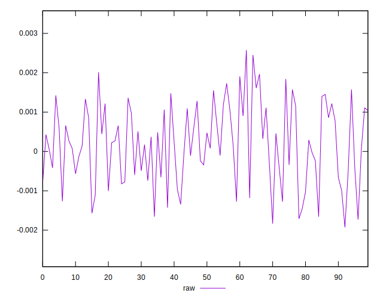
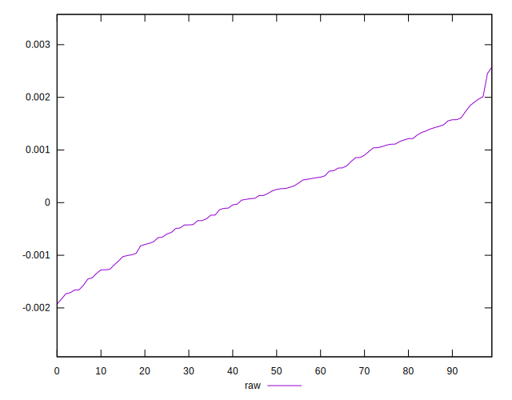
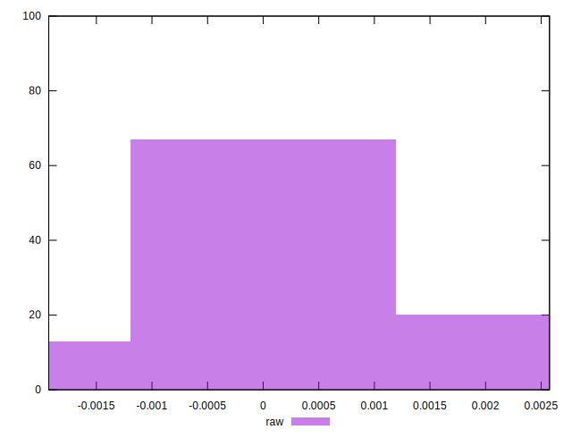

# //meta/pScore-difference/samples/astro

[→ Parent](../..)


## Raw


```yaml
p90min: -0.0017103226682556624
p90max: 0.0019672645311607784
p90range: 0.0036775871994164408
p90mean: 0.00018241314194187536
median: 0.00023669820869741046
p90stdev: 0.0009710272601254659
mad: 0.0008437120212156563
stdevBySn: 0.0011394564399644352
lfitCenter: 0.00019796877649032755
lfitStdev: 0.0008354861814185064
mfitCenter: 0.00019796877649032755
mfitStdev: 0.0010471266437572203
mfitConfidence: 0.00010471266437572202
p90skewness: -0.13590660565305818
p90eccentricity: 1.0000000000000004
p90discretization: 1
outlandishness: 1.0501973477147977

```

