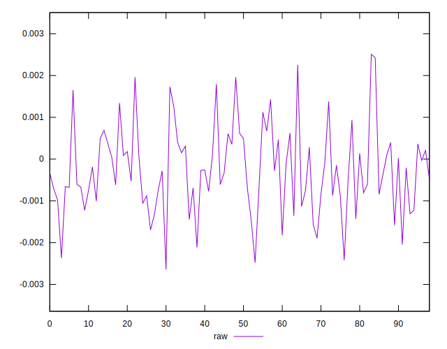
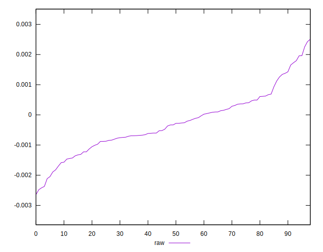
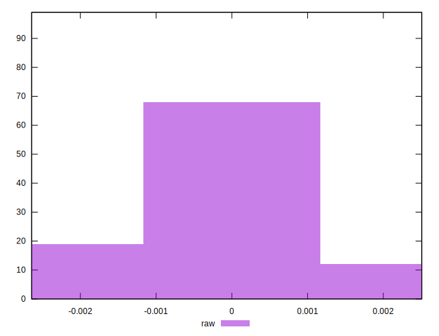

# //meta/pScore-difference/samples/card

[→ Parent](../..)


## Raw


```yaml
p90min: -0.0023711517777344863
p90max: 0.001962038989753881
p90range: 0.004333190767488367
p90mean: -0.0002693329727401298
median: -0.0003323652086648338
p90stdev: 0.0009507520758372316
mad: 0.0006427387903456872
stdevBySn: 0.0010658990633805032
lfitCenter: -0.00028731796266395505
lfitStdev: 0.0007819243227405747
mfitCenter: -0.00028731796266395505
mfitStdev: 0.0009799968089877246
mfitConfidence: 0.00009849338518660221
p90skewness: 0.2997867660043038
p90eccentricity: 1.0000000000000002
p90discretization: 1
outlandishness: 0.9072951368244058

```

