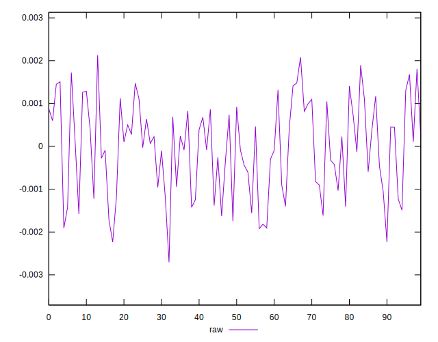
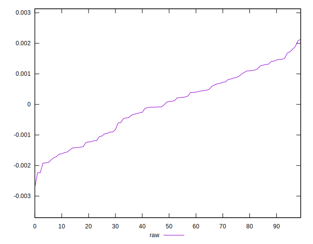
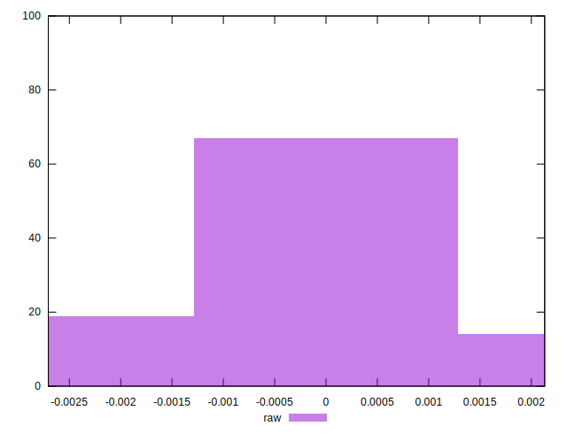

# //meta/pScore-difference/samples/music

[→ Parent](../..)


## Raw


```yaml
p90min: -0.0019222365530335308
p90max: 0.0018081800252193198
p90range: 0.0037304165782528504
p90mean: -0.0000329099736580817
median: 0.00008405516365386223
p90stdev: 0.001047585236686415
mad: 0.0009869390194408027
stdevBySn: 0.0012477535197761567
lfitCenter: -0.000011323190403105239
lfitStdev: 0.0009169546664548277
mfitCenter: -0.000011323190403105239
mfitStdev: 0.001149232247901661
mfitConfidence: 0.0001149232247901661
p90skewness: -0.16967381244463853
p90eccentricity: 0.9999999999999999
p90discretization: 1
outlandishness: 1.5974053272038231

```

