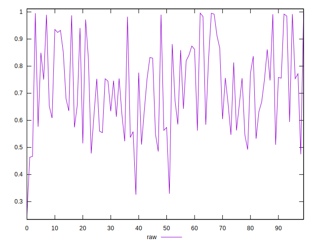
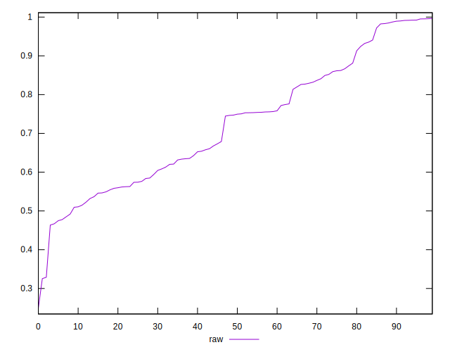
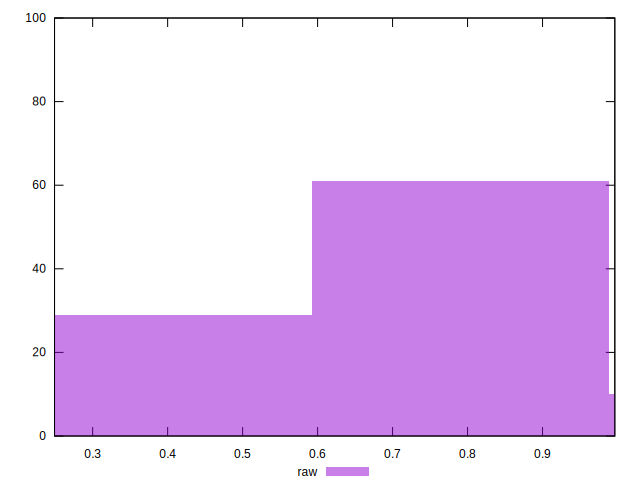

# //meta/pScore/samples/agenda

[→ Parent](../..)


## Raw


```yaml
p90min: 0.4635052949797748
p90max: 0.9952077649777711
p90range: 0.5317024699979963
p90mean: 0.726043725337272
median: 0.7483731259250435
p90stdev: 0.16069755061509705
mad: 0.14909699492232414
stdevBySn: 0.199151433864513
lfitCenter: 0.7210453326085656
lfitStdev: 0.14920677092494364
mfitCenter: 0.7210453326085656
mfitStdev: 0.18700295557159752
mfitConfidence: 0.01870029555715975
p90skewness: 0.16971399919183977
p90eccentricity: 1.0000000000000007
p90discretization: 1
outlandishness: 0.9872243204914215

```

