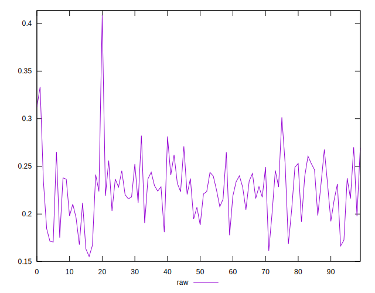
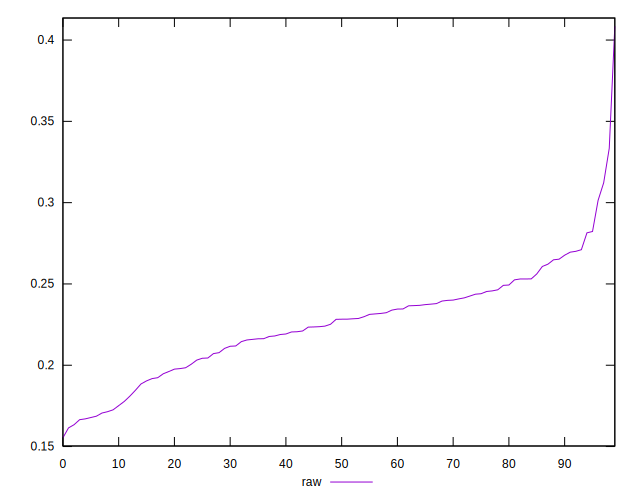
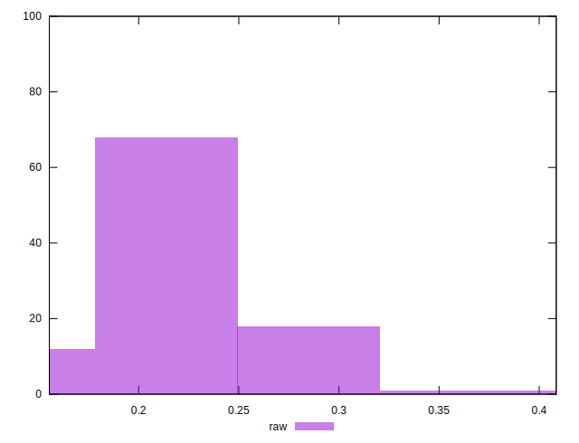

# //meta/pScore/samples/astro

[→ Parent](../..)


## Raw


```yaml
p90min: 0.16651765468444701
p90max: 0.3014217693607042
p90range: 0.13490411467625718
p90mean: 0.22450926721645723
median: 0.22827169193548763
p90stdev: 0.02895177161127625
mad: 0.019335064994186385
stdevBySn: 0.031674804416499676
lfitCenter: 0.22599807534213268
lfitStdev: 0.024111113837264057
mfitCenter: 0.22599807534213268
mfitStdev: 0.030218799869073863
mfitConfidence: 0.0030218799869073864
p90skewness: -0.0895090444441284
p90eccentricity: 1.0000000000000002
p90discretization: 1
outlandishness: 1.0167598250991146

```

