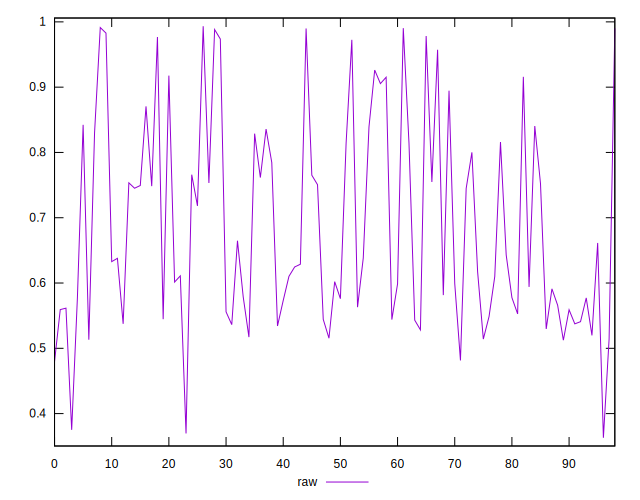

# //meta/pScore/samples/card

[→ Parent](../..)


## Raw


```yaml
p90min: 0.4796676347913351
p90max: 0.9900242424863727
p90range: 0.5103566076950375
p90mean: 0.6895099259378064
median: 0.6287959371308829
p90stdev: 0.1540553546183012
mad: 0.11467647649565704
stdevBySn: 0.1492610686936886
lfitCenter: 0.6764795829333801
lfitStdev: 0.1475671142918726
mfitCenter: 0.6764795829333801
mfitStdev: 0.18494795073095863
mfitConfidence: 0.018587968433931106
p90skewness: 0.5667004831122576
p90eccentricity: 0.9999999999999996
p90discretization: 1
outlandishness: 0.9984073309051271

```

