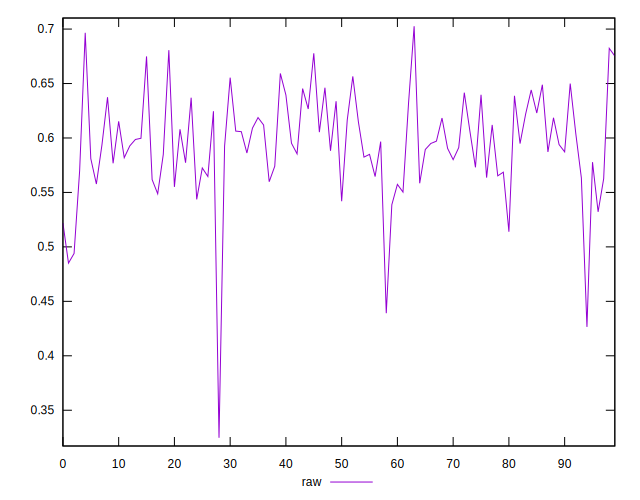
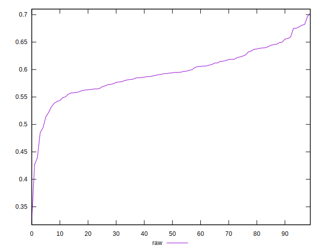
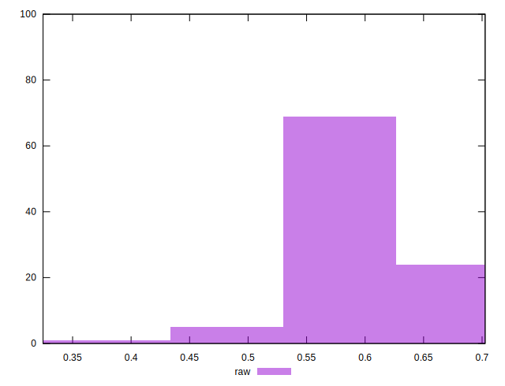

# //meta/pScore/samples/music

[→ Parent](../..)


## Raw


```yaml
p90min: 0.48509893007438265
p90max: 0.6806264814033792
p90range: 0.19552755132899657
p90mean: 0.5960214143832512
median: 0.5937829073367379
p90stdev: 0.039155857539891065
mad: 0.028838715377144497
stdevBySn: 0.0412258674061771
lfitCenter: 0.5942714755575154
lfitStdev: 0.032659043222424765
mfitCenter: 0.5942714755575154
mfitStdev: 0.04093204062305049
mfitConfidence: 0.004093204062305049
p90skewness: -0.1331468425921381
p90eccentricity: 1.0000000000000007
p90discretization: 1
outlandishness: 0.9898149944382701

```

