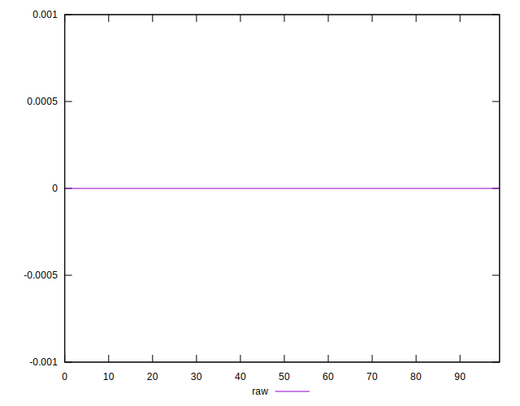
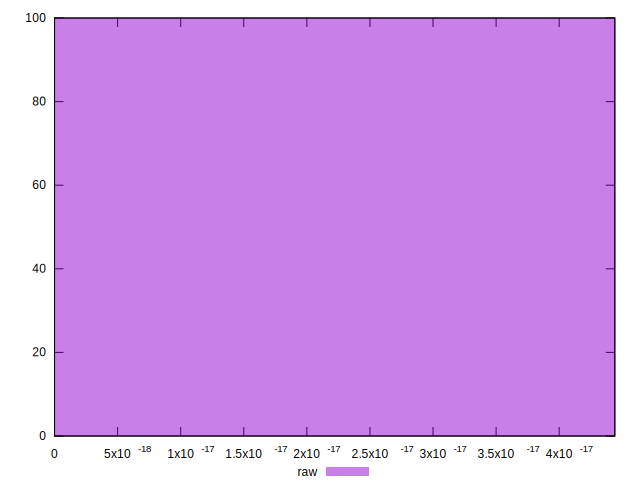

# //meta/score-difference/samples/agenda

[→ Parent](../..)


## Raw


```yaml
p90min: 0
p90max: 4.163336342344337e-17
p90range: 4.163336342344337e-17
p90mean: 4.8719893367859264e-18
median: 0
p90stdev: 1.0102664241689115e-17
mad: 0
stdevBySn: 0
lfitCenter: 3.514971923798057e-18
lfitStdev: 7.434921309515991e-18
mfitCenter: 3.514971923798057e-18
mfitStdev: 9.318291996421126e-18
mfitConfidence: 9.318291996421126e-19
p90skewness: 1.945411419668578
p90eccentricity: 1.0000000000000027
p90discretization: 13.428571428571429
outlandishness: 1.4724719338842984

```

