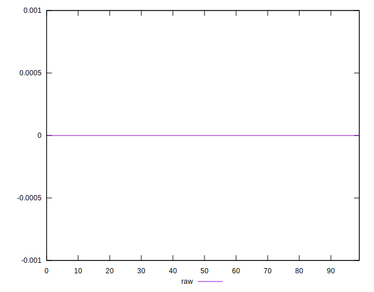
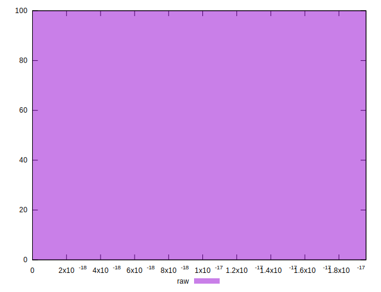

# //meta/score-difference/samples/astro

[→ Parent](../..)


## Raw


```yaml
p90min: 0
p90max: 1.6653345369377347e-17
p90range: 1.6653345369377347e-17
p90mean: 1.5753633969571605e-18
median: 0
p90stdev: 4.723603881762363e-18
mad: 0
stdevBySn: 0
lfitCenter: 1.0864918780925794e-18
lfitStdev: 2.52875798145386e-18
mfitCenter: 1.0864918780925794e-18
mfitStdev: 3.1693281311946432e-18
mfitConfidence: 3.1693281311946433e-19
p90skewness: 2.7782277853654027
p90eccentricity: 1.0000000000000018
p90discretization: 23.5
outlandishness: 1.6276358198940246

```

