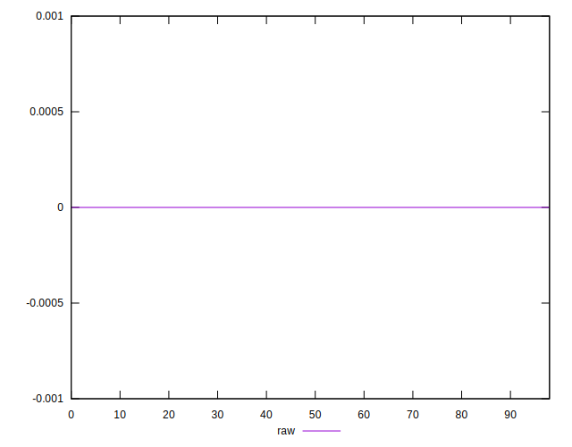
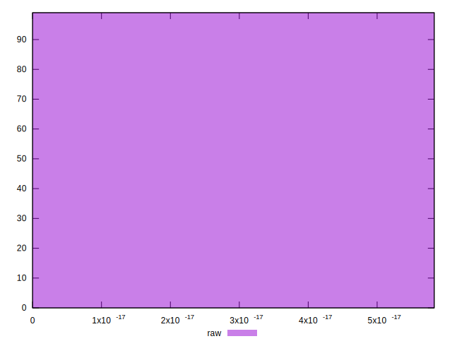

# //meta/score-difference/samples/card

[→ Parent](../..)


## Raw


```yaml
p90min: 0
p90max: 4.4408920985006264e-17
p90range: 4.4408920985006264e-17
p90mean: 8.475896209503887e-18
median: 0
p90stdev: 1.3279116320672077e-17
mad: 0
stdevBySn: 0
lfitCenter: 6.579197861209924e-18
lfitStdev: 1.2327496004890786e-17
mfitCenter: 6.579197861209924e-18
mfitStdev: 1.5450225036176643e-17
mfitConfidence: 1.5528060415622154e-18
p90skewness: 1.2463685461662926
p90eccentricity: 1.0000000000000016
p90discretization: 13.285714285714286
outlandishness: 1.2872030730015707

```

