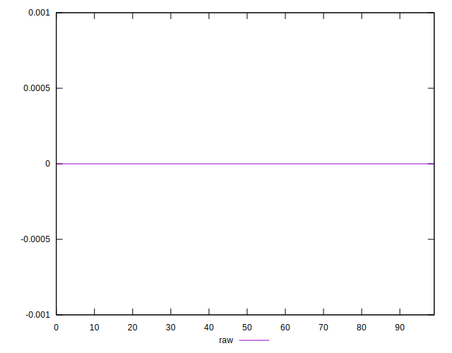
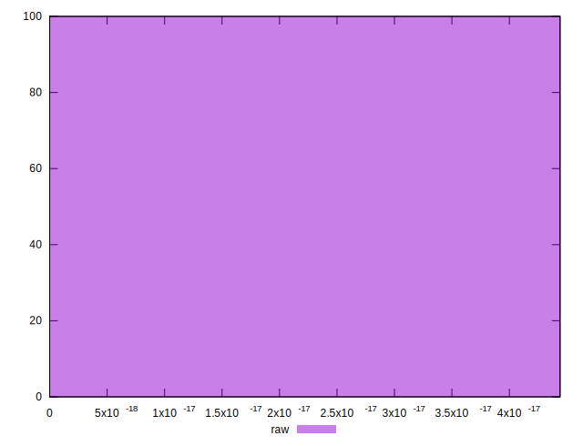

# //meta/score-difference/samples/music

[→ Parent](../..)


## Raw


```yaml
p90min: 0
p90max: 3.608224830031759e-17
p90range: 3.608224830031759e-17
p90mean: 8.090455019874815e-18
median: 0
p90stdev: 1.0608941375660163e-17
mad: 0
stdevBySn: 0
lfitCenter: 6.858887741899663e-18
lfitStdev: 1.0536727510596557e-17
mfitCenter: 6.858887741899663e-18
mfitStdev: 1.320582956336009e-17
mfitConfidence: 1.320582956336009e-18
p90skewness: 1.0002839683916895
p90eccentricity: 1.0000000000000007
p90discretization: 13.428571428571429
outlandishness: 1.2127314667803295

```

