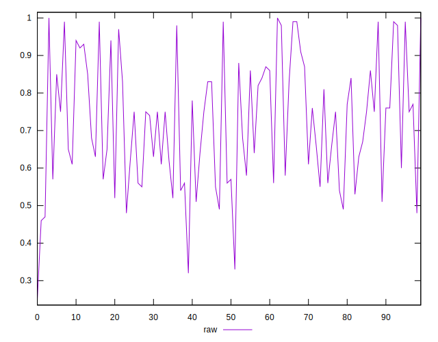
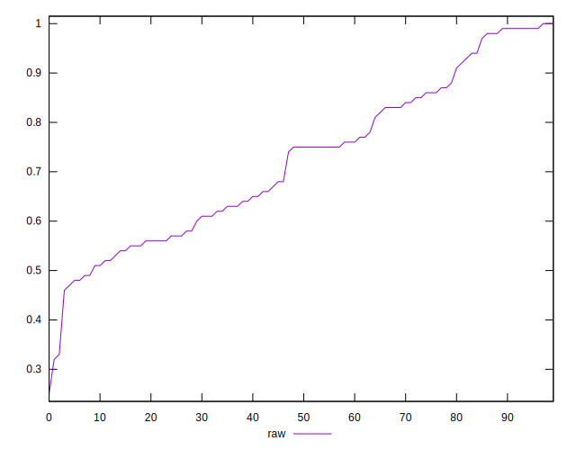
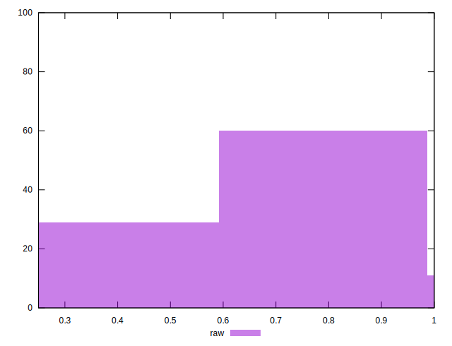

# //meta/score/samples/agenda

[→ Parent](../..)


## Raw


```yaml
p90min: 0.46
p90max: 0.99
p90range: 0.53
p90mean: 0.7254255319148935
median: 0.75
p90stdev: 0.16032324325201483
mad: 0.14500000000000002
stdevBySn: 0.19677900000000006
lfitCenter: 0.7205204572379458
lfitStdev: 0.1490345811935671
mfitCenter: 0.7205204572379458
mfitStdev: 0.1867871477467456
mfitConfidence: 0.01867871477467456
p90skewness: 0.16895183618711923
p90eccentricity: 1.0000000000000002
p90discretization: 2.292682926829268
outlandishness: 0.9875620155040264

```

