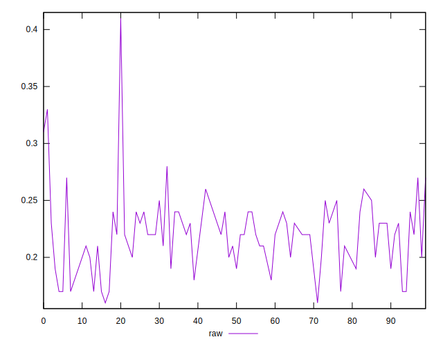
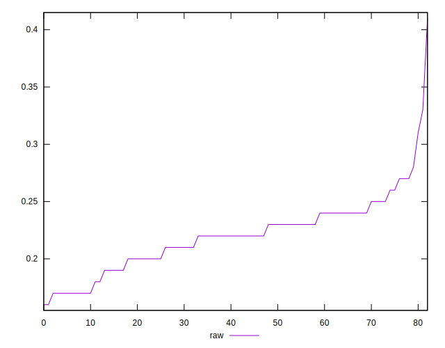
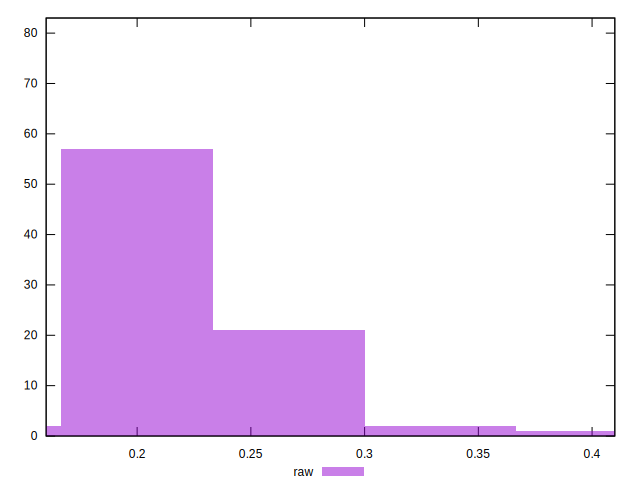

# //meta/score/samples/astro

[→ Parent](../..)


## Raw


```yaml
p90min: 0.17
p90max: 0.28
p90range: 0.11000000000000001
p90mean: 0.21844155844155855
median: 0.22
p90stdev: 0.02668064793431068
mad: 0.01999999999999999
stdevBySn: 0.023852000000000022
lfitCenter: 0.22033318729397158
lfitStdev: 0.02244239844604597
mfitCenter: 0.22033318729397158
mfitStdev: 0.02812737527599979
mfitConfidence: 0.003087380532622429
p90skewness: -0.10355256848861615
p90eccentricity: 0.9999999999999998
p90discretization: 6.416666666666667
outlandishness: 1.0254597918346402

```

