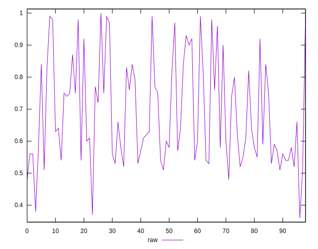
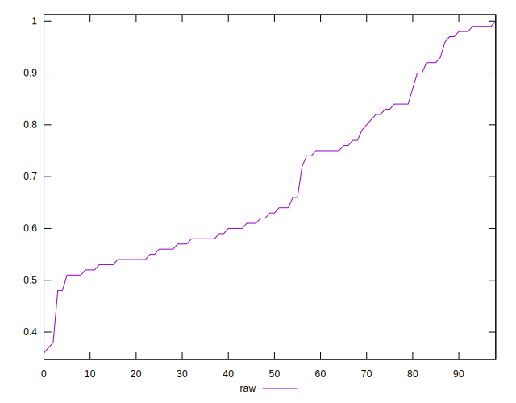
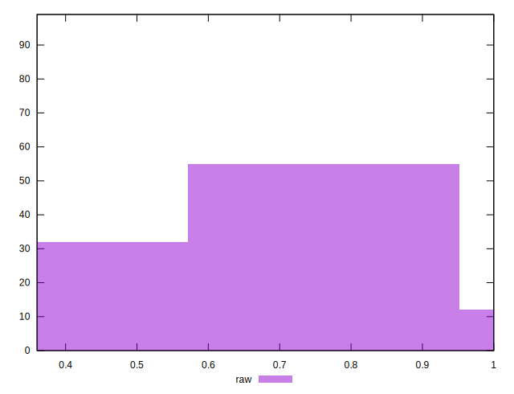

# //meta/score/samples/card

[→ Parent](../..)


## Raw


```yaml
p90min: 0.48
p90max: 0.99
p90range: 0.51
p90mean: 0.6895698924731181
median: 0.63
p90stdev: 0.15461999188085526
mad: 0.10999999999999999
stdevBySn: 0.155038
lfitCenter: 0.676492087632152
lfitStdev: 0.14808568233073174
mfitCenter: 0.676492087632152
mfitStdev: 0.18559787938587474
mfitConfidence: 0.01865328872147223
p90skewness: 0.5642655481991414
p90eccentricity: 1.0000000000000002
p90discretization: 2.657142857142857
outlandishness: 0.9986112588914293

```

