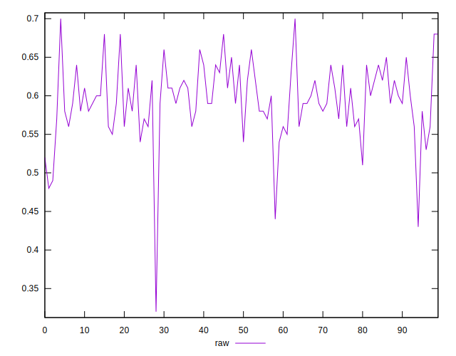
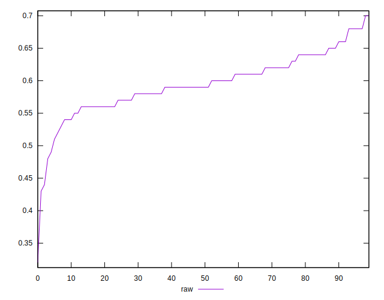
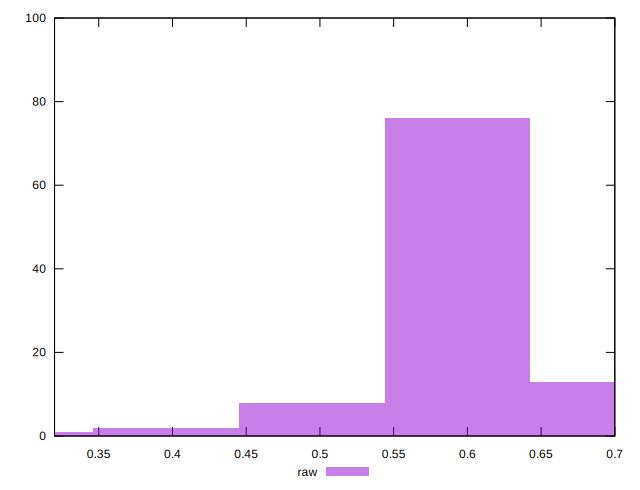

# //meta/score/samples/music

[→ Parent](../..)


## Raw


```yaml
p90min: 0.48
p90max: 0.68
p90range: 0.20000000000000007
p90mean: 0.5963829787234044
median: 0.59
p90stdev: 0.04018179602198909
mad: 0.029999999999999916
stdevBySn: 0.03577800000000003
lfitCenter: 0.5946857826841332
lfitStdev: 0.03373057013037984
mfitCenter: 0.5946857826841332
mfitStdev: 0.04227500044665589
mfitConfidence: 0.004227500044665589
p90skewness: -0.17064863128546934
p90eccentricity: 0.9999999999999997
p90discretization: 4.947368421052632
outlandishness: 0.9896878007470972

```

