# //render-blocking-resources/samples/astro

[→ Parent](../..)


## Raw


```yaml
p90min: 598
p90max: 2265
p90range: 1667
p90mean: 1757.8510638297873
median: 1800
p90stdev: 318.6843618674569
mad: 118
stdevBySn: 208.705
lfitCenter: 1770.602070049777
lfitStdev: 197.72231610143822
mfitCenter: 1770.602070049777
mfitStdev: 247.80817428205182
mfitConfidence: 24.780817428205182
p90skewness: -2.0024587310076107
p90eccentricity: 0.9999999999999996
p90discretization: 1.0804597701149425
outlandishness: 0.9775869202727588

```

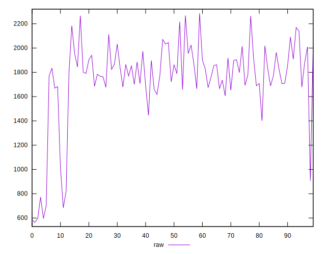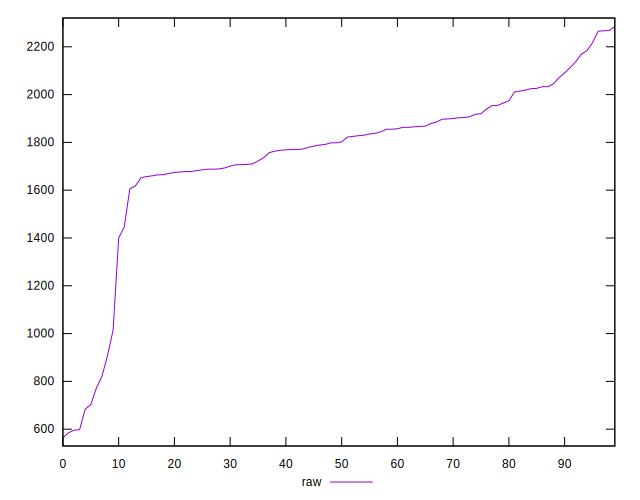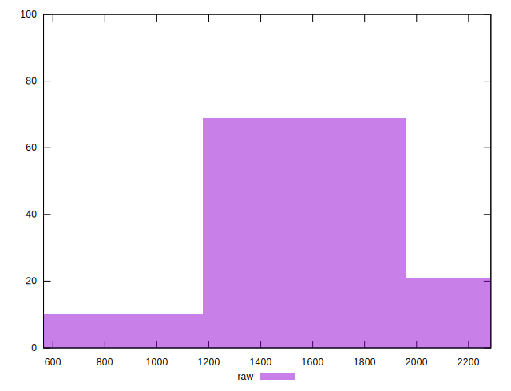
## Score


```yaml
p90min: 0.32
p90max: 0.58
p90range: 0.25999999999999995
p90mean: 0.3825531914893618
median: 0.38
p90stdev: 0.04247492802926206
mad: 0.010000000000000009
stdevBySn: 0.023852000000000022
lfitCenter: 0.3815440306235887
lfitStdev: 0.026223775476290612
mfitCenter: 0.3815440306235887
mfitStdev: 0.03286662857129434
mfitConfidence: 0.003286662857129434
p90skewness: 2.491594789583466
p90eccentricity: 1.0000000000000018
p90discretization: 5.529411764705882
outlandishness: 1.023383171389295

```

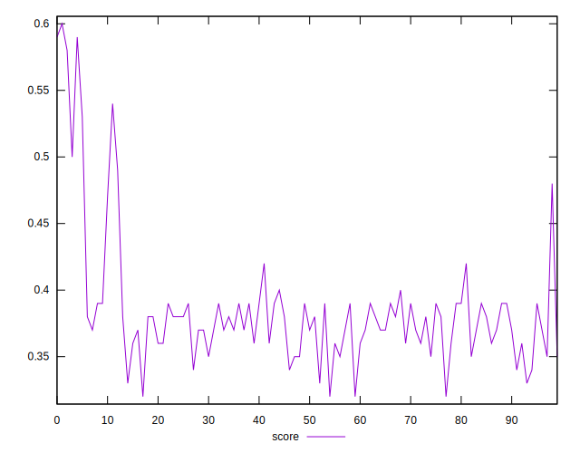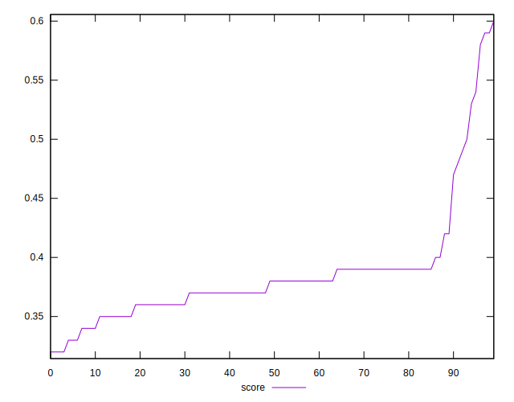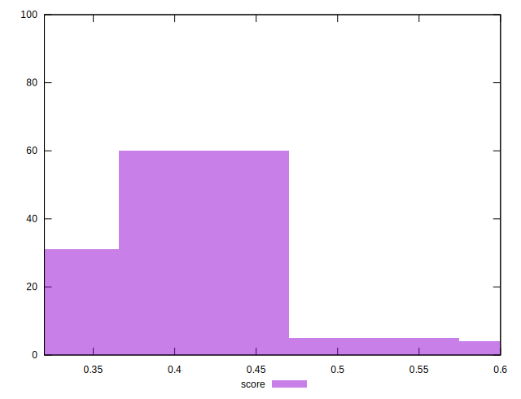
## Raw Estimate

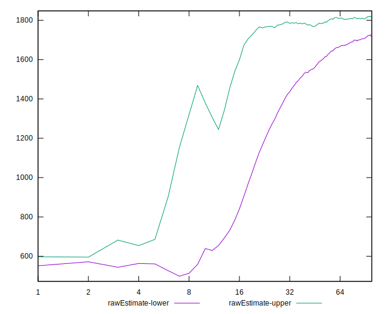
## Score Estimate

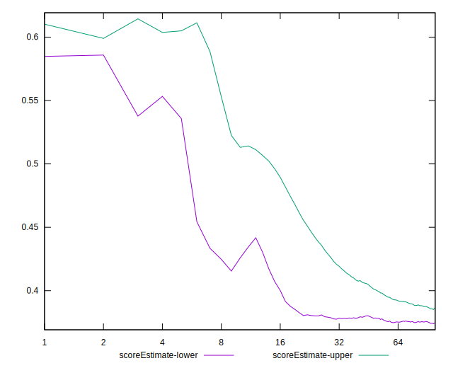
## P Score


```yaml
p90min: 0.32176470588235295
p90max: 0.5844444444444444
p90range: 0.2626797385620915
p90mean: 0.3826638158809624
median: 0.3764705882352941
p90stdev: 0.042307827474822424
mad: 0.013882352941176457
stdevBySn: 0.024553529411764686
lfitCenter: 0.3815785730141274
lfitStdev: 0.026053282913065426
mfitCenter: 0.3815785730141274
mfitStdev: 0.032652947831282045
mfitConfidence: 0.0032652947831282044
p90skewness: 2.523751040321541
p90eccentricity: 1.0000000000000004
p90discretization: 1.0804597701149425
outlandishness: 1.0234888409671488

```

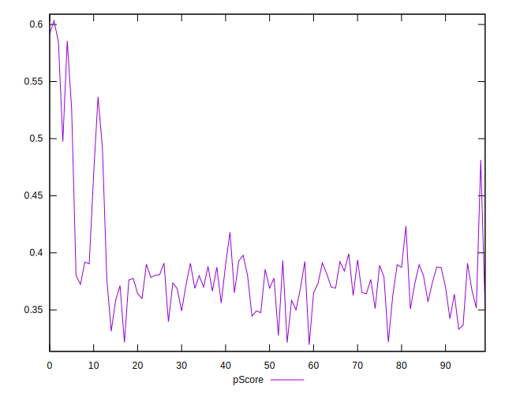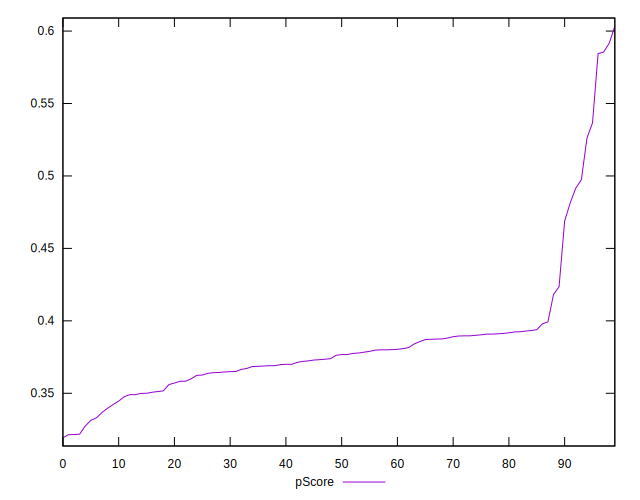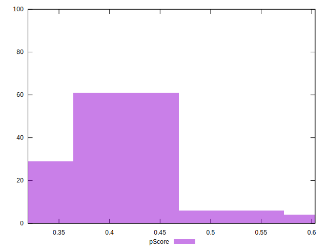
## Score Difference


```yaml
p90min: 0
p90max: 5.551115123125783e-17
p90range: 5.551115123125783e-17
p90mean: 3.543264972207946e-18
median: 0
p90stdev: 1.3569671737421592e-17
mad: 0
stdevBySn: 0
lfitCenter: 2.593298623283183e-18
lfitStdev: 6.196756661059375e-18
mfitCenter: 2.593298623283183e-18
mfitStdev: 7.766482736624675e-18
mfitConfidence: 7.766482736624675e-19
p90skewness: 3.5685919470918015
p90eccentricity: 0.9999999999999988
p90discretization: 47
outlandishness: 1.9881000000000004

```

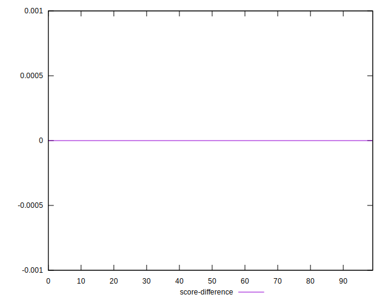
## P Score Difference


```yaml
p90min: -0.0040000000000000036
p90max: 0.004444444444444473
p90range: 0.008444444444444477
p90mean: 0.00013502989848421183
median: 0
p90stdev: 0.00226387271797329
mad: 0.001823529411764696
stdevBySn: 0.0025371980392156893
lfitCenter: 0.00011385266921739995
lfitStdev: 0.0019387056292016647
mfitCenter: 0.00011385266921739995
mfitStdev: 0.002429807175616564
mfitConfidence: 0.00024298071756165637
p90skewness: 0.07350881481408054
p90eccentricity: 0.9999999999999996
p90discretization: 1.4461538461538461
outlandishness: 0.9541124872592646

```

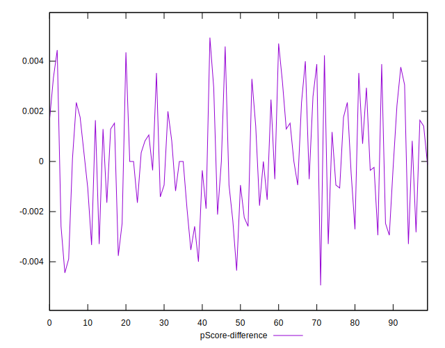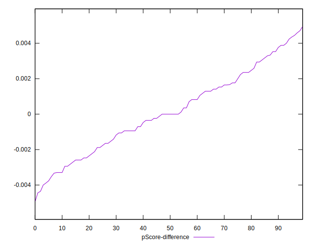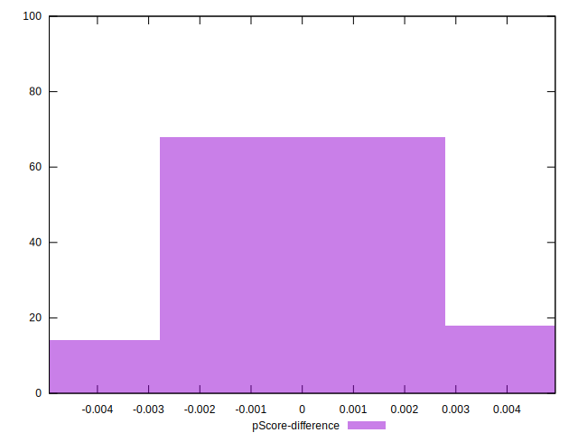