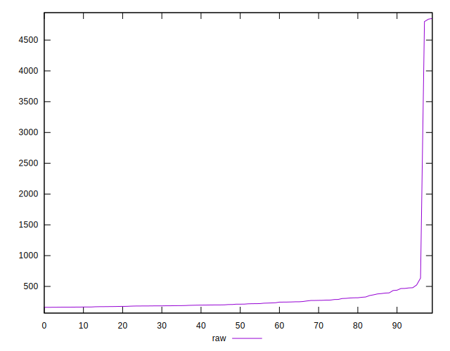
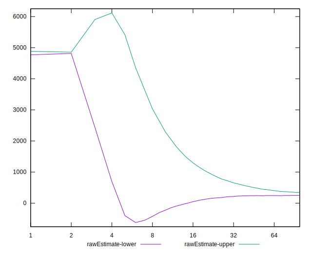

# //server-response-time/samples/agenda

[→ Parent](../..)


## Raw


```yaml
p90min: 161.582
p90max: 635.3589999999999
p90range: 473.77699999999993
p90mean: 248.9358723404256
median: 211.81400000000002
p90stdev: 95.52686979858397
mad: 40.02900000000001
stdevBySn: 57.95797480000001
lfitCenter: 300.9071952461399
lfitStdev: 193.05436702655498
mfitCenter: 300.9071952461399
mfitStdev: 241.9577677083449
mfitConfidence: 24.19577677083449
p90skewness: 1.6531266580448363
p90eccentricity: 1
p90discretization: 1
outlandishness: 2.376397036071296

```


## Score


```yaml
p90min: 0
p90max: 1
p90range: 1
p90mean: 0.9893617021276596
median: 1
p90stdev: 0.10259202937226548
mad: 0
stdevBySn: 0
lfitCenter: 0.9806252396582452
lfitStdev: 0.047624380658411104
mfitCenter: 0.9806252396582452
mfitStdev: 0.059688309620142425
mfitConfidence: 0.005968830962014242
p90skewness: -9.53995559151989
p90eccentricity: 1.0000000000000044
p90discretization: 47
outlandishness: 0.9415259105098853

```


## Raw Estimate


## Score Estimate


## P Score


```yaml
p90min: 0
p90max: 1
p90range: 1
p90mean: 0.9893617021276596
median: 1
p90stdev: 0.10259202937226548
mad: 0
stdevBySn: 0
lfitCenter: 0.9806252396582452
lfitStdev: 0.047624380658411104
mfitCenter: 0.9806252396582452
mfitStdev: 0.059688309620142425
mfitConfidence: 0.005968830962014242
p90skewness: -9.53995559151989
p90eccentricity: 1.0000000000000044
p90discretization: 47
outlandishness: 0.9415259105098853

```


## Score Difference


```yaml
p90min: 0
p90max: 0
p90range: 0
p90mean: 0
median: 0
p90stdev: 0
mad: 0
stdevBySn: 0
lfitCenter: 0
lfitStdev: 0
mfitCenter: 0
mfitStdev: 0
mfitConfidence: 0
p90skewness: .nan
p90eccentricity: .nan
p90discretization: 94
outlandishness: .nan

```


## P Score Difference


```yaml
p90min: 0
p90max: 0
p90range: 0
p90mean: 0
median: 0
p90stdev: 0
mad: 0
stdevBySn: 0
lfitCenter: 0
lfitStdev: 0
mfitCenter: 0
mfitStdev: 0
mfitConfidence: 0
p90skewness: .nan
p90eccentricity: .nan
p90discretization: 94
outlandishness: .nan

```

