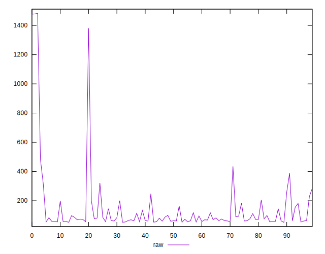
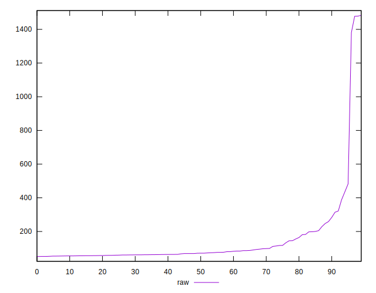
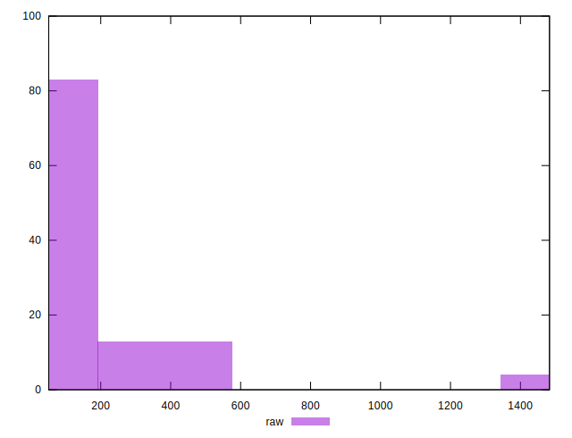
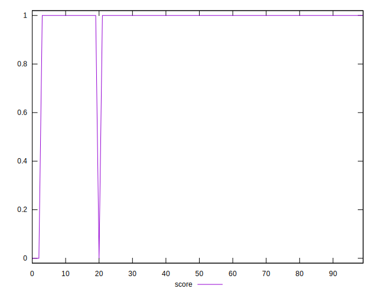
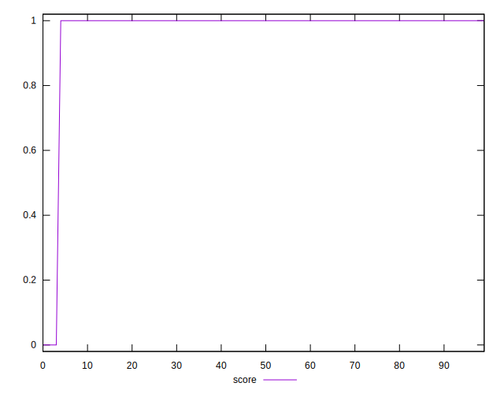
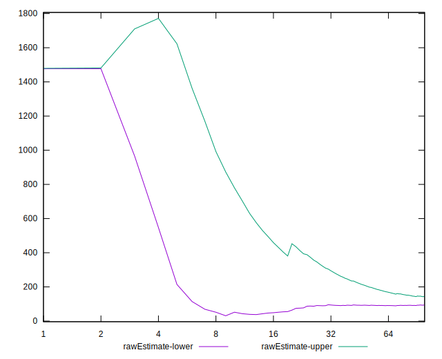
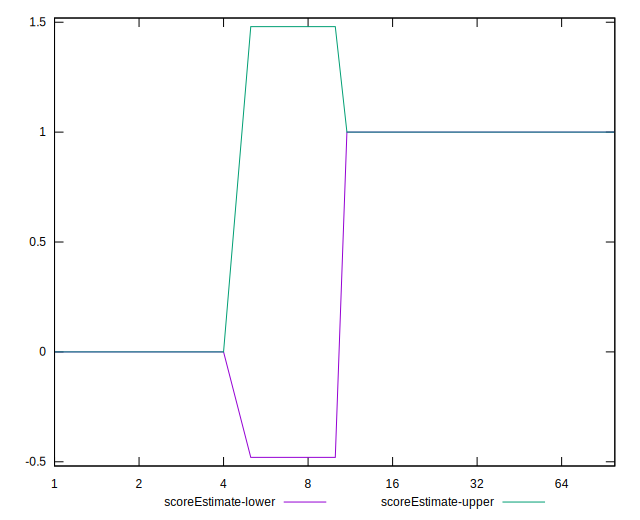
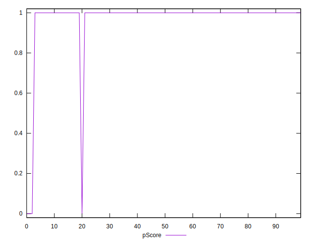
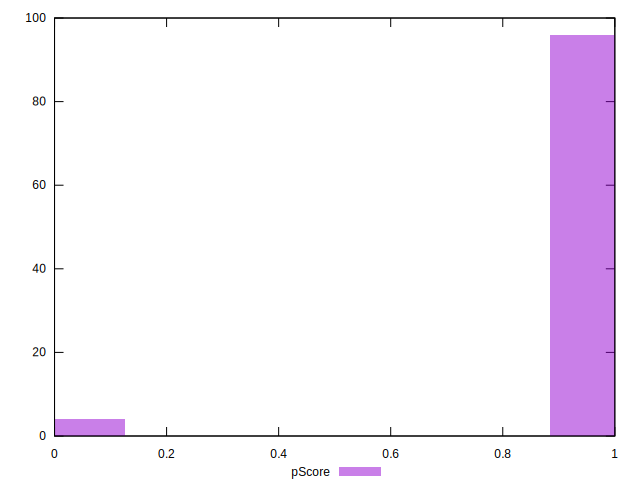

# //server-response-time/samples/astro

[→ Parent](../..)


## Raw


```yaml
p90min: 52.236000000000004
p90max: 1381.0320000000002
p90range: 1328.796
p90mean: 120.98327659574466
median: 71.167
p90stdev: 155.88396130676648
mad: 15.313999999999997
stdevBySn: 21.5747303
lfitCenter: 119.77818598673838
lfitStdev: 102.2985175548623
mfitCenter: 119.77818598673838
mfitStdev: 128.21217840693936
mfitConfidence: 12.821217840693937
p90skewness: 5.93681150334677
p90eccentricity: 0.9999999999999989
p90discretization: 1
outlandishness: 1.7417876395768888

```


## Score


```yaml
p90min: 0
p90max: 1
p90range: 1
p90mean: 0.9893617021276596
median: 1
p90stdev: 0.10259202937226548
mad: 0
stdevBySn: 0
lfitCenter: 0.9806252396582452
lfitStdev: 0.047624380658411104
mfitCenter: 0.9806252396582452
mfitStdev: 0.059688309620142425
mfitConfidence: 0.005968830962014242
p90skewness: -9.53995559151989
p90eccentricity: 1.0000000000000044
p90discretization: 47
outlandishness: 0.9415259105098853

```


## Raw Estimate


## Score Estimate


## P Score


```yaml
p90min: 0
p90max: 1
p90range: 1
p90mean: 0.9893617021276596
median: 1
p90stdev: 0.10259202937226548
mad: 0
stdevBySn: 0
lfitCenter: 0.9806252396582452
lfitStdev: 0.047624380658411104
mfitCenter: 0.9806252396582452
mfitStdev: 0.059688309620142425
mfitConfidence: 0.005968830962014242
p90skewness: -9.53995559151989
p90eccentricity: 1.0000000000000044
p90discretization: 47
outlandishness: 0.9415259105098853

```


## Score Difference


```yaml
p90min: 0
p90max: 0
p90range: 0
p90mean: 0
median: 0
p90stdev: 0
mad: 0
stdevBySn: 0
lfitCenter: 0
lfitStdev: 0
mfitCenter: 0
mfitStdev: 0
mfitConfidence: 0
p90skewness: .nan
p90eccentricity: .nan
p90discretization: 94
outlandishness: .nan

```


## P Score Difference


```yaml
p90min: 0
p90max: 0
p90range: 0
p90mean: 0
median: 0
p90stdev: 0
mad: 0
stdevBySn: 0
lfitCenter: 0
lfitStdev: 0
mfitCenter: 0
mfitStdev: 0
mfitConfidence: 0
p90skewness: .nan
p90eccentricity: .nan
p90discretization: 94
outlandishness: .nan

```

