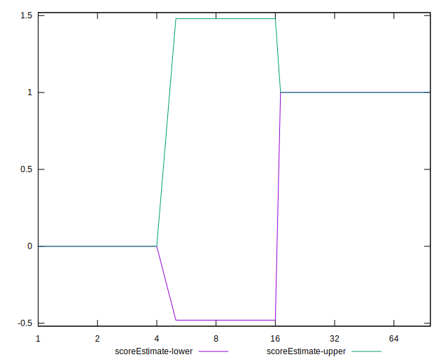

# //server-response-time/samples/card

[→ Parent](../..)


## Raw


```yaml
p90min: 163.56199999999998
p90max: 917.5590000000001
p90range: 753.9970000000001
p90mean: 269.29993548387097
median: 207.31900000000002
p90stdev: 137.19922703454841
mad: 40.271000000000015
stdevBySn: 52.0617604
lfitCenter: 281.40586636145275
lfitStdev: 151.92666116141712
mfitCenter: 281.40586636145275
mfitStdev: 190.4118324603463
mfitConfidence: 19.137109209544956
p90skewness: 2.1958336596180668
p90eccentricity: 1
p90discretization: 1
outlandishness: 1.575095847215825

```


## Score


```yaml
p90min: 0
p90max: 1
p90range: 1
p90mean: 0.956989247311828
median: 1
p90stdev: 0.20288131466788398
mad: 0
stdevBySn: 0
lfitCenter: 0.9642842441228447
lfitStdev: 0.08632863044568395
mfitCenter: 0.9642842441228447
mfitStdev: 0.10819689310153333
mfitConfidence: 0.010874196906059957
p90skewness: -4.504990990027053
p90eccentricity: 0.9999999999999974
p90discretization: 46.5
outlandishness: 0.9429553943446817

```


## Raw Estimate


## Score Estimate


## P Score


```yaml
p90min: 0
p90max: 1
p90range: 1
p90mean: 0.956989247311828
median: 1
p90stdev: 0.20288131466788398
mad: 0
stdevBySn: 0
lfitCenter: 0.9642842441228447
lfitStdev: 0.08632863044568395
mfitCenter: 0.9642842441228447
mfitStdev: 0.10819689310153333
mfitConfidence: 0.010874196906059957
p90skewness: -4.504990990027053
p90eccentricity: 0.9999999999999974
p90discretization: 46.5
outlandishness: 0.9429553943446817

```


## Score Difference


```yaml
p90min: 0
p90max: 0
p90range: 0
p90mean: 0
median: 0
p90stdev: 0
mad: 0
stdevBySn: 0
lfitCenter: 0
lfitStdev: 0
mfitCenter: 0
mfitStdev: 0
mfitConfidence: 0
p90skewness: .nan
p90eccentricity: .nan
p90discretization: 93
outlandishness: .nan

```


## P Score Difference


```yaml
p90min: 0
p90max: 0
p90range: 0
p90mean: 0
median: 0
p90stdev: 0
mad: 0
stdevBySn: 0
lfitCenter: 0
lfitStdev: 0
mfitCenter: 0
mfitStdev: 0
mfitConfidence: 0
p90skewness: .nan
p90eccentricity: .nan
p90discretization: 93
outlandishness: .nan

```

