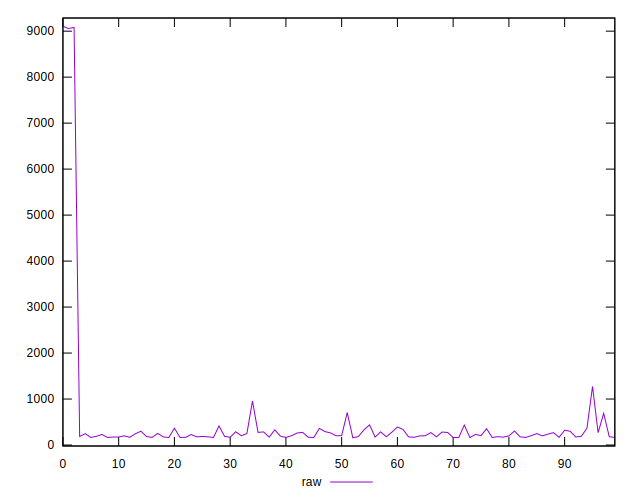
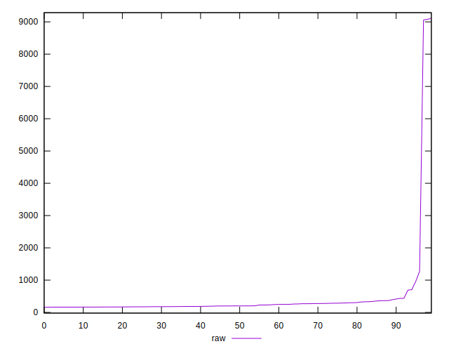
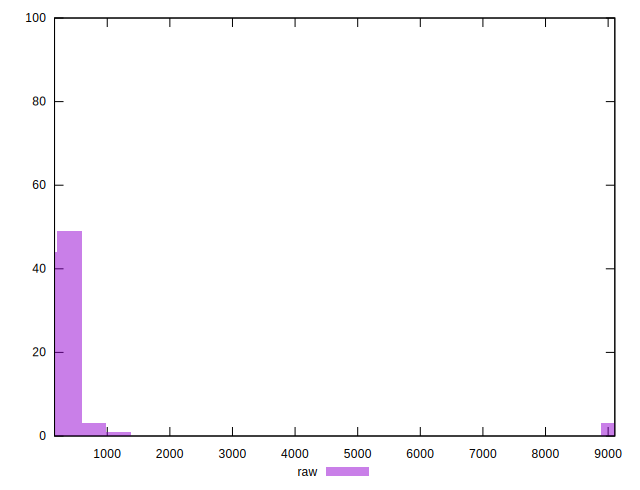
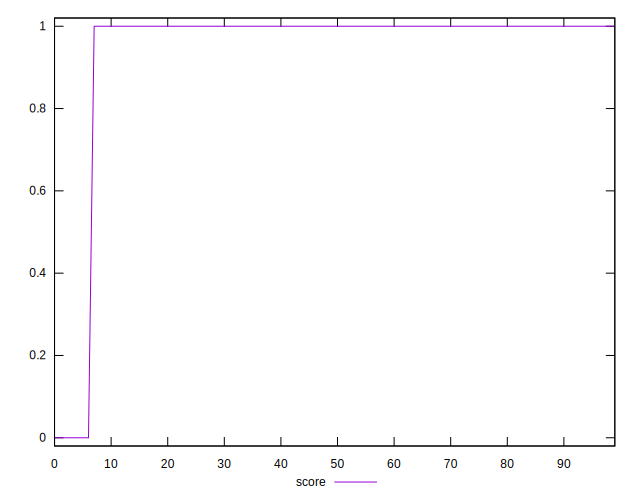
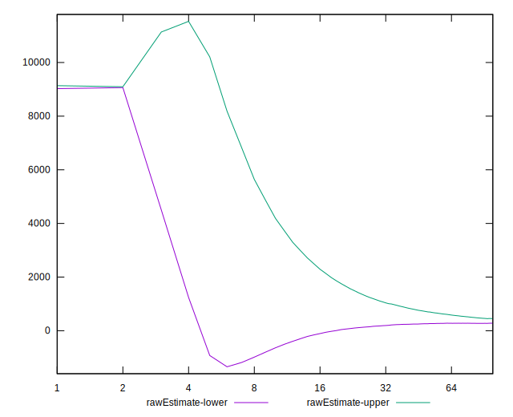
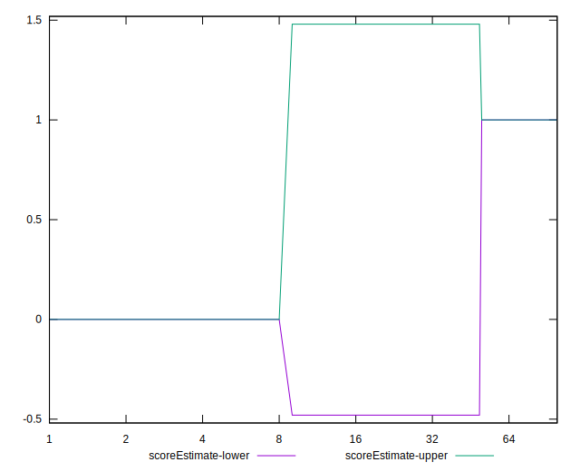
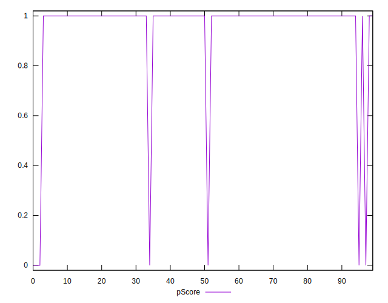
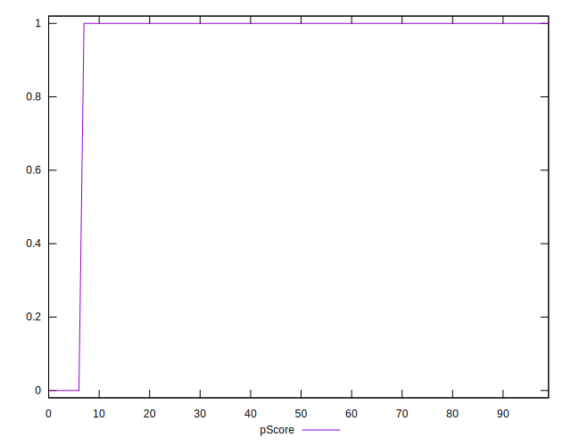
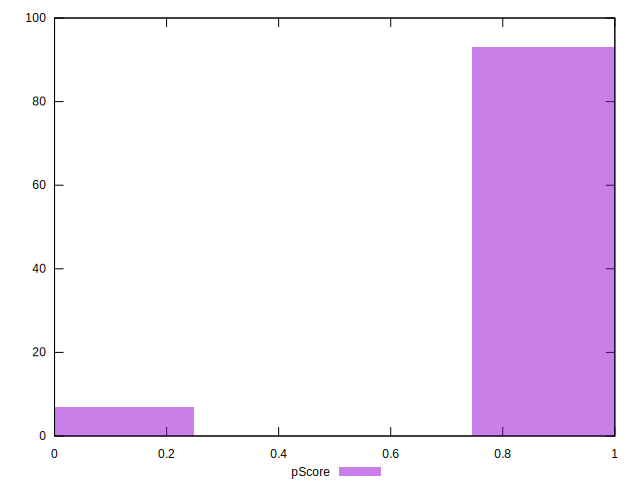

# //server-response-time/samples/music

[→ Parent](../..)


## Raw


```yaml
p90min: 163.536
p90max: 1274.1699999999998
p90range: 1110.6339999999998
p90mean: 259.2490957446808
median: 201.273
p90stdev: 160.47565021026006
mad: 36.89200000000001
stdevBySn: 45.885881299999994
lfitCenter: 364.7809077813093
lfitStdev: 344.58464899721184
mfitCenter: 364.7809077813093
mfitStdev: 431.8728125246738
mfitConfidence: 43.18728125246738
p90skewness: 3.987033378001524
p90eccentricity: 0.9999999999999994
p90discretization: 1
outlandishness: 4.037932934085423

```


## Score


```yaml
p90min: 0
p90max: 1
p90range: 1
p90mean: 0.9574468085106383
median: 1
p90stdev: 0.20184751022351363
mad: 0
stdevBySn: 0
lfitCenter: 0.9646699554088893
lfitStdev: 0.0854304851827208
mfitCenter: 0.9646699554088893
mfitStdev: 0.10707123494496597
mfitConfidence: 0.010707123494496597
p90skewness: -4.532597979574668
p90eccentricity: 1.0000000000000064
p90discretization: 47
outlandishness: 0.9434884444444446

```


## Raw Estimate


## Score Estimate


## P Score


```yaml
p90min: 0
p90max: 1
p90range: 1
p90mean: 0.9574468085106383
median: 1
p90stdev: 0.20184751022351363
mad: 0
stdevBySn: 0
lfitCenter: 0.9646699554088893
lfitStdev: 0.0854304851827208
mfitCenter: 0.9646699554088893
mfitStdev: 0.10707123494496597
mfitConfidence: 0.010707123494496597
p90skewness: -4.532597979574668
p90eccentricity: 1.0000000000000064
p90discretization: 47
outlandishness: 0.9434884444444446

```


## Score Difference


```yaml
p90min: 0
p90max: 0
p90range: 0
p90mean: 0
median: 0
p90stdev: 0
mad: 0
stdevBySn: 0
lfitCenter: 0
lfitStdev: 0
mfitCenter: 0
mfitStdev: 0
mfitConfidence: 0
p90skewness: .nan
p90eccentricity: .nan
p90discretization: 94
outlandishness: .nan

```


## P Score Difference


```yaml
p90min: 0
p90max: 0
p90range: 0
p90mean: 0
median: 0
p90stdev: 0
mad: 0
stdevBySn: 0
lfitCenter: 0
lfitStdev: 0
mfitCenter: 0
mfitStdev: 0
mfitConfidence: 0
p90skewness: .nan
p90eccentricity: .nan
p90discretization: 94
outlandishness: .nan

```

