# //speed-index/samples/agenda

[→ Parent](../..)


## Raw


```yaml
p90min: 1452.408
p90max: 9975.660470344057
p90range: 8523.252470344058
p90mean: 4293.149702820846
median: 2135.7397595079424
p90stdev: 2885.1129418774663
mad: 674.2462595079425
stdevBySn: 874.1844249467691
lfitCenter: 4193.631502339287
lfitStdev: 3437.892414132463
mfitCenter: 4193.631502339287
mfitStdev: 4308.759169537587
mfitConfidence: 430.8759169537587
p90skewness: 0.34277694965103467
p90eccentricity: 1
p90discretization: 1
outlandishness: 1.153862066881976

```

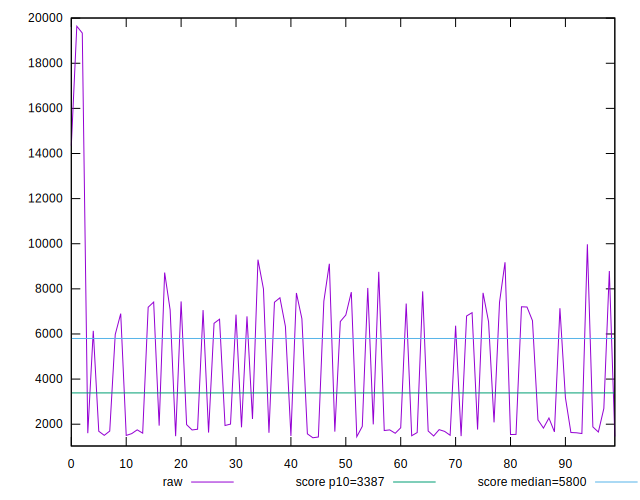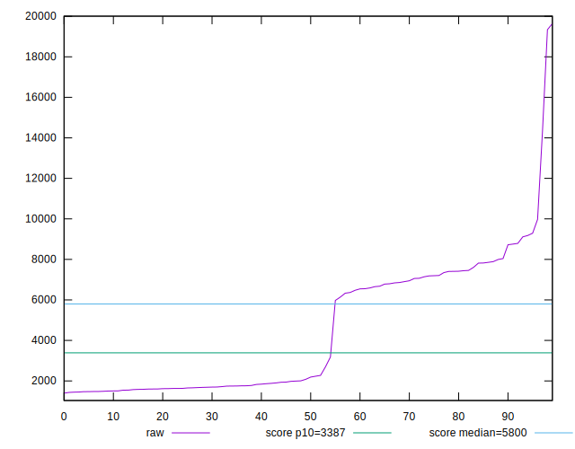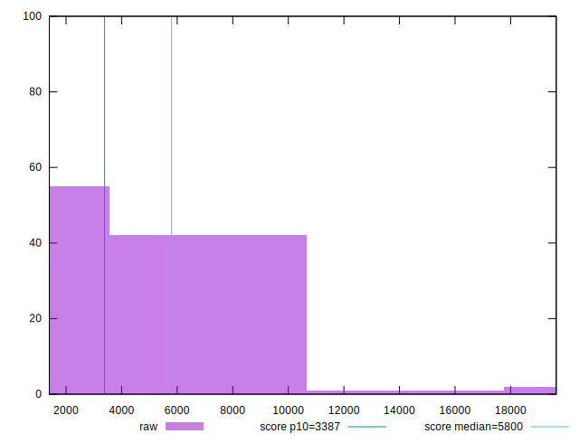
## Score


```yaml
p90min: 0.1
p90max: 1
p90range: 0.9
p90mean: 0.6820212765957446
median: 0.99
p90stdev: 0.35519422252835026
mad: 0.010000000000000009
stdevBySn: 0.011926000000000011
lfitCenter: 0.711473933996674
lfitStdev: 0.4159203957774603
mfitCenter: 0.711473933996674
mfitStdev: 0.5212789125502821
mfitConfidence: 0.052127891255028216
p90skewness: -0.2991132041662045
p90eccentricity: 1.0000000000000007
p90discretization: 3.1333333333333333
outlandishness: 0.9688074008949825

```


## Raw Estimate

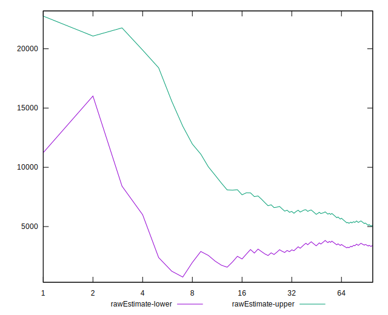
## Score Estimate

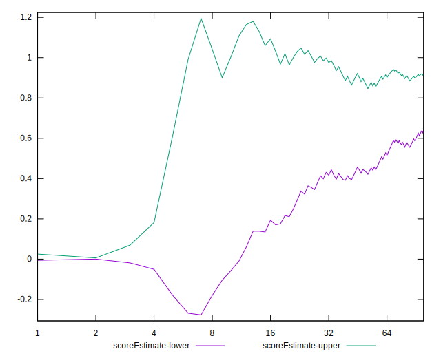
## P Score


```yaml
p90min: 0.0981822181952261
p90max: 0.9995144869392596
p90range: 0.9013322687440335
p90mean: 0.6813587203728682
median: 0.9912623405003635
p90stdev: 0.35465315012038207
mad: 0.008261272037256961
stdevBySn: 0.010781358076352707
lfitCenter: 0.7107914611815933
lfitStdev: 0.41529434923026004
mfitCenter: 0.7107914611815933
mfitStdev: 0.5204942795612689
mfitConfidence: 0.052049427956126895
p90skewness: -0.29983630835930475
p90eccentricity: 0.9999999999999996
p90discretization: 1
outlandishness: 0.9688374245583107

```

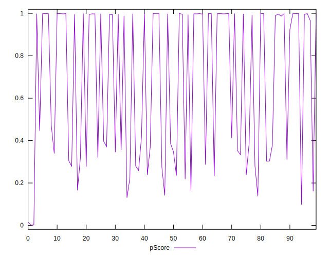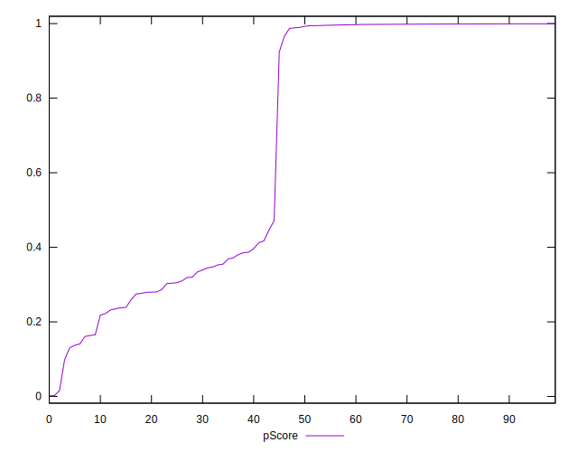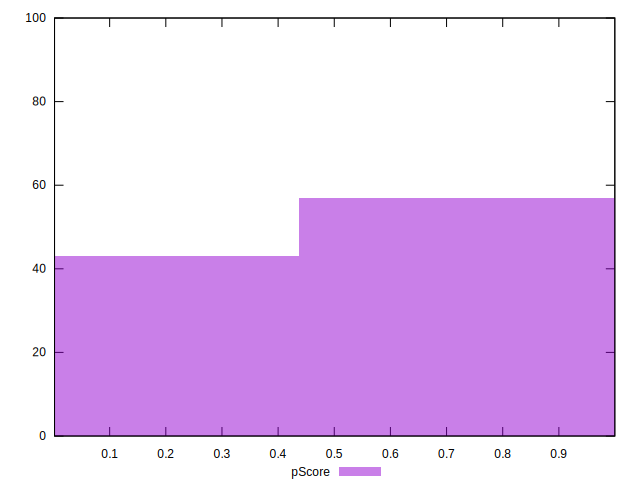
## Score Difference


```yaml
p90min: 0
p90max: 5.551115123125783e-17
p90range: 5.551115123125783e-17
p90mean: 1.1810883240693154e-18
median: 0
p90stdev: 8.010530753054493e-18
mad: 0
stdevBySn: 0
lfitCenter: 1.3627910306422e-18
lfitStdev: 3.332147950479324e-18
mfitCenter: 1.3627910306422e-18
mfitStdev: 4.176228138164904e-18
mfitConfidence: 4.1762281381649044e-19
p90skewness: 6.634888026970369
p90eccentricity: 0.9999999999999992
p90discretization: 47
outlandishness: 5.522500000000001

```

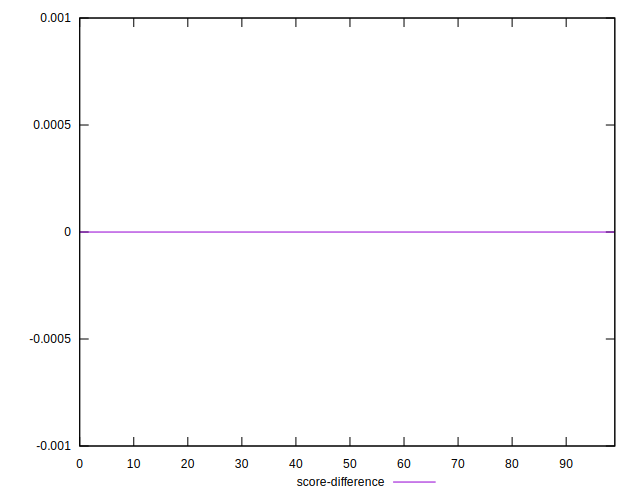
## P Score Difference


```yaml
p90min: -0.00449170622482295
p90max: 0.004814947158768623
p90range: 0.009306653383591573
p90mean: -0.0006898171547309922
median: -0.0010352394314899205
p90stdev: 0.002222192955119624
mad: 0.0011808503902867862
stdevBySn: 0.0019874326581811176
lfitCenter: -0.0007877857976121474
lfitStdev: 0.0016038407264643232
mfitCenter: -0.0007877857976121474
mfitStdev: 0.0020101162585027628
mfitConfidence: 0.00020101162585027627
p90skewness: 0.7010217577492209
p90eccentricity: 1.0000000000000002
p90discretization: 1
outlandishness: 0.8654913083450836

```

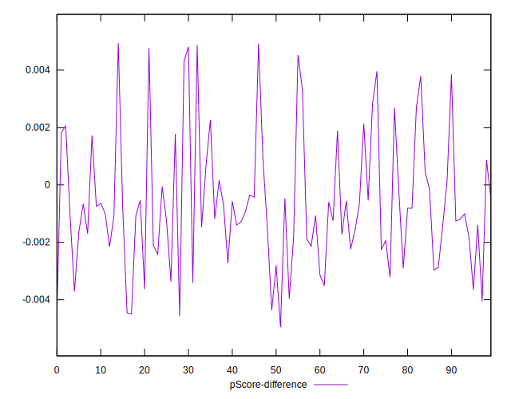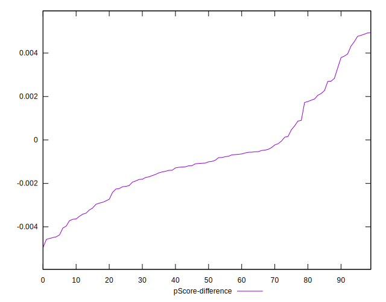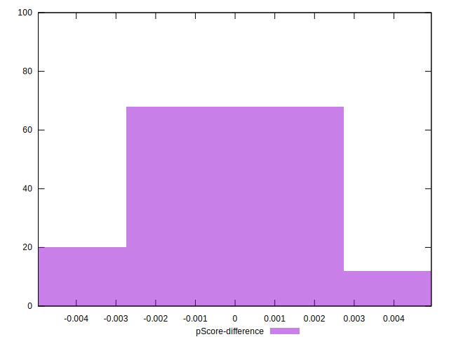