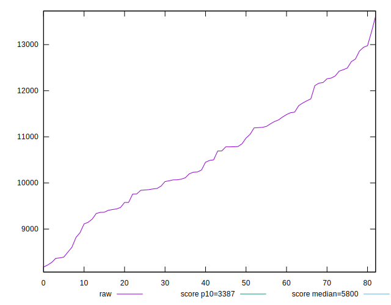

# //speed-index/samples/astro

[→ Parent](../..)


## Raw


```yaml
p90min: 8365.297991890086
p90max: 12941.604271974775
p90range: 4576.306280084689
p90mean: 10583.72641429344
median: 10488.830546347901
p90stdev: 1204.9414834495576
mad: 1020.2065415822617
stdevBySn: 1443.3126883446216
lfitCenter: 10567.010891923488
lfitStdev: 1078.0370222009808
mfitCenter: 10567.010891923488
mfitStdev: 1351.1190418335464
mfitConfidence: 148.3045817848387
p90skewness: 0.11065646659149025
p90eccentricity: 0.9999999999999998
p90discretization: 1
outlandishness: 1.002391193650647

```


## Score


```yaml
p90min: 0.03
p90max: 0.19
p90range: 0.16
p90mean: 0.08571428571428572
median: 0.08
p90stdev: 0.042132400199463085
mad: 0.03
stdevBySn: 0.04770400000000001
lfitCenter: 0.08429398597640617
lfitStdev: 0.036353541781867636
mfitCenter: 0.08429398597640617
mfitStdev: 0.04556240790255126
mfitConfidence: 0.005001123986771959
p90skewness: 0.7193128865369214
p90eccentricity: 1.0000000000000007
p90discretization: 4.529411764705882
outlandishness: 1.0471289172755283

```


## Raw Estimate


## Score Estimate


## P Score


```yaml
p90min: 0.027929767323559118
p90max: 0.191458461277898
p90range: 0.1635286939543389
p90mean: 0.0858006077189111
median: 0.07905020227674991
p90stdev: 0.04223677148588878
mad: 0.031279536509433103
stdevBySn: 0.048263808155488405
lfitCenter: 0.08436394763457787
lfitStdev: 0.03648113512145284
mfitCenter: 0.08436394763457787
mfitStdev: 0.045722322439041604
mfitConfidence: 0.005018676887531415
p90skewness: 0.7346860973594274
p90eccentricity: 0.9999999999999992
p90discretization: 1
outlandishness: 1.0471591474280326

```


## Score Difference


```yaml
p90min: 0
p90max: 0
p90range: 0
p90mean: 0
median: 0
p90stdev: 0
mad: 0
stdevBySn: 0
lfitCenter: 0
lfitStdev: 0
mfitCenter: 0
mfitStdev: 0
mfitConfidence: 0
p90skewness: .nan
p90eccentricity: .nan
p90discretization: 77
outlandishness: .nan

```


## P Score Difference


```yaml
p90min: -0.004325177890820056
p90max: 0.004490065535363227
p90range: 0.008815243426183283
p90mean: 0.00009896850332202968
median: -0.00030026608993229814
p90stdev: 0.002625216291123064
mad: 0.0024264492677980587
stdevBySn: 0.003152047640000028
lfitCenter: 0.00003295822026777956
lfitStdev: 0.002430494401009004
mfitCenter: 0.00003295822026777956
mfitStdev: 0.003046172996515942
mfitConfidence: 0.00033436092476314997
p90skewness: 0.13516804415700717
p90eccentricity: 1.0000000000000004
p90discretization: 1
outlandishness: 0.8196391597448877

```

