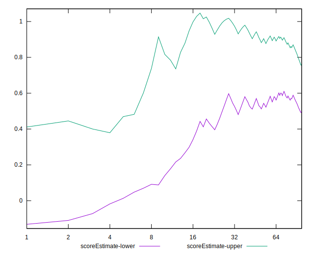
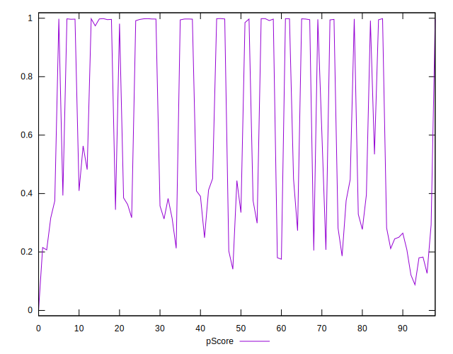

# //speed-index/samples/card

[→ Parent](../..)


## Raw


```yaml
p90min: 1652.7209999999998
p90max: 9363.1450959155
p90range: 7710.424095915501
p90mean: 4915.772769584273
median: 6127.596190909075
p90stdev: 2736.401146624144
mad: 2387.8790872578174
stdevBySn: 3568.7357048391336
lfitCenter: 5034.992087643687
lfitStdev: 3033.6012708667836
mfitCenter: 5034.992087643687
mfitStdev: 3802.0553635813976
mfitConfidence: 382.1209416108417
p90skewness: -0.08716016571707905
p90eccentricity: 1.0000000000000002
p90discretization: 1
outlandishness: 1.062218405636492

```


## Score


```yaml
p90min: 0.13
p90max: 1
p90range: 0.87
p90mean: 0.6097849462365593
median: 0.45
p90stdev: 0.3460746966875255
mad: 0.27
stdevBySn: 0.381632
lfitCenter: 0.6011055306398192
lfitStdev: 0.3853725967378112
mfitCenter: 0.6011055306398192
mfitStdev: 0.48299292411149203
mfitConfidence: 0.048542615323467236
p90skewness: 0.12482993524947437
p90eccentricity: 0.9999999999999997
p90discretization: 2.8181818181818183
outlandishness: 0.9851896092874762

```


## Raw Estimate


## Score Estimate


## P Score


```yaml
p90min: 0.12693276518301372
p90max: 0.9986096519773735
p90range: 0.8716768867943598
p90mean: 0.6091333316869284
median: 0.4479260681236216
p90stdev: 0.345580636268378
mad: 0.2678107397802675
stdevBySn: 0.382816613086969
lfitCenter: 0.6007892263272898
lfitStdev: 0.38463654863805014
mfitCenter: 0.6007892263272898
mfitStdev: 0.482070424621389
mfitConfidence: 0.04844990063625615
p90skewness: 0.12252389505724827
p90eccentricity: 1.0000000000000002
p90discretization: 1
outlandishness: 0.9852264260742665

```


## Score Difference


```yaml
p90min: 0
p90max: 0
p90range: 0
p90mean: 0
median: 0
p90stdev: 0
mad: 0
stdevBySn: 0
lfitCenter: 8.04066926186321e-19
lfitStdev: 1.9863028606986994e-18
mfitCenter: 8.04066926186321e-19
mfitStdev: 2.4894614588089026e-18
mfitConfidence: 2.5020029057333103e-19
p90skewness: .nan
p90eccentricity: .nan
p90discretization: 93
outlandishness: .inf

```


## P Score Difference


```yaml
p90min: -0.0048010622925382385
p90max: 0.004775884961942145
p90range: 0.009576947254480384
p90mean: -0.0006770318281080236
median: -0.0014371445288179352
p90stdev: 0.0027678404758704317
mad: 0.002342718540425337
stdevBySn: 0.002998117119194352
lfitCenter: -0.0008446446768659945
lfitStdev: 0.0024946948858163504
mfitCenter: -0.0008446446768659945
mfitStdev: 0.003126636371828464
mfitConfidence: 0.0003142387788252469
p90skewness: 0.4399877084596153
p90eccentricity: 0.9999999999999993
p90discretization: 1
outlandishness: 0.8810035456625882

```

