# //speed-index/samples/music

[→ Parent](../..)


## Raw


```yaml
p90min: 3698.8300087513985
p90max: 9381.599672794246
p90range: 5682.769664042848
p90mean: 5427.275154234043
median: 5381.372369679868
p90stdev: 982.6279565398323
mad: 627.2044976017137
stdevBySn: 966.4019016038914
lfitCenter: 5550.315038635628
lfitStdev: 991.9326131027555
mfitCenter: 5550.315038635628
mfitStdev: 1243.2031685169536
mfitConfidence: 124.32031685169537
p90skewness: 1.536750215328537
p90eccentricity: 1.0000000000000002
p90discretization: 1
outlandishness: 1.1319085104208022

```

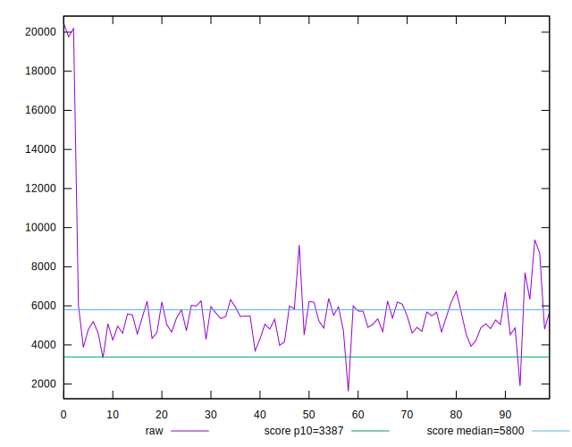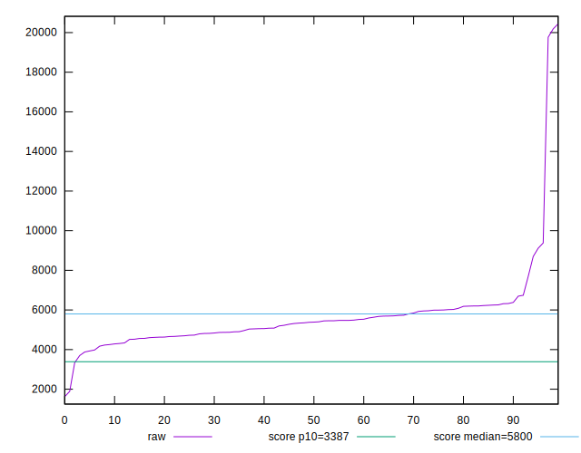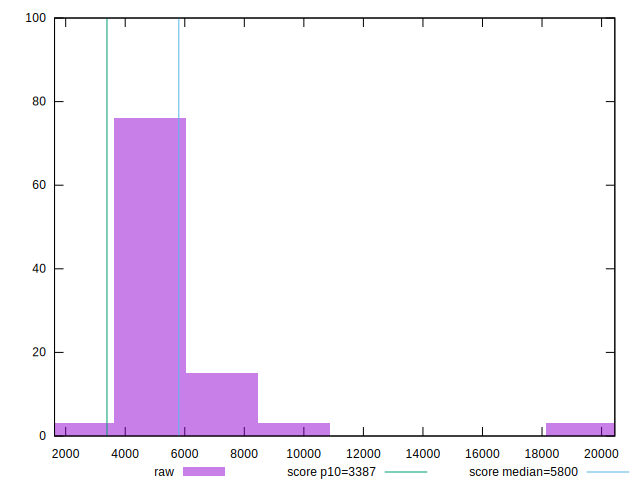
## Score


```yaml
p90min: 0.13
p90max: 0.86
p90range: 0.73
p90mean: 0.5736170212765958
median: 0.57
p90stdev: 0.14374808834125588
mad: 0.10999999999999993
stdevBySn: 0.16100099999999995
lfitCenter: 0.5740816803680088
lfitStdev: 0.1214073677559166
mfitCenter: 0.5740816803680088
mfitStdev: 0.15216157053586374
mfitConfidence: 0.015216157053586374
p90skewness: -0.6410585080944255
p90eccentricity: 0.9999999999999997
p90discretization: 2.238095238095238
outlandishness: 0.9815473440292907

```

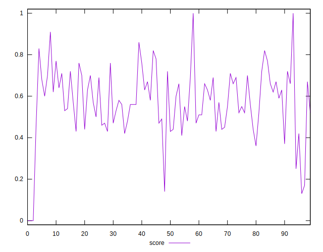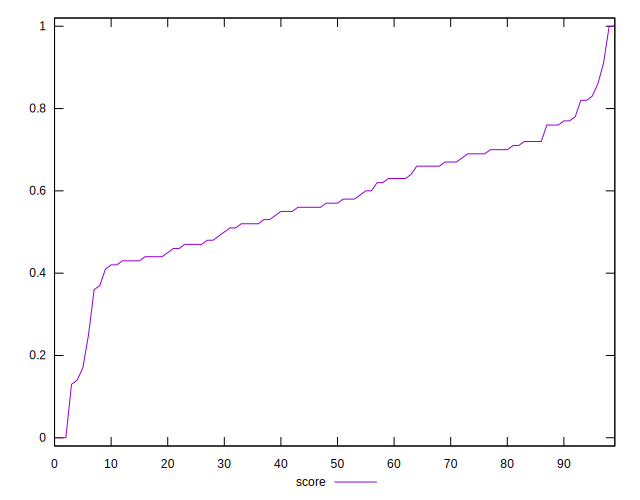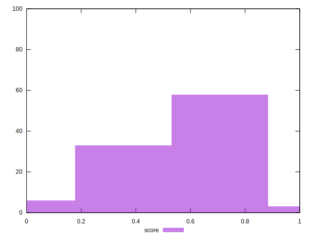
## Raw Estimate

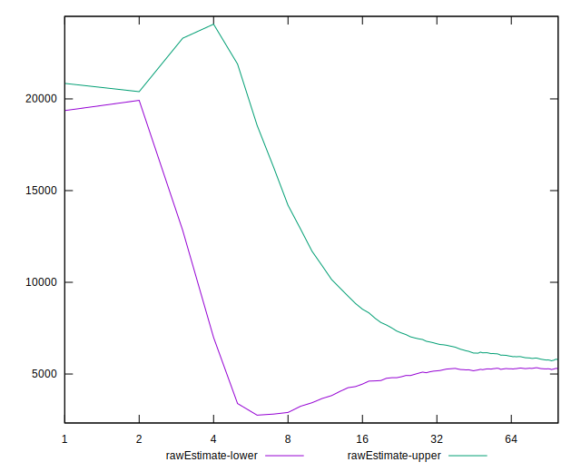
## Score Estimate

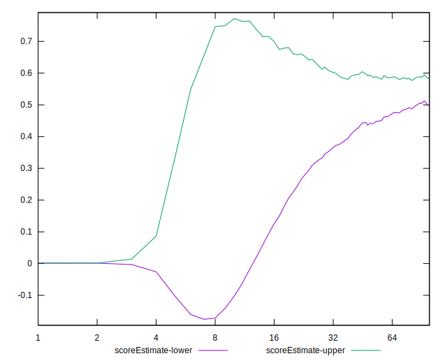
## P Score


```yaml
p90min: 0.12595930215413864
p90max: 0.8580780644864725
p90range: 0.7321187623323339
p90mean: 0.5735757828543107
median: 0.5708272099045129
p90stdev: 0.1441144174990268
mad: 0.10513252474561002
stdevBySn: 0.16544032110761747
lfitCenter: 0.5739850189015425
lfitStdev: 0.12159913391776724
mfitCenter: 0.5739850189015425
mfitStdev: 0.1524019137778117
mfitConfidence: 0.015240191377781171
p90skewness: -0.6468683931873567
p90eccentricity: 0.9999999999999997
p90discretization: 1
outlandishness: 0.9813996560846918

```

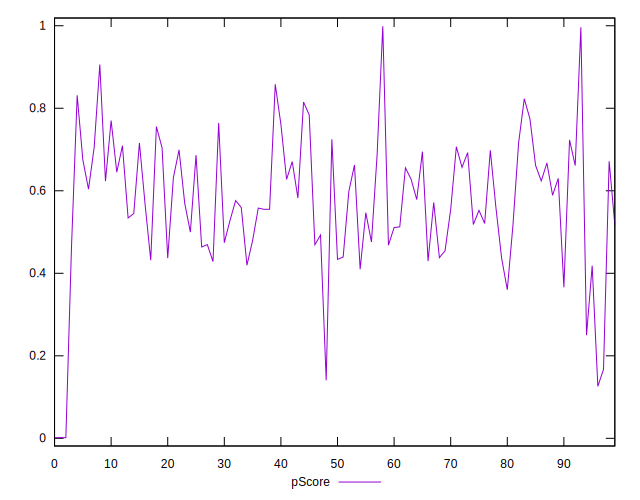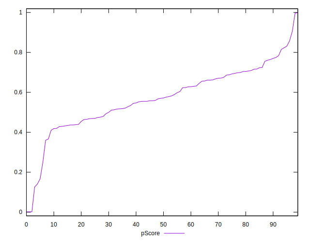
## Score Difference


```yaml
p90min: 0
p90max: 1.1102230246251565e-16
p90range: 1.1102230246251565e-16
p90mean: 1.594469237493576e-17
median: 0
p90stdev: 3.6770563133481384e-17
mad: 0
stdevBySn: 0
lfitCenter: 1.0682523162052494e-17
lfitStdev: 2.371598038429901e-17
mfitCenter: 1.0682523162052494e-17
mfitStdev: 2.9723573525848166e-17
mfitConfidence: 2.9723573525848166e-18
p90skewness: 2.021627042396741
p90eccentricity: 1.0000000000000007
p90discretization: 31.333333333333332
outlandishness: 1.3199456790123456

```

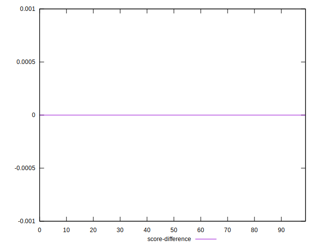
## P Score Difference


```yaml
p90min: -0.004824690861970127
p90max: 0.004899211142380178
p90range: 0.009723902004350304
p90mean: -0.00009048613352814701
median: -0.0004245322288232156
p90stdev: 0.0027816111171349947
mad: 0.002235447607666363
stdevBySn: 0.003343039789058524
lfitCenter: -0.00015752620167281
lfitStdev: 0.002435193628441201
mfitCenter: -0.00015752620167281
mfitStdev: 0.0030520626046971018
mfitConfidence: 0.0003052062604697102
p90skewness: 0.188203167365405
p90eccentricity: 0.9999999999999999
p90discretization: 1
outlandishness: 0.8537756224349523

```

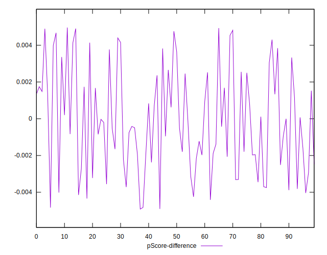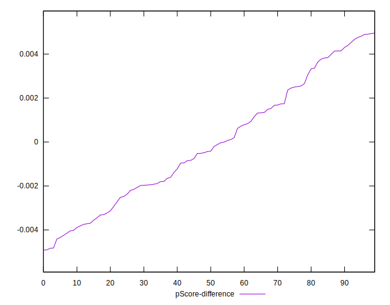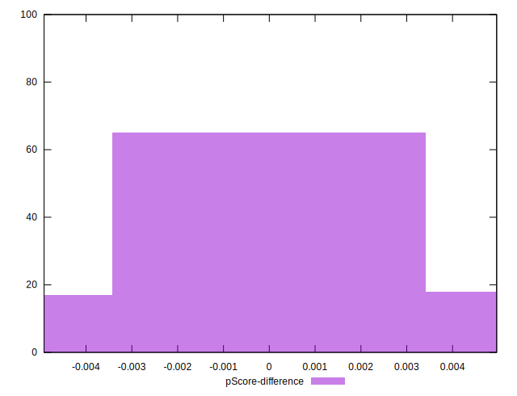