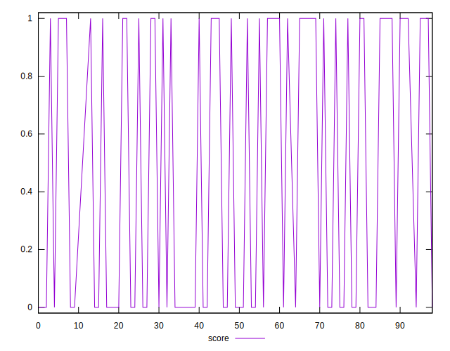
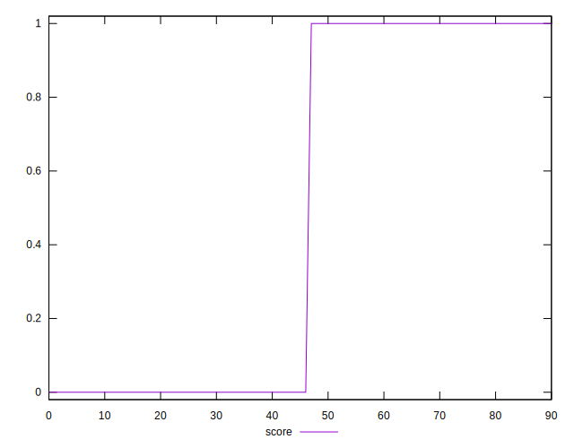
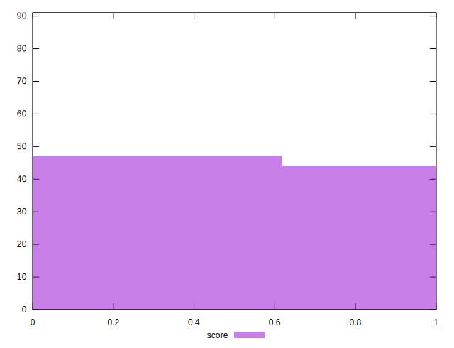

# //third-party-summary/samples/agenda

[→ Parent](../..)


## Raw


```yaml
p90range: 0

```


## Score


```yaml
p90min: 0
p90max: 1
p90range: 1
p90mean: 0.4823529411764706
median: 0
p90stdev: 0.49968848427283014
mad: 0
stdevBySn: 0
lfitCenter: 0.4705977447030781
lfitStdev: 0.6244901076502968
mfitCenter: 0.4705977447030781
mfitStdev: 0.7826822813193638
mfitConfidence: 0.08204739674780079
p90skewness: 0.0706322414022017
p90eccentricity: 1.0000000000000036
p90discretization: 42.5
outlandishness: 1.0048302626634469

```

