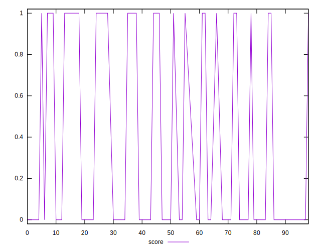
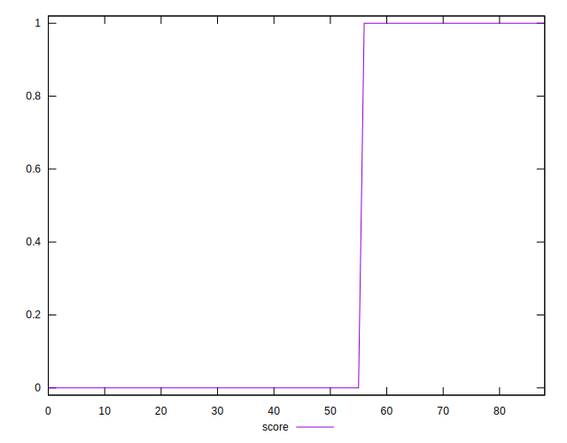
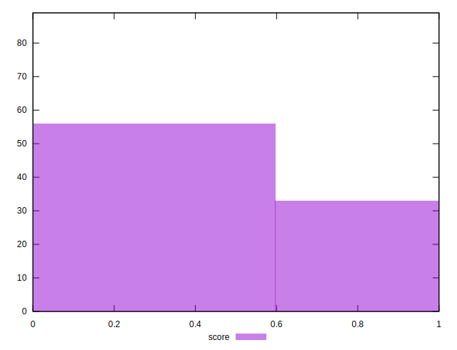

# //third-party-summary/samples/card

[→ Parent](../..)


## Raw


```yaml
p90range: 0

```


## Score


```yaml
p90min: 0
p90max: 1
p90range: 1
p90mean: 0.3614457831325301
median: 0
p90stdev: 0.4804193262018526
mad: 0
stdevBySn: 0
lfitCenter: 0.2989105727912335
lfitStdev: 0.5252966475873411
mfitCenter: 0.2989105727912335
mfitStdev: 0.6583617153681243
mfitConfidence: 0.06978620225675623
p90skewness: 0.5768053419618459
p90eccentricity: 0.999999999999999
p90discretization: 41.5
outlandishness: 1.0523532382274967

```

