# //total-blocking-time/samples/agenda

[→ Parent](../..)


## Raw


```yaml
p90min: 0
p90max: 1082.499999999999
p90range: 1082.499999999999
p90mean: 362.7530904255319
median: 132.5
p90stdev: 392.539721336153
mad: 132.5
stdevBySn: 167.26215000000002
lfitCenter: 329.90875365018263
lfitStdev: 412.49171984575287
mfitCenter: 329.90875365018263
mfitStdev: 516.9817045284757
mfitConfidence: 51.69817045284757
p90skewness: 0.46948283204483643
p90eccentricity: 1.0000000000000007
p90discretization: 1.3428571428571427
outlandishness: 1.091102983966539

```

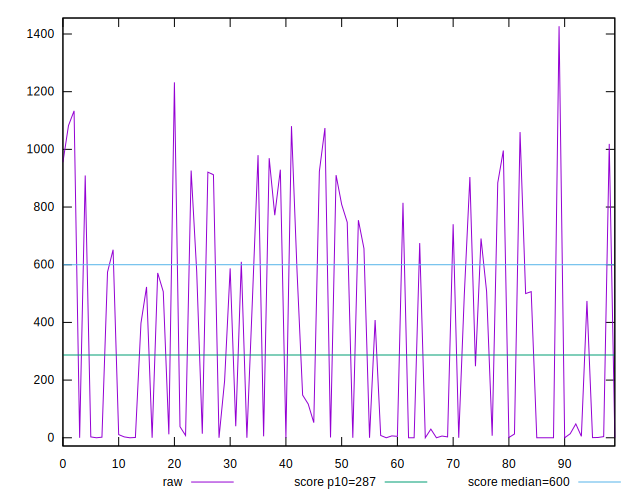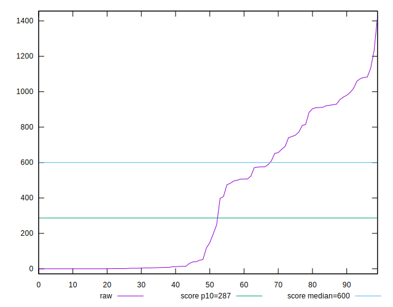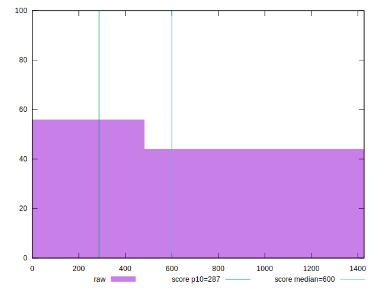
## Score


```yaml
p90min: 0.15
p90max: 1
p90range: 0.85
p90mean: 0.7119148936170211
median: 0.995
p90stdev: 0.3298880422453625
mad: 0.0050000000000000044
stdevBySn: 0.008944500000000008
lfitCenter: 0.747757171395855
lfitStdev: 0.34563319768107253
mfitCenter: 0.747757171395855
mfitStdev: 0.43318697341514234
mfitConfidence: 0.04331869734151424
p90skewness: -0.4968376730755463
p90eccentricity: 1.0000000000000007
p90discretization: 3.032258064516129
outlandishness: 0.9731710465056452

```

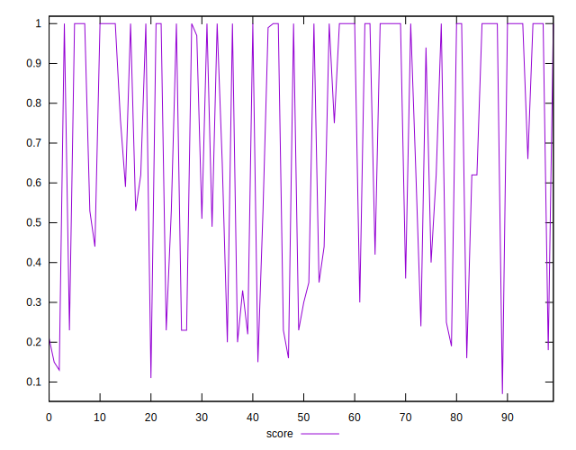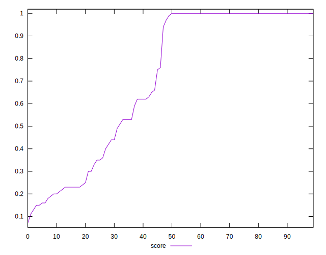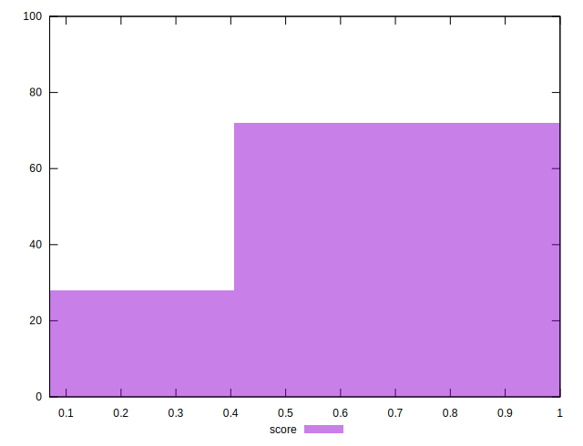
## Raw Estimate

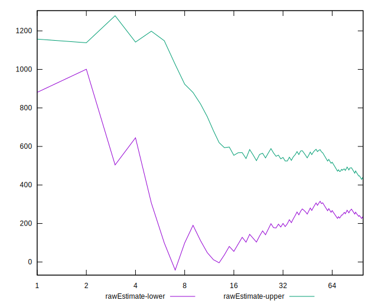
## Score Estimate

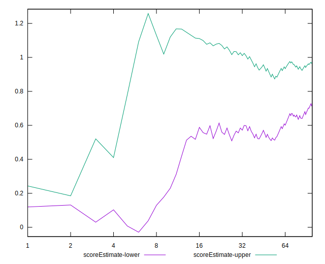
## P Score


```yaml
p90min: 0.15256697646602696
p90max: 1
p90range: 0.8474330235339731
p90mean: 0.7119014975289978
median: 0.9951261705832345
p90stdev: 0.3298713356436242
mad: 0.004873829416765507
stdevBySn: 0.007377538666719206
lfitCenter: 0.7477092351881895
lfitStdev: 0.34581989368726335
mfitCenter: 0.7477092351881895
mfitStdev: 0.4334209621593171
mfitConfidence: 0.04334209621593171
p90skewness: -0.4960878363971455
p90eccentricity: 0.9999999999999999
p90discretization: 1.540983606557377
outlandishness: 0.9730628682481776

```

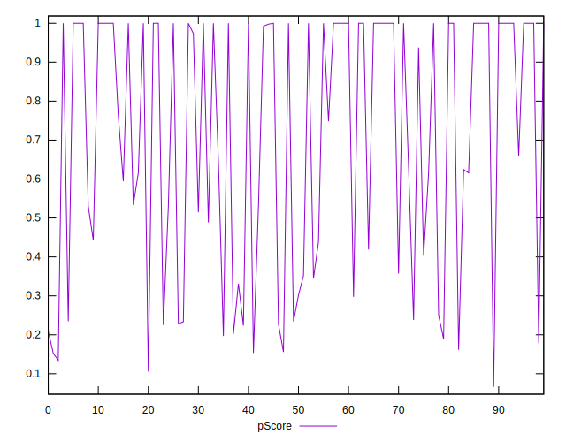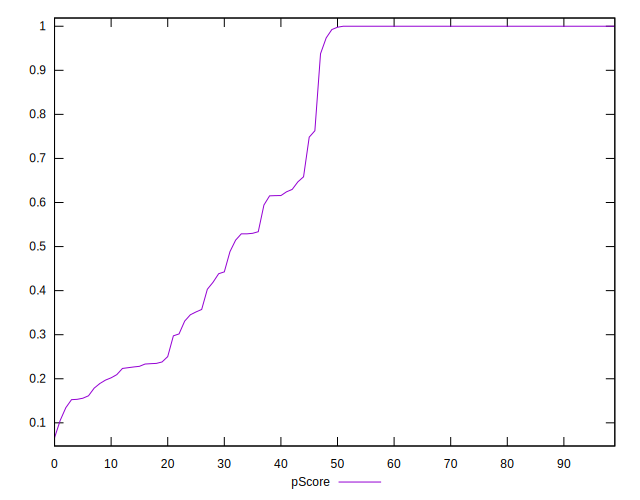
## Score Difference


```yaml
p90min: 0
p90max: 0
p90range: 0
p90mean: 0
median: 0
p90stdev: 0
mad: 0
stdevBySn: 0
lfitCenter: 1.0541723501857061e-18
lfitStdev: 2.6045347189173595e-18
mfitCenter: 1.0541723501857061e-18
mfitStdev: 3.264300187632857e-18
mfitConfidence: 3.264300187632857e-19
p90skewness: .nan
p90eccentricity: .nan
p90discretization: 94
outlandishness: .inf

```

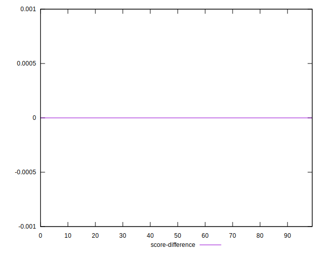
## P Score Difference


```yaml
p90min: -0.004533706920991545
p90max: 0.0043256292128507345
p90range: 0.00885933613384228
p90mean: -0.000049405891938498976
median: 0
p90stdev: 0.0018849470300894957
mad: 0.0001452300689995245
stdevBySn: 0.0002507639300843574
lfitCenter: -0.000047477206722507445
lfitStdev: 0.0010649230978814637
mfitCenter: -0.000047477206722507445
mfitStdev: 0.0013346831750716717
mfitConfidence: 0.00013346831750716718
p90skewness: 0.08269489885996141
p90eccentricity: 1.000000000000001
p90discretization: 1.6206896551724137
outlandishness: 1.1184270518797355

```

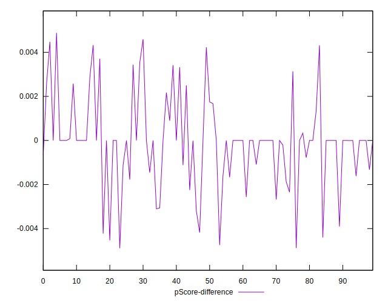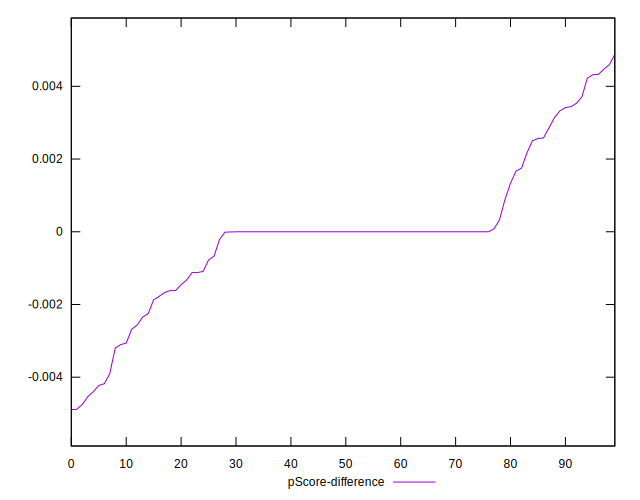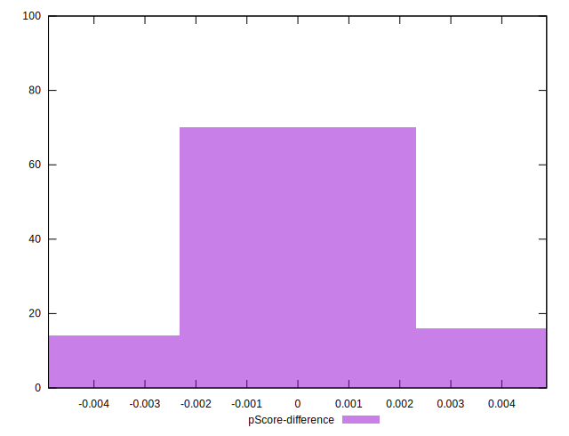