# //total-blocking-time/samples/astro

[→ Parent](../..)


## Raw


```yaml
p90min: 805.5
p90max: 1969.5459999999994
p90range: 1164.0459999999994
p90mean: 1119.6745851063836
median: 1074.7624999999998
p90stdev: 250.5595072800756
mad: 166.9984999999997
stdevBySn: 229.71607772499843
lfitCenter: 1114.793149338603
lfitStdev: 206.72981839977987
mfitCenter: 1114.793149338603
mfitStdev: 259.09740426582493
mfitConfidence: 25.909740426582495
p90skewness: 1.2614700528432634
p90eccentricity: 0.9999999999999999
p90discretization: 1
outlandishness: 1.0592187164528648

```

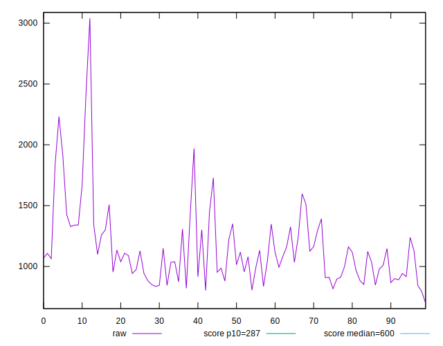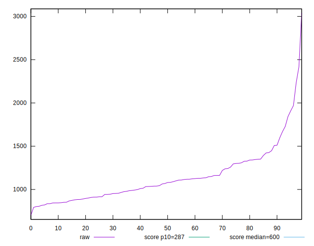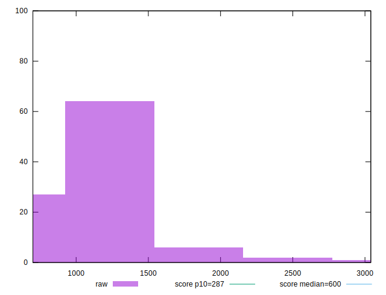
## Score


```yaml
p90min: 0.02
p90max: 0.3
p90range: 0.27999999999999997
p90mean: 0.16223404255319154
median: 0.155
p90stdev: 0.07511911470655165
mad: 0.065
stdevBySn: 0.095408
lfitCenter: 0.16187102201125317
lfitStdev: 0.06545632664385469
mfitCenter: 0.16187102201125317
mfitStdev: 0.08203733964203379
mfitConfidence: 0.008203733964203378
p90skewness: 0.016537292541583815
p90eccentricity: 0.9999999999999991
p90discretization: 3.357142857142857
outlandishness: 1.006989218984144

```

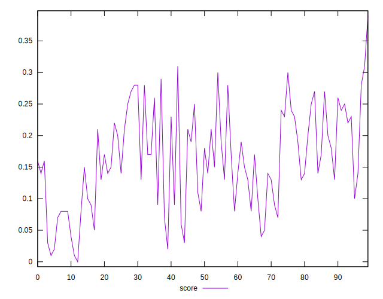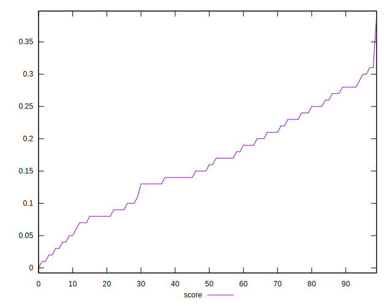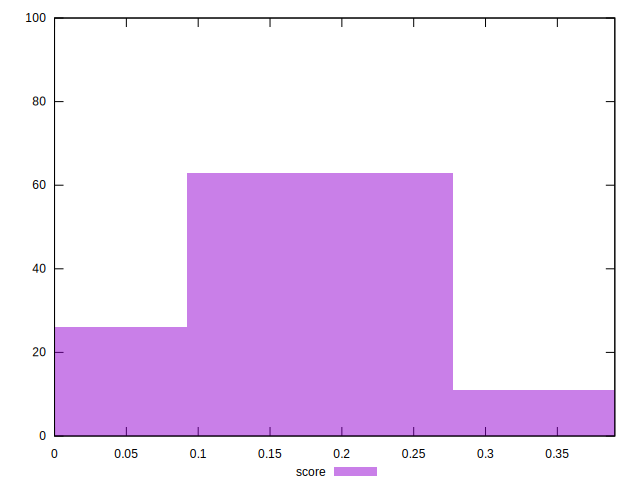
## Raw Estimate

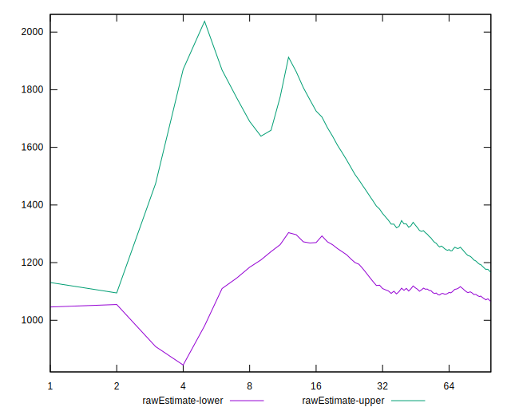
## Score Estimate

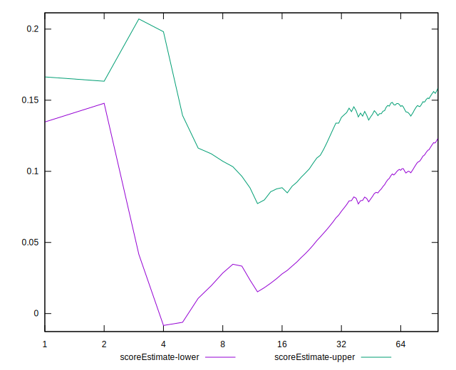
## P Score


```yaml
p90min: 0.019431944037458404
p90max: 0.30437919599558744
p90range: 0.28494725195812903
p90mean: 0.16250865305870285
median: 0.15554183010061387
p90stdev: 0.07504887018490751
mad: 0.06713345852778504
stdevBySn: 0.09254104969101525
lfitCenter: 0.16213834988821296
lfitStdev: 0.06577010211611851
mfitCenter: 0.16213834988821296
mfitStdev: 0.08243059887776061
mfitConfidence: 0.008243059887776061
p90skewness: 0.02320896345077075
p90eccentricity: 0.9999999999999994
p90discretization: 1
outlandishness: 1.0074985091619293

```

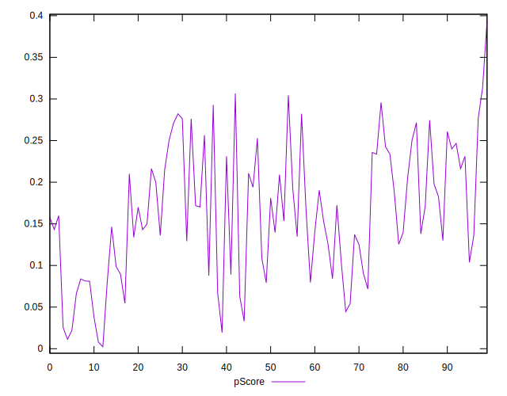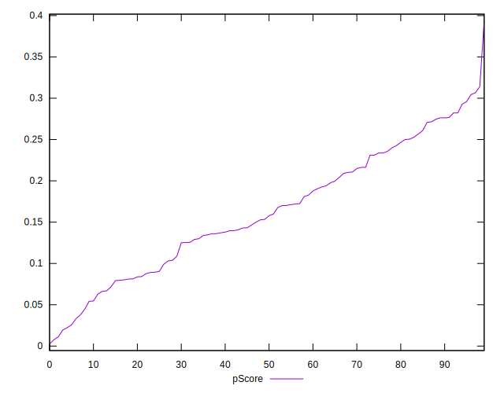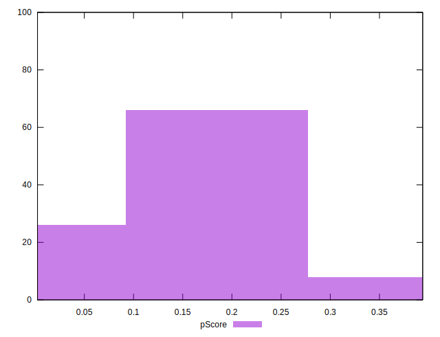
## Score Difference


```yaml
p90min: 0
p90max: 0
p90range: 0
p90mean: 0
median: 0
p90stdev: 0
mad: 0
stdevBySn: 0
lfitCenter: 0
lfitStdev: 0
mfitCenter: 0
mfitStdev: 0
mfitConfidence: 0
p90skewness: .nan
p90eccentricity: .nan
p90discretization: 94
outlandishness: .nan

```


## P Score Difference


```yaml
p90min: -0.004381813383632943
p90max: 0.004535501067034528
p90range: 0.008917314450667471
p90mean: 0.00033676480201259894
median: 0.0004019351019610984
p90stdev: 0.002621196230194075
mad: 0.0024927729537290444
stdevBySn: 0.003157609616401627
lfitCenter: 0.0003772215373469592
lfitStdev: 0.0022423611405338263
mfitCenter: 0.0003772215373469592
mfitStdev: 0.0028103829212258805
mfitConfidence: 0.00028103829212258806
p90skewness: -0.17756804096373927
p90eccentricity: 0.9999999999999997
p90discretization: 1
outlandishness: 0.8849544743292608

```

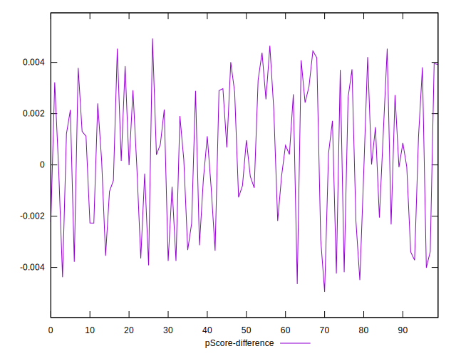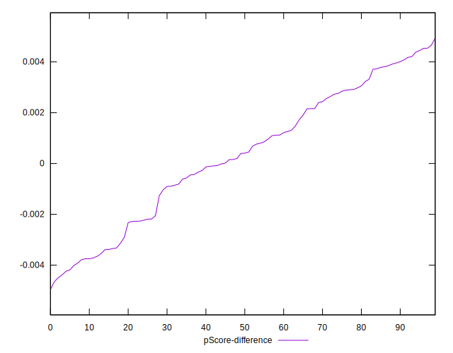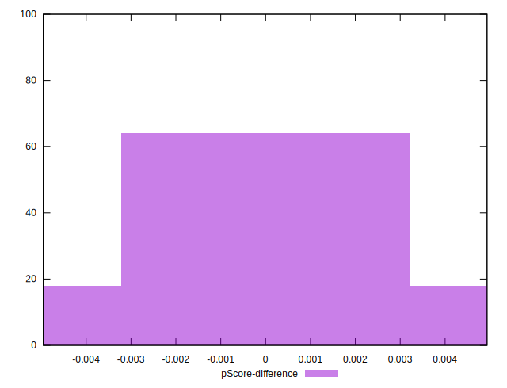