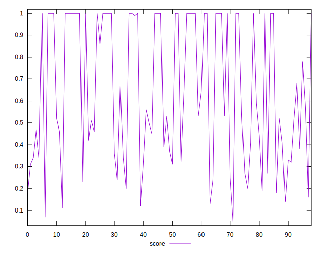

# //total-blocking-time/samples/card

[→ Parent](../..)


## Raw


```yaml
p90min: 0
p90max: 1167.5
p90range: 1167.5
p90mean: 433.5902150537633
median: 541.2870000000003
p90stdev: 380.70501726025515
mad: 441.71299999999974
stdevBySn: 540.8441
lfitCenter: 436.27359110812824
lfitStdev: 387.2596017918916
mfitCenter: 436.27359110812824
mfitStdev: 485.3579342253366
mfitConfidence: 48.780307783255665
p90skewness: 0.12557387366082892
p90eccentricity: 0.9999999999999992
p90discretization: 1.1481481481481481
outlandishness: 1.0738292627656139

```


## Score


```yaml
p90min: 0.12
p90max: 1
p90range: 0.88
p90mean: 0.6516129032258067
median: 0.57
p90stdev: 0.32275790828481415
mad: 0.38999999999999996
stdevBySn: 0.48896599999999996
lfitCenter: 0.6557955380213315
lfitStdev: 0.3369072424524699
mfitCenter: 0.6557955380213315
mfitStdev: 0.4222506103545479
mfitConfidence: 0.042437783092260366
p90skewness: -0.08723122618206205
p90eccentricity: 0.9999999999999999
p90discretization: 2.325
outlandishness: 0.9790389012148536

```


## Raw Estimate


## Score Estimate


## P Score


```yaml
p90min: 0.12366676655124492
p90max: 1
p90range: 0.876333233448755
p90mean: 0.651183871170893
median: 0.5710157614861296
p90stdev: 0.32285102589652254
mad: 0.3930091889981623
stdevBySn: 0.48146297141241867
lfitCenter: 0.6552857892926127
lfitStdev: 0.3370165998116427
mfitCenter: 0.6552857892926127
mfitStdev: 0.4223876694789566
mfitConfidence: 0.04245155805255607
p90skewness: -0.08709669459720304
p90eccentricity: 0.9999999999999996
p90discretization: 1.2916666666666667
outlandishness: 0.9790936393212173

```


## Score Difference


```yaml
p90min: 0
p90max: 5.551115123125783e-17
p90range: 5.551115123125783e-17
p90mean: 5.968940992608369e-19
median: 0
p90stdev: 5.725207074628953e-18
mad: 0
stdevBySn: 0
lfitCenter: 1.3477028736356578e-18
lfitStdev: 3.3120530219972805e-18
mfitCenter: 1.3477028736356578e-18
mfitStdev: 4.151042880184673e-18
mfitConfidence: 4.171955067348111e-19
p90skewness: 9.487405839596862
p90eccentricity: 0.9999999999999972
p90discretization: 46.5
outlandishness: 22.0615243342516

```


## P Score Difference


```yaml
p90min: -0.004533515319699977
p90max: 0.0039409031587637755
p90range: 0.008474418478463752
p90mean: -0.00043262635792663297
median: -3.2937652605369294e-11
p90stdev: 0.001968994557183784
mad: 0.0010157615190673486
stdevBySn: 0.0012866169337749955
lfitCenter: -0.0003129636727744865
lfitStdev: 0.0013963667805668909
mfitCenter: -0.0003129636727744865
mfitStdev: 0.0017500862287232264
mfitConfidence: 0.00017589028398312252
p90skewness: -0.32884534671045623
p90eccentricity: 0.9999999999999996
p90discretization: 1.3285714285714285
outlandishness: 0.8828664643721453

```

