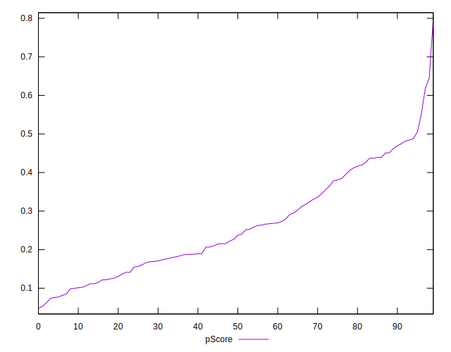

# //total-blocking-time/samples/music

[→ Parent](../..)


## Raw


```yaml
p90min: 557.615499999999
p90max: 1382
p90range: 824.384500000001
p90mean: 922.6224308510638
median: 914.4337500000001
p90stdev: 213.99398308261306
mad: 190.31400000000122
stdevBySn: 261.7360460500009
lfitCenter: 919.8986318584934
lfitStdev: 188.93553889395264
mfitCenter: 919.8986318584934
mfitStdev: 236.79558217538718
mfitConfidence: 23.67955821753872
p90skewness: 0.26797627165076354
p90eccentricity: 0.9999999999999999
p90discretization: 1
outlandishness: 1.007861915170004

```


## Score


```yaml
p90min: 0.07
p90max: 0.55
p90range: 0.48000000000000004
p90mean: 0.2588297872340426
median: 0.235
p90stdev: 0.1262878877885064
mad: 0.10499999999999998
stdevBySn: 0.149075
lfitCenter: 0.2549342611245291
lfitStdev: 0.11329084670143362
mfitCenter: 0.2549342611245291
mfitStdev: 0.14198901994222526
mfitConfidence: 0.014198901994222527
p90skewness: 0.4355750788964275
p90eccentricity: 1.0000000000000002
p90discretization: 2.292682926829268
outlandishness: 1.0529982046761133

```


## Raw Estimate


## Score Estimate


## P Score


```yaml
p90min: 0.07353437391041312
p90max: 0.5506536044551262
p90range: 0.4771192305447131
p90mean: 0.2586970933049497
median: 0.23205955162017441
p90stdev: 0.12632691436001237
mad: 0.10254929012891659
stdevBySn: 0.14432936708368227
lfitCenter: 0.25461007300418687
lfitStdev: 0.11344741840176098
mfitCenter: 0.25461007300418687
mfitStdev: 0.14218525346794653
mfitConfidence: 0.014218525346794653
p90skewness: 0.44703884295378643
p90eccentricity: 1
p90discretization: 1
outlandishness: 1.0527414825303445

```


## Score Difference


```yaml
p90min: 0
p90max: 5.551115123125783e-17
p90range: 5.551115123125783e-17
p90mean: 5.905441620346577e-19
median: 0
p90stdev: 5.695001657605475e-18
mad: 0
stdevBySn: 0
lfitCenter: 1.0755152514005351e-18
lfitStdev: 2.6436841970240598e-18
mfitCenter: 1.0755152514005351e-18
mfitStdev: 3.313366782061881e-18
mfitConfidence: 3.313366782061881e-19
p90skewness: 9.539955591519908
p90eccentricity: 0.9999999999999996
p90discretization: 47
outlandishness: 14.137600000000003

```


## P Score Difference


```yaml
p90min: -0.00474627431381236
p90max: 0.0048370735351806055
p90range: 0.009583347848992965
p90mean: -0.00017961025806190794
median: -0.00020613925563017776
p90stdev: 0.00275691541263955
mad: 0.002467413314765826
stdevBySn: 0.0031795772003168038
lfitCenter: -0.0001730877620760241
lfitStdev: 0.0024658475307714595
mfitCenter: -0.0001730877620760241
mfitStdev: 0.0030904815738901623
mfitConfidence: 0.00030904815738901623
p90skewness: 0.05808065940141595
p90eccentricity: 1
p90discretization: 1
outlandishness: 0.8803929248545322

```

