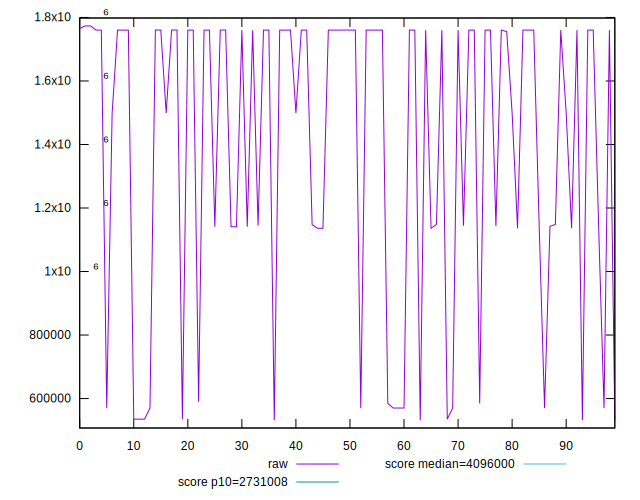
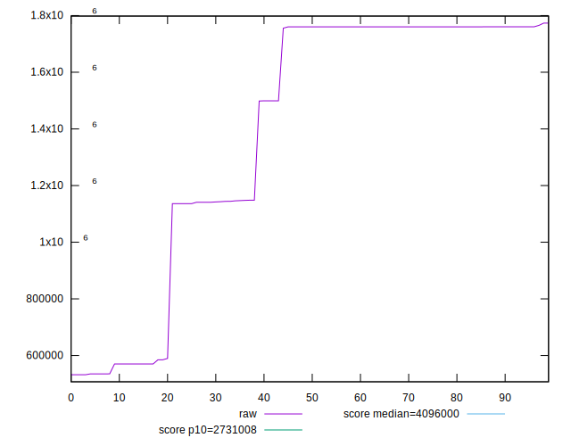
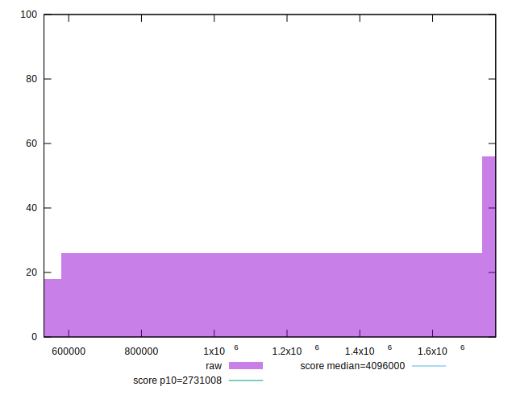
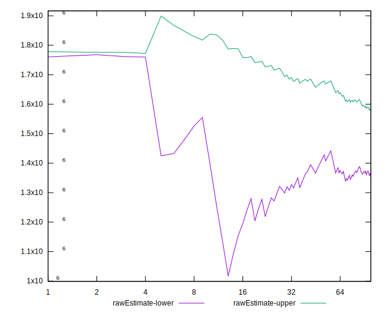

# //total-byte-weight/samples/agenda

[→ Parent](../..)


## Raw


```yaml
p90min: 532107
p90max: 1760359
p90range: 1228252
p90mean: 1398269.0212765958
median: 1760238
p90stdev: 470404.24387968786
mad: 93.5
stdevBySn: 144.30460000000002
lfitCenter: 1464513.7215779
lfitStdev: 452433.93421724485
mfitCenter: 1464513.7215779
mfitStdev: 567041.8465263257
mfitConfidence: 56704.18465263257
p90skewness: -0.8551791501085458
p90eccentricity: 0.9999999999999999
p90discretization: 1.205128205128205
outlandishness: 0.9789264415686996

```


## Score


```yaml
p90min: 1
p90max: 1
p90range: 0
p90mean: 1
median: 1
p90stdev: 0
mad: 0
stdevBySn: 0
lfitCenter: 1
lfitStdev: 0
mfitCenter: 1
mfitStdev: 0
mfitConfidence: 0
p90skewness: .nan
p90eccentricity: .nan
p90discretization: 94
outlandishness: 1

```


## Raw Estimate


## Score Estimate


## P Score


```yaml
p90min: 0
p90max: 0
p90range: 0
p90mean: 0
median: 0
p90stdev: 0
mad: 0
stdevBySn: 0
lfitCenter: 0
lfitStdev: 0
mfitCenter: 0
mfitStdev: 0
mfitConfidence: 0
p90skewness: .nan
p90eccentricity: .nan
p90discretization: 94
outlandishness: .nan

```


## Score Difference


```yaml
p90min: -1
p90max: -1
p90range: 0
p90mean: -1
median: -1
p90stdev: 0
mad: 0
stdevBySn: 0
lfitCenter: -1
lfitStdev: 0
mfitCenter: -1
mfitStdev: 0
mfitConfidence: 0
p90skewness: .nan
p90eccentricity: .nan
p90discretization: 94
outlandishness: 1

```


## P Score Difference


```yaml
p90min: -1
p90max: -1
p90range: 0
p90mean: -1
median: -1
p90stdev: 0
mad: 0
stdevBySn: 0
lfitCenter: -1
lfitStdev: 0
mfitCenter: -1
mfitStdev: 0
mfitConfidence: 0
p90skewness: .nan
p90eccentricity: .nan
p90discretization: 94
outlandishness: 1

```

