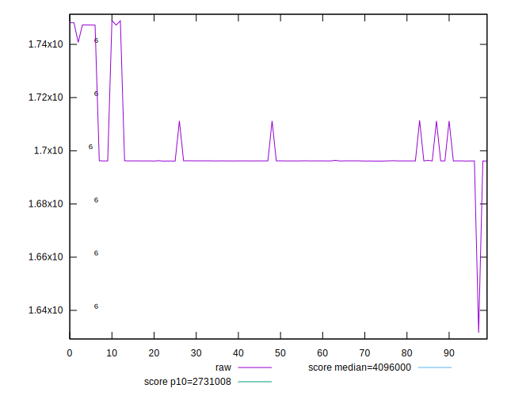

# //total-byte-weight/samples/astro

[→ Parent](../..)


## Raw


```yaml
p90min: 1696130
p90max: 1748132
p90range: 52002
p90mean: 1700747.8510638298
median: 1696201
p90stdev: 13414.663358443671
mad: 16
stdevBySn: 32.7965
lfitCenter: 1699064.115212084
lfitStdev: 7312.825632948
mfitCenter: 1699064.115212084
mfitStdev: 9165.267758719381
mfitConfidence: 916.5267758719381
p90skewness: 2.9621932348807167
p90eccentricity: 0.9999999999999992
p90discretization: 1.492063492063492
outlandishness: 1.000768325988808

```


## Score


```yaml
p90min: 1
p90max: 1
p90range: 0
p90mean: 1
median: 1
p90stdev: 0
mad: 0
stdevBySn: 0
lfitCenter: 1
lfitStdev: 0
mfitCenter: 1
mfitStdev: 0
mfitConfidence: 0
p90skewness: .nan
p90eccentricity: .nan
p90discretization: 94
outlandishness: 1

```


## Raw Estimate


## Score Estimate


## P Score


```yaml
p90min: 0
p90max: 0
p90range: 0
p90mean: 0
median: 0
p90stdev: 0
mad: 0
stdevBySn: 0
lfitCenter: 0
lfitStdev: 0
mfitCenter: 0
mfitStdev: 0
mfitConfidence: 0
p90skewness: .nan
p90eccentricity: .nan
p90discretization: 94
outlandishness: .nan

```


## Score Difference


```yaml
p90min: -1
p90max: -1
p90range: 0
p90mean: -1
median: -1
p90stdev: 0
mad: 0
stdevBySn: 0
lfitCenter: -1
lfitStdev: 0
mfitCenter: -1
mfitStdev: 0
mfitConfidence: 0
p90skewness: .nan
p90eccentricity: .nan
p90discretization: 94
outlandishness: 1

```


## P Score Difference


```yaml
p90min: -1
p90max: -1
p90range: 0
p90mean: -1
median: -1
p90stdev: 0
mad: 0
stdevBySn: 0
lfitCenter: -1
lfitStdev: 0
mfitCenter: -1
mfitStdev: 0
mfitConfidence: 0
p90skewness: .nan
p90eccentricity: .nan
p90discretization: 94
outlandishness: 1

```

