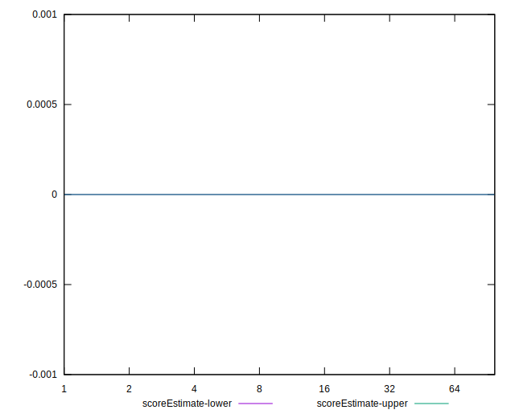

# //total-byte-weight/samples/card

[→ Parent](../..)


## Raw


```yaml
p90min: 544923
p90max: 1777916
p90range: 1232993
p90mean: 1501310.817204301
median: 1773032
p90stdev: 435508.7324012221
mad: 37
stdevBySn: 64.4004
lfitCenter: 1572622.8758737112
lfitStdev: 371217.2110883088
mfitCenter: 1572622.8758737112
mfitStdev: 465251.7791399658
mfitConfidence: 46759.563165229265
p90skewness: -1.3021715331779598
p90eccentricity: 1.0000000000000002
p90discretization: 1.273972602739726
outlandishness: 0.9730503846940646

```


## Score


```yaml
p90min: 1
p90max: 1
p90range: 0
p90mean: 1
median: 1
p90stdev: 0
mad: 0
stdevBySn: 0
lfitCenter: 1
lfitStdev: 0
mfitCenter: 1
mfitStdev: 0
mfitConfidence: 0
p90skewness: .nan
p90eccentricity: .nan
p90discretization: 93
outlandishness: 1

```


## Raw Estimate


## Score Estimate


## P Score


```yaml
p90min: 0
p90max: 0
p90range: 0
p90mean: 0
median: 0
p90stdev: 0
mad: 0
stdevBySn: 0
lfitCenter: 0
lfitStdev: 0
mfitCenter: 0
mfitStdev: 0
mfitConfidence: 0
p90skewness: .nan
p90eccentricity: .nan
p90discretization: 93
outlandishness: .nan

```


## Score Difference


```yaml
p90min: -1
p90max: -1
p90range: 0
p90mean: -1
median: -1
p90stdev: 0
mad: 0
stdevBySn: 0
lfitCenter: -1
lfitStdev: 0
mfitCenter: -1
mfitStdev: 0
mfitConfidence: 0
p90skewness: .nan
p90eccentricity: .nan
p90discretization: 93
outlandishness: 1

```


## P Score Difference


```yaml
p90min: -1
p90max: -1
p90range: 0
p90mean: -1
median: -1
p90stdev: 0
mad: 0
stdevBySn: 0
lfitCenter: -1
lfitStdev: 0
mfitCenter: -1
mfitStdev: 0
mfitConfidence: 0
p90skewness: .nan
p90eccentricity: .nan
p90discretization: 93
outlandishness: 1

```

