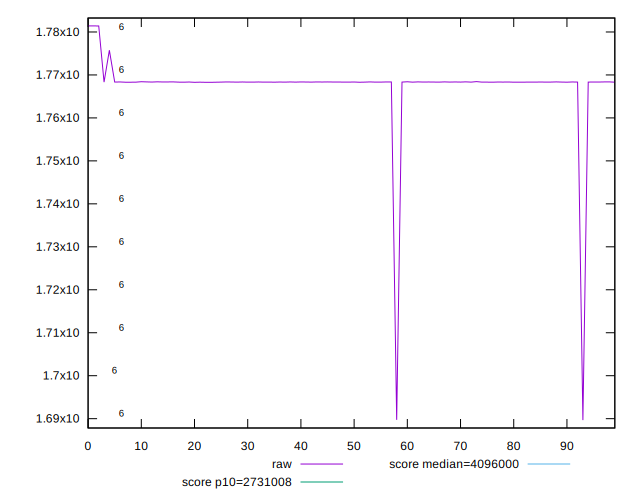
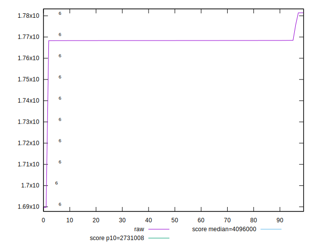
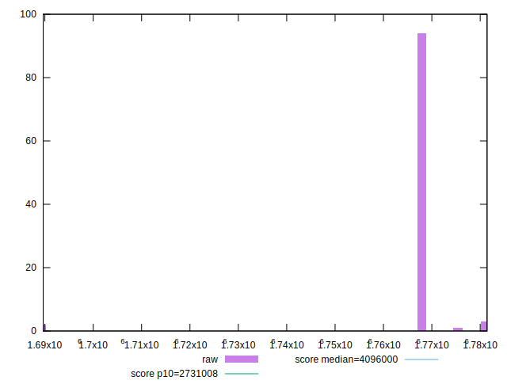
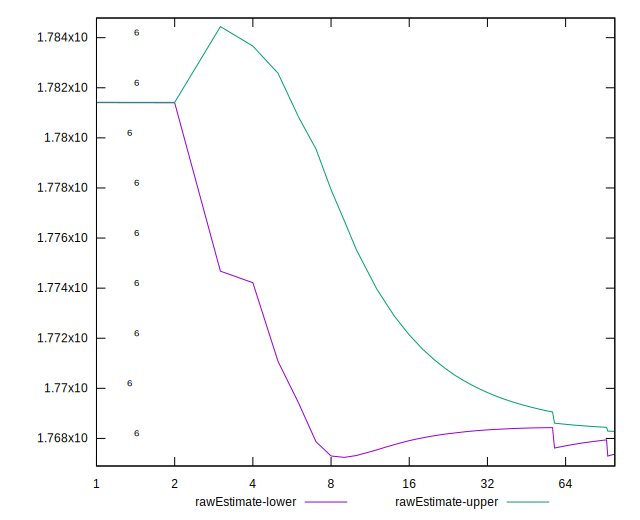

# //total-byte-weight/samples/music

[→ Parent](../..)


## Raw


```yaml
p90min: 1768286
p90max: 1775760
p90range: 7474
p90mean: 1768424.914893617
median: 1768341.5
p90stdev: 761.0998992160561
mad: 17.5
stdevBySn: 28.622400000000003
lfitCenter: 1767827.557263596
lfitStdev: 1847.0733510595526
mfitCenter: 1767827.557263596
mfitStdev: 2314.963145871068
mfitConfidence: 231.49631458710678
p90skewness: 9.521292758661641
p90eccentricity: 0.9999999999999991
p90discretization: 1.5666666666666667
outlandishness: 0.9986584821398251

```


## Score


```yaml
p90min: 1
p90max: 1
p90range: 0
p90mean: 1
median: 1
p90stdev: 0
mad: 0
stdevBySn: 0
lfitCenter: 1
lfitStdev: 0
mfitCenter: 1
mfitStdev: 0
mfitConfidence: 0
p90skewness: .nan
p90eccentricity: .nan
p90discretization: 94
outlandishness: 1

```


## Raw Estimate


## Score Estimate


## P Score


```yaml
p90min: 0
p90max: 0
p90range: 0
p90mean: 0
median: 0
p90stdev: 0
mad: 0
stdevBySn: 0
lfitCenter: 0
lfitStdev: 0
mfitCenter: 0
mfitStdev: 0
mfitConfidence: 0
p90skewness: .nan
p90eccentricity: .nan
p90discretization: 94
outlandishness: .nan

```


## Score Difference


```yaml
p90min: -1
p90max: -1
p90range: 0
p90mean: -1
median: -1
p90stdev: 0
mad: 0
stdevBySn: 0
lfitCenter: -1
lfitStdev: 0
mfitCenter: -1
mfitStdev: 0
mfitConfidence: 0
p90skewness: .nan
p90eccentricity: .nan
p90discretization: 94
outlandishness: 1

```


## P Score Difference


```yaml
p90min: -1
p90max: -1
p90range: 0
p90mean: -1
median: -1
p90stdev: 0
mad: 0
stdevBySn: 0
lfitCenter: -1
lfitStdev: 0
mfitCenter: -1
mfitStdev: 0
mfitConfidence: 0
p90skewness: .nan
p90eccentricity: .nan
p90discretization: 94
outlandishness: 1

```

