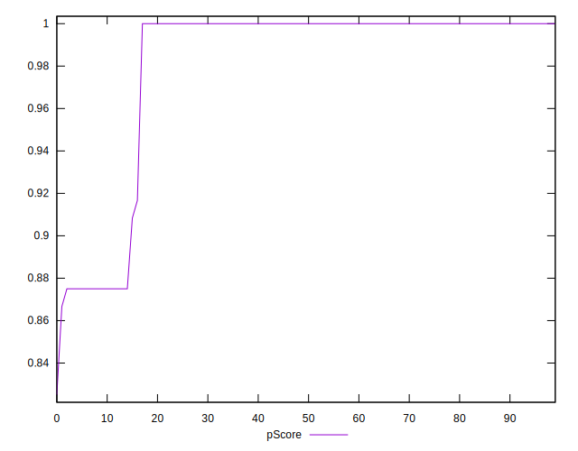

# //unminified-javascript/samples/agenda

[→ Parent](../..)


## Raw


```yaml
p90min: 0
p90max: 150
p90range: 150
p90mean: 21.382978723404257
median: 0
p90stdev: 51.48023921297453
mad: 0
stdevBySn: 0
lfitCenter: 14.566089010351986
lfitStdev: 32.889341400232716
mfitCenter: 14.566089010351986
mfitStdev: 41.22067658538563
mfitConfidence: 4.122067658538564
p90skewness: 2.0219599451188404
p90eccentricity: 0.9999999999999974
p90discretization: 23.5
outlandishness: 1.399924566223608

```


## Score


```yaml
p90min: 0.88
p90max: 1
p90range: 0.12
p90mean: 0.9828723404255317
median: 1
p90stdev: 0.041221310859681434
mad: 0
stdevBySn: 0
lfitCenter: 0.9883142093511041
lfitStdev: 0.026385803211146072
mfitCenter: 0.9883142093511041
mfitStdev: 0.033069700222230235
mfitConfidence: 0.0033069700222230236
p90skewness: -2.019664612438172
p90eccentricity: 1.0000000000000022
p90discretization: 23.5
outlandishness: 0.9935551734699803

```


## Raw Estimate


## Score Estimate


## P Score


```yaml
p90min: 0.875
p90max: 1
p90range: 0.125
p90mean: 0.9821808510638298
median: 1
p90stdev: 0.04290019934414544
mad: 0
stdevBySn: 0
lfitCenter: 0.9878615924913735
lfitStdev: 0.027407784500193766
mfitCenter: 0.9878615924913735
mfitStdev: 0.034350563821154485
mfitConfidence: 0.0034350563821154484
p90skewness: -2.0219599451188404
p90eccentricity: 0.9999999999999978
p90discretization: 23.5
outlandishness: 0.9933642357395813

```


## Score Difference


```yaml
p90min: 0
p90max: 0
p90range: 0
p90mean: 0
median: 0
p90stdev: 0
mad: 0
stdevBySn: 0
lfitCenter: 5.166535369026208e-19
lfitStdev: 1.2890316797319448e-18
mfitCenter: 5.166535369026208e-19
mfitStdev: 1.6155616292812394e-18
mfitConfidence: 1.6155616292812395e-19
p90skewness: .nan
p90eccentricity: .nan
p90discretization: 94
outlandishness: .inf

```


## P Score Difference


```yaml
p90min: -0.0050000000000000044
p90max: 0
p90range: 0.0050000000000000044
p90mean: -0.0006737588652482283
median: 0
p90stdev: 0.00165455080103379
mad: 0
stdevBySn: 0
lfitCenter: -0.0004488540162069848
lfitStdev: 0.0010134850176602337
mfitCenter: -0.0004488540162069848
mfitStdev: 0.0012702151018691647
mfitConfidence: 0.00012702151018691648
p90skewness: -2.1251744633802474
p90eccentricity: 0.9999999999999974
p90discretization: 18.8
outlandishness: 1.3517121883656504

```

